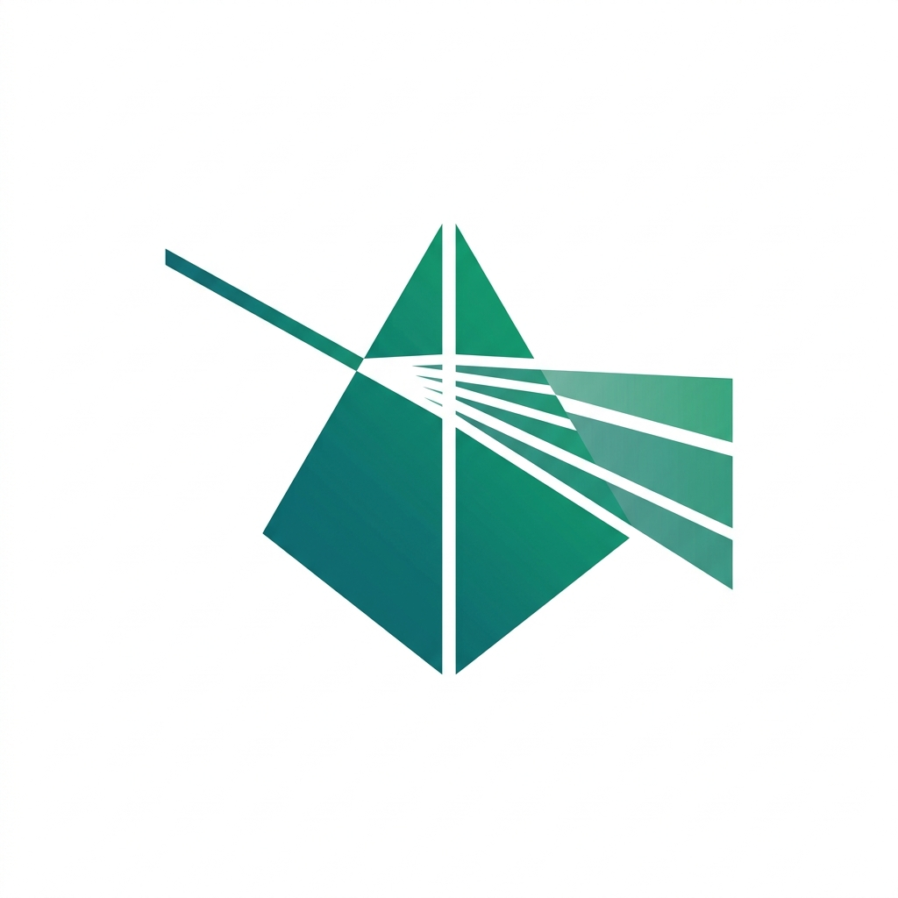

<div align="center">



# Vivechak (विवेचक)

**Evidence-grounded pre-development research meta-framework.**

*vi- (apart) + √vic (to sift/separate) + -aka (the agent who does) = "the discerning analyst"*

</div>

---

### v3.0 — Separating evidence from assumption, truth from bias

> **Transform software architecture decisions from gut-feel and cached training data into structured, evidence-graded, empirically validated research — before a single line of application code is written.**

---

## What Is This?

You have a software project idea. Before coding, you need to make architectural decisions — database, auth, hosting, data model, APIs. Some of these decisions are **irreversible** (one-way doors). If you get them wrong, you're looking at a rewrite.

**Vivechak generates a customized research pipeline for your project** that investigates every critical decision with appropriate rigor. It produces focused research prompts, executes them across frontier AI platforms, grades every claim with traceable evidence, and synthesizes the results into a sealed Founding Architecture Document (FAD) — your architectural source of truth before writing code.

---

## Quick Start (5 Steps)

### Step 1: Generate Your Pipeline
Open [GENERATOR.md](GENERATOR.md), paste your project description into the generator prompt, and send it to a frontier AI (Claude, Gemini, or ChatGPT with web search):
- **Single-Session Mode (Default):** Generates all 3 files in one shot (ideal for IDE agents like Antigravity / Cursor).
- **Split Generation Mode:** Generates Pipeline + Decisions first, then Prompts in a follow-up step (ideal for web chat interfaces with credit / token output limits).

You'll receive 3 files:
- **RESEARCH-PIPELINE.md** — your project's complexity score, session DAG, and execution plan
- **PROMPT-LIBRARY.md** — copy-paste research prompts for each session
- **DECISIONS.md** — initial hypothesis registry

### Step 2: Set Up Your Project Workspace
Create your project's `research/` directory, paste in the 3 generated files, and **copy the 4 templates** from this repository:

```
vivechak/
├── README.md                       ← Overview, quickstart, philosophy
├── GENERATOR.md                    ← The generator prompt (THE tool)
├── FRAMEWORK.md                    ← Complete v3.0 specification
├── AGENTS.md                       ← AI agent operating manual
├── ROADMAP.md                      ← Lineage, Phase 4 validation, frontiers
├── CHANGELOG.md                    ← Release history & spec evolution
├── CONTRIBUTING.md                 ← Evidence-grounding contribution rules
├── CODE_OF_CONDUCT.md              ← Contributor Covenant v2.1
├── LICENSE                         ← MIT License
├── VERSION                         ← Spec version (3.0.0)
│
├── templates/                      ← 4 operational contracts (copy to projects)
│   ├── DECISIONS.template.md       ← YAML frontmatter ADR format
│   ├── CONFLICT-RESOLUTION.template.md ← Analysis of Competing Hypotheses
│   ├── FOUNDING-ARCHITECTURE.template.md ← Map-Reduce synthesis to FAD
│   └── PHASE-0-GATE.template.md    ← Two-track pre-codebase exit gate
│
├── examples/                       ← Concrete adoption walkthroughs
│   └── SAMPLE-PIPELINE.md          ← End-to-end Tier 1 sample project
│
├── docs/assets/                    ← Visual branding & diagrams
│   └── logo.jpg                    ← Minimalist prism logo
│
└── meta-research/                  ← Empirical evidence base (sealed provenance)
    ├── README.md                   ← Provenance index
    ├── DECISIONS.md                ← 10 hypothesis verdicts & 31 evidence nodes
    ├── RESEARCH-PIPELINE.md        ← Meta-research execution DAG
    ├── PROMPT-LIBRARY.md           ← 14 meta-research prompts
    └── research/                   ← 14 primary research artifacts (639KB)
```

Your project is now **100% self-contained**. You never need to return to this meta-repo.

### Step 3: Execute Research Sessions
Take each prompt from your generated PROMPT-LIBRARY.md and run it in an independent AI deep research session. Sessions are designed to be parallel — run as many simultaneously as you want.

Save each output as `research/sessions/T#-##-[slug].md`.

### Step 4: Record Decisions
After key research sessions, lock architectural decisions in `DECISIONS.md` using the format from `templates/DECISIONS.template.md`. Classify each as one-way or two-way door. If models disagree, use `templates/CONFLICT-RESOLUTION.template.md`.

### Step 5: Synthesize, Gate & Build
Compile all findings into a Founding Architecture Document using `templates/FOUNDING-ARCHITECTURE.template.md`. Verify exit criteria with `templates/PHASE-0-GATE.template.md`. Once the gate passes — start coding with the FAD as your architectural source of truth.

---


---

## Sovereign Tools Ecosystem

Vivechak operates as the **foundational intelligence layer** within the Sovereign Tools suite:

```
                                  SOVEREIGN TOOLS ECOSYSTEM
  
    ┌─────────────────────────┐     Founding Architecture      ┌─────────────────────────┐
    │    Vivechak (विवेचक)     │            Document            │      Rachak (रचक)       │
    │  Pre-Dev Deep Research  │ ─────────────────────────────> │  Governance Scaffolding │
    │   & Evidence Grading    │            (FAD.md)            │    & Agent Constraints  │
    └─────────────────────────┘                                └────────────┬────────────┘
                                                                            │
                                                                            │ Scaffolding + Specs
                                                                            ▼
                                                               ┌─────────────────────────┐
                                                               │      Kramak (क्रमक)     │
                                                               │  Autonomous SDLC Engine │
                                                               │    & Development Loop   │
                                                               └─────────────────────────┘
```

- **[Vivechak (विवेचक)](https://github.com/bhaskarjha-dev/vivechak):** *The Discerning Analyst* — Investigates architectural assumptions, grades evidence, and seals the Founding Architecture Document (FAD) *before* coding.
- **[Rachak (रचक)](https://github.com/bhaskarjha-dev/rachak):** *The Scaffolder* — Generates single-binary project structure, governance policies, and agent-proof boundaries.
- **[Kramak (क्रमक)](https://github.com/bhaskarjha-dev/kramak):** *The Methodical Progressor* — Executes autonomous development loops guided by the FAD and project specifications.
- **[Pramedha (प्रमेधा)](https://github.com/bhaskarjha-dev/pramedha):** *The Advanced Intellect* — Career intelligence and knowledge graph management.
- **[GitSetu (गिट-सेतु)](https://github.com/bhaskarjha-dev/gitsetu):** *The Identity Bridge* — Multi-profile Git authentication and identity governance.

---

## Repository Structure

```
vivechak/
├── README.md              ← You are here
├── GENERATOR.md           ← THE TOOL: generator prompt (start here)
├── FRAMEWORK.md           ← Complete v3.0 methodology specification
├── AGENTS.md              ← AI agent operating manual
│
├── templates/             ← Operational templates (copy to new projects)
│   ├── DECISIONS.template.md
│   ├── CONFLICT-RESOLUTION.template.md
│   ├── FOUNDING-ARCHITECTURE.template.md
│   └── PHASE-0-GATE.template.md
│
└── meta-research/         ← Empirical evidence base (provenance, not operational)
    ├── README.md
    ├── DECISIONS.md        ← 10 hypothesis verdicts, 31 evidence nodes
    └── research/           ← 14 primary research artifacts (639KB)
```

---

## Using with AI Agents (Antigravity, Claude Code, Cursor, etc.)

Because your project workspace contains both the generated files AND the operational templates, AI agents can autonomously execute every step. Example commands:

| Step | Agent Prompt |
|---|---|
| **Research** | *"Read T2-01 from `research/PROMPT-LIBRARY.md`, run deep research with web search, save to `research/sessions/T2-01-datastore-selection.md`"* |
| **Decide** | *"Read `research/sessions/T2-01-*.md`, formulate D-001 in `research/DECISIONS.md` following `research/templates/DECISIONS.template.md`"* |
| **Synthesize** | *"Read all sessions and decisions, compile `FAD.md` following `research/templates/FOUNDING-ARCHITECTURE.template.md`"* |
| **Gate** | *"Audit `FAD.md` against `research/templates/PHASE-0-GATE.template.md`, run premortem for One-Way Doors, emit `PHASE-0-GATE.md`"* |

The templates act as **contracts** — the agent reads them and follows the exact format, methodology, and checklist without hallucinating structure.

---

## Key Capabilities

| Capability | How It Works |
|---|---|
| **Flexible Generation** | Single-session for IDE/API agents, or 2-step split for web chat output limits |
| **Adaptive Scaling** | 8-dimension complexity scoring (0–24) maps to 4 tiers (1–30 sessions) |
| **Open-Ended Input** | Accepts natural language vision dumps; AI extracts parameters and classifies |
| **Constrained DAG** | Sessions run when dependencies are met, not rigid stage gates |
| **5-Block Prompts** | BRIEF, SCOPE, APPROACH, DELIVERABLE, FORMAT — no personas, no hardcoded queries |
| **Staged Triangulation** | Single-model default → multi-model only for contested one-way doors |
| **GRADE-Aligned Evidence** | A–E grades + modifiers (corroboration, recency, directness) + verification |
| **Two-Track Gate** | Fast-track for reversible decisions; 9-step + premortem for irreversible |

---

## Origin & Philosophy

### Why This Exists

Software venture failures almost never stem from bad code — they stem from **premature architectural decisions made on unverified assumptions.** The cost of wrong decisions compounds: a bad database choice costs 10× more to fix at month 6 than at month 0.

Vivechak was born from 7 real project research pipelines (2024–2026), each independently discovering pieces of the same methodology: unbiased landscape cataloging, evidence grading, aspect isolation, decision registries, and synthesis protocols. Vivechak v1.0/v2.0 consolidated these patterns.

### The v3.0 Transformation

In August 2026, Vivechak was subjected to its own methodology. 11 independent deep research sessions tested every foundational assumption. Of 10 hypotheses, **0 survived unchanged**:

| v2.0 Dogma | Verdict | v3.0 Resolution |
|---|---|---|
| Absolute aspect-isolation | Refined | Context Architecture Law — conditional decomposition + synthesis |
| Mandatory 3-model triangulation | Refined | Staged, risk-triggered protocol |
| Fixed 17–27 sessions | Refuted | 4-tier adaptive scaling (1–30) |
| 8-section XML prompts | Refuted | 5-block prompt anatomy |
| Expert personas improve research | Refuted | Personas debunked for factual accuracy |
| Fixed ~40/60 compose/build | Refined | Wardley evolution mapping |

The most load-bearing finding: **how you frame a research question measurably biases what "evidence" a model reports back.** This single finding justifies the entire framework — unstructured "just ask the AI" research is systematically vulnerable to confirmation bias.

### The Self-Referential Validation

Vivechak v3.0's most distinctive property: it was validated by the methodology it prescribes. The meta-research discovered that several of its own axioms needed refinement. This recursive self-correction is built into v3.0's DNA through mandatory review triggers and decay conditions on every locked ADR.

---

## Roadmap

| Phase | Status | Description |
|---|---|---|
| 1: Foundation | ✅ | 7 project methodologies consolidated into v1.0/v2.0 |
| 2: Self-Validation | ✅ | 11 meta-research sessions → 10 verdicts → v3.0 spec |
| 3: v3.0 Overhaul | ✅ | Framework, generator, templates rewritten from evidence |
| 4: Real-World Validation | Next | Battle-test on 2–3 real projects, refine generator from output quality |
| 5: Tooling | Future | CLI initializer, YAML validator, code-based generator (if validated) |
| 6: v4.0 Frontiers | Future | DSPy optimization, multi-agent debate, longitudinal calibration |

See [ROADMAP.md](ROADMAP.md) for detailed plans, overhaul decisions, and source material status.
