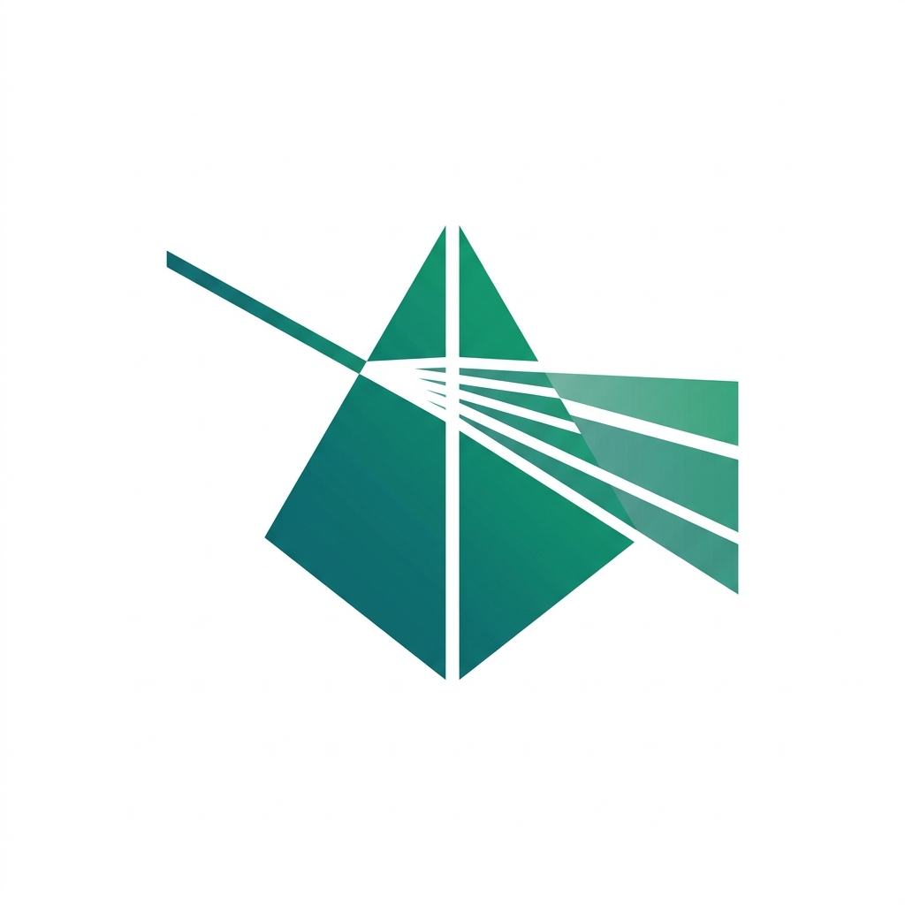

<div align="center">



# Vivechak (विवेचक)

**Evidence-grounded research for technical decisions.**

*vi- (apart) + √vic (to sift/separate) + -aka (the agent who does) = "the discerning analyst"*

</div>

---

### v0.1.0 — Separating evidence from assumption, truth from bias

> **Transform technical decisions from gut-feel and cached training data into structured, evidence-graded research — whether you're architecting a whole project, researching a single decision, or comparing specific options.**

---

## Install

**macOS / Linux:**
```sh
curl -fsSL https://raw.githubusercontent.com/bhaskarjha-dev/vivechak/main/install.sh | sh
```

**Windows (PowerShell):**
```powershell
irm https://raw.githubusercontent.com/bhaskarjha-dev/vivechak/main/install.ps1 | iex
```

**Package managers:**
```sh
# Homebrew (macOS / Linux)
brew install bhaskarjha-dev/tap/vivechak

# Windows (WinGet or Scoop)
winget install bhaskarjha-dev.Vivechak
# or: scoop bucket add vivechak https://github.com/bhaskarjha-dev/scoop-bucket && scoop install vivechak

# Go (requires Go 1.27+)
go install github.com/bhaskarjha-dev/vivechak/cmd/vivechak@latest
```

**Then configure your AI host:**
Vivechak installs the official 3-letter shorthand **`vck`** alongside `vivechak`. Configure your AI host in 1 second:
```sh
# Fast host setup (auto-resolves config paths and merges cleanly):
vck setup cursor                             # Cursor IDE
vck setup vscode                             # VS Code (Copilot Agent mode)
vck setup claude                             # Claude Desktop
vck setup agy                                # Google Antigravity
vck setup                                    # auto-detect host in current workspace

# Or output universal MCP JSON configuration:
vck mcp-config
```

Done. Your agent now has 9 MCP tools for evidence-grounded research. See [Host Setup Guide](docs/HOST-SETUP.md) for harness instructions, desktop shortcuts, and manual setup details.

---

## What Is This?

You're making a technical decision — maybe architecting a whole project, choosing between databases, or evaluating whether to adopt a new framework. Some decisions are **irreversible** (one-way doors). If you get them wrong, you're looking at a rewrite.

**Vivechak generates evidence-grounded research at three scope levels:**

| Scope | Entry Point | What You Get |
|---|---|---|
| **Project** | [GENERATOR.md](GENERATOR.md) | Full research pipeline → Founding Architecture Document |
| **Decision** | [GENERATOR-DECISION.md](GENERATOR-DECISION.md) | 1–3 focused sessions → proposed ADR |
| **Comparison** | [GENERATOR-COMPARISON.md](GENERATOR-COMPARISON.md) | 1 structured comparison → WEP matrix |

Every scope level applies the same methodology: traceable evidence grades (A–E), structured falsification, bias-corrected weighted evaluation, and explicit reversal triggers on every decision.

**Vivechak is not a deep-research tool** — it is the **orchestration layer above** tools like Gemini Deep Research, ChatGPT Deep Research, and Perplexity. Those tools execute individual research sessions; Vivechak structures which sessions to run, how evidence is graded consistently across sessions, how decisions are tracked with reversal triggers, and how findings are synthesized into a coherent architecture.

---

## Quick Start (5 Steps)

### Step 1: Generate Your Pipeline
Open [GENERATOR.md](GENERATOR.md), paste your project description into the generator prompt, and send it to a frontier AI (Claude, Gemini, or ChatGPT with web search). You'll receive two files:
- **RESEARCH-PIPELINE.md** — your project's complexity score, session DAG, and copy-paste-ready research prompts for every session
- **DECISIONS.md** — initial decision registry with proposed hypotheses (evolves as you execute research)

> **Extracting from web chat:** If your AI platform outputs inline text rather than downloadable files, look for the two clear document boundaries in the output. `RESEARCH-PIPELINE.md` starts with the pipeline header and ends after the last session prompt. `DECISIONS.md` starts with the decision registry header. Copy each section into its own file. The generator prompt instructs the AI to produce clearly separated, complete documents.

### Step 2: Set Up Your Project Workspace
Create your project's `research/` directory, paste in the generated files, and **copy the 5 templates** from this repository:

```
my-project/
└── research/
    ├── RESEARCH-PIPELINE.md         ← Generated (paste here)
    ├── DECISIONS.md                 ← Generated (paste here)
    ├── sessions/                    ← Create empty folder for research outputs
    └── templates/                   ← Copy from Vivechak (see templates/)
        ├── DECISIONS.template.md
        ├── CONFLICT-RESOLUTION.template.md
        ├── COMPARISON-SESSION.template.md
        ├── FOUNDING-ARCHITECTURE.template.md
        └── PHASE-0-GATE.template.md
```

Your project is now **100% self-contained**. You never need to return to this meta-repo.

### Step 3: Execute Research Sessions
Take each prompt from your generated RESEARCH-PIPELINE.md (inside the ```` ```prompt ```` code fences) and run it in an independent AI deep research session. Layer 0 sessions are designed to be parallel — run as many simultaneously as you want.

Save each output using the filename specified in the session's metadata table (e.g., `research/sessions/T1-01-primary-datastore-selection.md`).

### Step 4: Record Decisions
After key research sessions, update `DECISIONS.md` — lock architectural decisions using the format from `templates/DECISIONS.template.md`. Classify each as one-way or two-way door. If models disagree, use `templates/CONFLICT-RESOLUTION.template.md`.

### Step 5: Synthesize, Gate & Build
Compile all findings into a Founding Architecture Document using `templates/FOUNDING-ARCHITECTURE.template.md`. Verify exit criteria with `templates/PHASE-0-GATE.template.md`. Once the gate passes — start coding with the FAD as your architectural source of truth.

---

## Repository Structure

> **For most users:** Install the binary, run `vck setup <host>`, and you're done. The repository structure below is for contributors and those who want to understand the internals.

```
vivechak/
├── cmd/vivechak/                   ← MCP server + CLI entry point
│   ├── main.go                     ← Entry point (serve, setup, mcp-config, doctor, version)
│   ├── config.go                   ← setup & mcp-config (auto-detection + 14 presets)
│   └── doctor.go                   ← Workspace integrity checker
│
├── internal/                       ← Server implementation
│   ├── core/                       ← Pure logic (workspace, DAG, validation)
│   ├── mcp/                        ← 9 MCP tool handlers
│   ├── store/                      ← Atomic file I/O with os.Root confinement
│   └── embed/                      ← Embedded generators + templates
│
├── .goreleaser.yml                 ← 6-platform cross-compilation config
├── install.sh                      ← macOS/Linux installer (curl | sh)
├── install.ps1                     ← Windows installer (irm | iex)
├── .github/workflows/              ← CI + release pipelines
│   ├── ci.yml                      ← Test + vet + build on push/PR
│   └── release.yml                 ← GoReleaser on tag push
│
├── Formula/vivechak.rb             ← Homebrew formula
├── scoop/vivechak.json             ← Scoop bucket manifest
├── winget/                         ← winget manifest
│
├── GENERATOR.md                    ← Project-scope generator (full pipeline → FAD)
├── GENERATOR-DECISION.md           ← Decision-scope generator (1–3 sessions → ADR)
├── GENERATOR-COMPARISON.md         ← Comparison-scope generator (1 session → WEP matrix)
├── FRAMEWORK.md                    ← Deep methodology reference
├── docs/HOST-SETUP.md              ← Universal MCP setup & desktop shortcuts
│
├── templates/                      ← 5 operational contracts (copy to projects)
├── examples/                       ← Concrete adoption walkthroughs
├── docs/meta-research/              ← 14 locked ADRs + evidence provenance
│
├── AGENTS.md                       ← AI agent operating manual
├── ROADMAP.md · CHANGELOG.md       ← Project history
├── CONTRIBUTING.md · LICENSE        ← MIT License
└── go.mod · go.sum                 ← Go 1.27+ module
```

---

## Using with AI Agents

Vivechak ships as a universal **MCP server** — install the binary, register it with your AI host or agent harness (`vck setup <host>`), and your AI agent gets 9 tools:

| Tool | What It Does |
|---|---|
| `vivechak_init` | Create workspace structure with templates |
| `vivechak_prepare_generator` | Return scope-appropriate generator prompt with context filled in |
| `vivechak_save_plan` | Validate + persist generated research plan |
| `vivechak_status` | Report workspace progress (DAG completion, blocked sessions) |
| `vivechak_next_session` | Return next session prompt with upstream findings injected |
| `vivechak_save_session` | Validate + persist completed session output |
| `vivechak_record_decision` | Save ADR or conflict resolution |
| `vivechak_validate` | Dry-run validation on any artifact |
| `vivechak_run_gate` | Phase 0 exit gate (Track A + Track B) |

The agent calls these tools in sequence. The server handles context injection, DAG resolution, evidence grading validation, and exit gate checks — the agent handles the actual research using its LLM capabilities.

**Still works without the MCP server:** The generators and templates in this repo are fully self-contained. You can copy-paste prompts manually — the MCP server just automates the orchestration.

---

## Key Capabilities

| Capability | How It Works |
|---|---|
| **Extract-2-Files** | Generator produces two clearly separated artifacts; guidance included for extracting from web chat |
| **Adaptive Scaling** | 8-dimension complexity scoring (0–24) maps to 4 tiers (1–30 sessions) |
| **Open-Ended Input** | Accepts natural language vision dumps; AI extracts parameters and classifies |
| **Constrained DAG** | Sessions run when dependencies are met, not rigid stage gates |
| **5-Block Prompts** | BRIEF, SCOPE, APPROACH, DELIVERABLE, FORMAT — no personas, no hardcoded queries |
| **Staged Triangulation** | Single-model default → multi-model only for contested one-way doors |
| **GRADE-Aligned Evidence** | A–E grades + modifiers (corroboration, recency, directness) + verification |
| **Two-Track Gate** | Fast-track for reversible decisions; 9-step + premortem for irreversible |

---

## Origin & Philosophy

### Why This Exists

Software venture failures almost never stem from bad code — they stem from **premature architectural decisions made on unverified assumptions.** The cost of wrong decisions compounds: a bad database choice costs 10× more to fix at month 6 than at month 0.

Vivechak was born from 8 real project research pipelines (2024–2026), each independently discovering pieces of the same methodology: unbiased landscape cataloging, evidence grading, aspect isolation, decision registries, and synthesis protocols.

### The Empirical Self-Validation

In August 2026, the framework was subjected to its own methodology. 11 independent deep research sessions (producing 15 artifacts across multiple AI platforms) tested every foundational assumption. Of 10 hypotheses, **0 survived unchanged**:

| Legacy Dogma | Verdict | Resolution |
|---|---|---|
| Absolute aspect-isolation | Refined | Context Architecture Law — conditional decomposition + synthesis |
| Mandatory 3-model triangulation | Refined | Staged, risk-triggered protocol |
| Fixed 17–27 sessions | Refuted | 4-tier adaptive scaling (1–30) |
| 8-section XML prompts | Refuted | 5-block prompt anatomy |
| Expert personas improve research | Refuted | Personas debunked for factual accuracy |
| Fixed ~40/60 compose/build | Refined | Wardley evolution mapping |

The most load-bearing finding: **how you frame a research question measurably biases what "evidence" a model reports back.** This single finding justifies the entire framework — unstructured "just ask the AI" research is systematically vulnerable to confirmation bias.

### The Self-Referential Validation

Vivechak's most distinctive property: it was validated by the methodology it prescribes. The meta-research discovered that several of its own axioms needed refinement. This recursive self-correction is built into Vivechak's DNA through mandatory review triggers and decay conditions on every locked ADR.

### FRAMEWORK.md — The Deep Reference

[FRAMEWORK.md](FRAMEWORK.md) contains the complete methodology specification — 8 principles, evidence grading system, pipeline topology, prompt anatomy, and synthesis workflows. **You do not need to read it to use Vivechak.** GENERATOR.md is self-contained; all methodology is operationalized inline in the generator prompt. FRAMEWORK.md is the definitive reference for understanding *why* the methodology works and for anyone improving the framework itself.


## Roadmap

| Phase | Status | Description |
|---|---|---|
| 1: Foundation (Gen 1) | ✅ | 8 project methodologies consolidated into initial patterns |
| 2: Self-Validation (Gen 2) | ✅ | 11 meta-research sessions → 10 verdicts → Gen 3 spec |
| 3: Framework Release (v0.1.0) | ✅ | Framework, generators, templates, bias correction |
| 4: Methodology Expansion | ✅ | 3 scope levels (Project / Decision / Comparison) |
| 5: MCP Server | ✅ | Go MCP server with 9 tools, full test suite passing |
| 6: Distribution | ✅ | GoReleaser, installers, Homebrew/Scoop/winget, CI pipelines |
| 7: Demand Proof | Next | Real case study, free wedge skill, content marketing |
| 8: Research Frontiers | Future | DSPy optimization, multi-agent debate, longitudinal calibration |

See [ROADMAP.md](ROADMAP.md) for detailed plans and evidence corpus.

