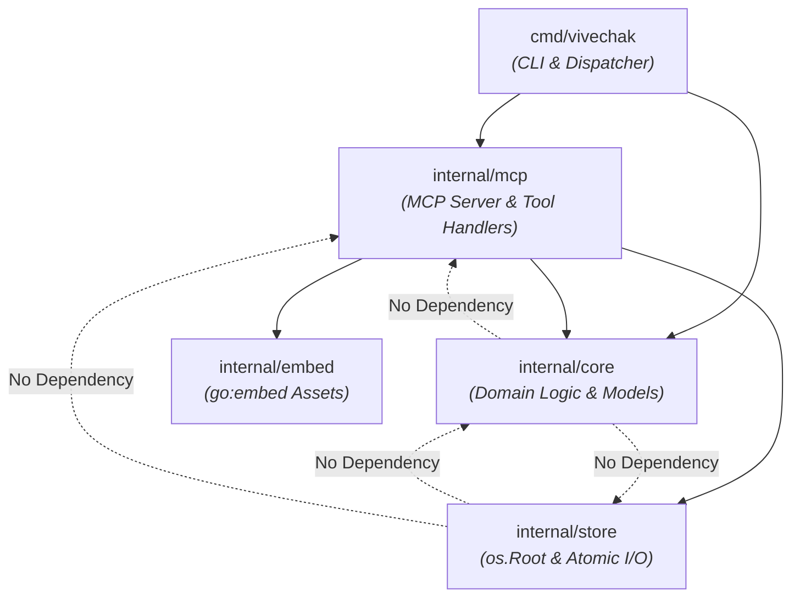
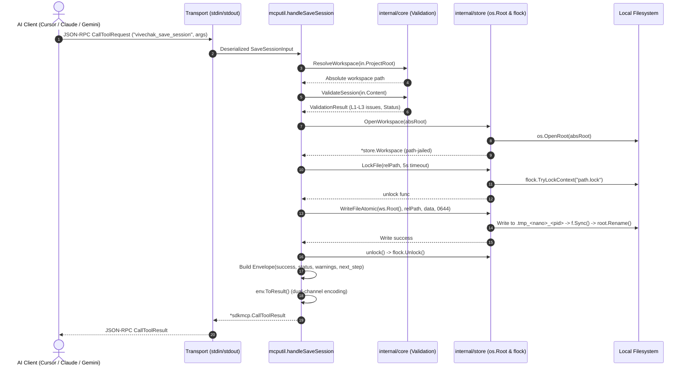

# Server Architecture Guide

> **Last verified against code:** 2026-10-04 (v0.1.0)
> If you find discrepancies with the actual code, please file an issue.

Welcome to the internal architecture guide for **Vivechak** (विवेचक). This document is written for Go developers and contributors who want to understand, extend, or maintain the Vivechak MCP server codebase.

Vivechak is an evidence-grounded research meta-framework for technical decisions. It operates across three distinct research scopes:
1. **Project** ([`GENERATOR.md`](../GENERATOR.md)) — Full research pipeline producing a Founding Architecture Document (FAD) across 4–30 DAG-ordered sessions.
2. **Decision** ([`GENERATOR-DECISION.md`](../GENERATOR-DECISION.md)) — Single architectural decision producing an Architectural Decision Record (ADR) across 1–3 sessions.
3. **Comparison** ([`GENERATOR-COMPARISON.md`](../GENERATOR-COMPARISON.md)) — Bounded technology evaluation producing a Weighted Evaluation Protocol (WEP) matrix in a single session.

The project ships as both a zero-dependency manual workflow and an autonomous **Model Context Protocol (MCP)** server providing 10 purpose-built tools.

---

## 1. Package Layout & Dependency Architecture

The codebase follows a strict separation of concerns. Pure domain logic has zero dependency on the MCP protocol or transport layer, allowing fast, isolated testing and clean architectural boundaries.

```
vivechak/
├── cmd/
│   └── vivechak/           # CLI entry points and host configurations
│       ├── main.go         # Command dispatcher, stdio server startup, slog routing (vck alias)
│       ├── config.go       # "setup" and "mcp-config" host configuration & 14 presets
│       └── doctor.go       # "doctor" workspace integrity verification
├── internal/
│   ├── core/               # Pure business logic (DAG, validation, injection, scopes)
│   │   ├── scope.go        # Scope definitions (project, decision, comparison)
│   │   ├── workspace.go    # Workspace layout & 4-step resolution chain
│   │   ├── dag.go          # Pipeline DAG parsing and dependency resolution
│   │   ├── frontmatter.go  # YAML frontmatter parsing and composition
│   │   ├── inject.go       # Upstream context injection engine
│   │   └── validate.go     # 4-level validation ladder (L1–L4)
│   ├── mcp/                # MCP protocol server and tool handlers (package mcputil)
│   │   ├── server.go       # Server factory and tool registration dispatcher
│   │   ├── envelope.go     # Standardized JSON response envelope & dual-channel encoding
│   │   ├── tool_*.go       # 10 individual MCP tool handlers
│   │   └── server_test.go  # In-memory JSON-RPC wire tests
│   ├── store/              # Storage, path jail, and concurrency primitives
│   │   ├── workspace.go    # os.Root confinement wrapper
│   │   ├── atomic.go       # Crash-safe atomic file writes
│   │   └── lock.go         # Cross-process advisory file locking (flock)
│   └── embed/              # Compile-time embedded generators and templates (package vembed)
│       ├── embed.go        # go:embed accessors for generators and templates
│       ├── generators/     # Embedded generator markdown prompts
│       └── templates/      # Embedded workspace markdown templates
```

### Dependency Direction

The dependency flow is strictly unidirectional:



Key architectural rules:
1. **[`internal/core`](../internal/core/scope.go#L1-L5) has NO dependency on MCP or Store**: Domain logic relies only on the Go standard library and [`gopkg.in/yaml.v3`](../go.mod#L16). You can test DAG parsing, upstream injection, frontmatter handling, and validation without launching an MCP server or writing to the disk.
2. **[`internal/store`](../internal/store/workspace.go#L1-L8) is independent**: It handles low-level filesystem confinement via `os.Root`, advisory locks via `github.com/gofrs/flock`, and atomic write semantics. It knows nothing about MCP requests or Vivechak research concepts.
3. **[`internal/mcp`](../internal/mcp/server.go#L1-L8) bridges protocol to domain**: Handlers decode MCP inputs, call `internal/core` algorithms, persist via `internal/store`, and package results into the standardized [`Envelope`](../internal/mcp/envelope.go#L24-L44).
4. **Stdio Protocol Discipline**: As defined in [`main.go`](../cmd/vivechak/main.go#L26-L30), the server communicates with AI hosts over `stdin`/`stdout`. **`stdout` is strictly reserved for JSON-RPC MCP messages**. Any stray `fmt.Println` or unrouted log on `stdout` corrupts the transport and crashes the host client. All logging is routed through `log/slog` writing exclusively to `os.Stderr`.

---

## 2. Key Abstractions

### Scope (`core.Scope`)
Defined in [`internal/core/scope.go`](../internal/core/scope.go#L8-L22), [`Scope`](../internal/core/scope.go#L8) encapsulates the three research tiers:
- [`ScopeProject`](../internal/core/scope.go#L13) (`"project"`): Multi-session architectural investigation (4–30 sessions), producing `RESEARCH-PIPELINE.md`, `DECISIONS.md`, and ultimately a Founding Architecture Document (`FAD.md`).
- [`ScopeDecision`](../internal/core/scope.go#L17) (`"decision"`): Targeted investigation for a single decision (1–3 sessions), producing an Architectural Decision Record (ADR).
- [`ScopeComparison`](../internal/core/scope.go#L21) (`"comparison"`): Rapid, bounded comparison of 2–4 options producing a Weighted Evaluation Protocol matrix in a single session.

### Workspace & Resolution Chain
Defined in [`internal/core/workspace.go`](../internal/core/workspace.go#L34-L88), [`ResolveWorkspace`](../internal/core/workspace.go#L43) evaluates a deterministic 4-step resolution chain:
1. **Explicit argument**: `project_root` passed directly in the MCP tool call or CLI command.
2. **Environment variable**: Value of `VIVECHAK_PROJECT_ROOT`.
3. **CWD Directory Traversal**: Walks upwards from the current working directory searching for an existing `research/` directory.
4. **Fallback error**: Clear diagnostic error instructing the caller to initialize the workspace with [`vivechak_init`](../internal/mcp/tool_init.go#L21-L40).

The workspace layout is standard across all Vivechak projects:
- `research/` — Workspace root
- `research/sessions/` — Markdown outputs from individual research sessions
- `research/templates/` — Copy of the 6 canonical templates
- `research/RESEARCH-PIPELINE.md` — DAG session definitions and metadata
- `research/DECISIONS.md` — Central architectural decision registry (auto-compiled from individual `D-*.md` files)
- `research/FAD.md` — Synthesized Founding Architecture Document
- `FOUNDING-ARCHITECTURE.md` — Root-level human-facing mirror of `research/FAD.md`
- `research/PHASE-0-GATE.md` — Auto-persisted Phase 0 exit gate evaluation checklist

### Pipeline DAG (`core.DAG` & `core.Session`)
Defined in [`internal/core/dag.go`](../internal/core/dag.go#L10-L49), [`ParsePipeline`](../internal/core/dag.go#L104) converts `RESEARCH-PIPELINE.md` into an in-memory graph.
- [`Session`](../internal/core/dag.go#L10-L34): Represents an individual node, capturing `ID` (e.g., `T1-01`, `SYN-01`), `Layer` (0 for landscape, 1 for deep dives, etc.), `DoorType` (`One-Way` vs `Two-Way`), `DecisionRef`, `Dependencies`, `OutputFile`, and the complete 5-block markdown `Prompt`.
- [`DAG.NextSessions(completedIDs)`](../internal/core/dag.go#L63-L85): Computes ready nodes by checking which uncompleted sessions have all upstream dependencies satisfied. Identifies parallel tracks that can execute concurrently.

### Frontmatter Parser (`core.Frontmatter`)
Defined in [`internal/core/frontmatter.go`](../internal/core/frontmatter.go#L11-L20), [`ParseFrontmatter`](../internal/core/frontmatter.go#L44) and [`ComposeFrontmatter`](../internal/core/frontmatter.go#L120) provide robust YAML frontmatter manipulation without mangling markdown body fences, tables, or unicode content.

### Validation Ladder (`core.ValidationLevel`)
Defined in [`internal/core/validate.go`](../internal/core/validate.go#L11-L22), Vivechak uses a 4-level validation ladder to enforce structure without rejecting variations in human/AI writing style:

| Level | Identifier | Behavior | Trigger Conditions |
|---|---|---|---|
| **L1** | `L1Construct` | Auto-remedies missing values | Missing non-critical fields (e.g., defaulting missing `status` to `draft`). |
| **L2** | `L2Block` | Persists as `draft`, blocks completion | Missing YAML frontmatter, missing mandatory fields (`session_id`, `title`, `date`), empty markdown body. |
| **L3** | `L3Warn` | Emits non-fatal warnings | Missing inline evidence grades (`A-E (source)`), missing `door_type`, decision body < 100 characters. |
| **L4** | `L4Gate` | Exit gate evaluation across project | Pipeline structural completeness and mechanical quality verification. |

### Quality Coaching Engine (`core.ObserveSessionQuality`)
Defined in [`internal/core/validate.go`](../internal/core/validate.go#L552-L655), `ObserveSessionQuality` performs real-time advisory analysis on session outputs during `vivechak_save_session` (and dry-run `vivechak_validate`). It coaches the agent on epistemic rigor without blocking workflow:
- **Grade Distribution:** Alerts when Grade A citations exceed 70% of claims, prompting primary source verification.
- **Grade A URL Verification:** Scans for `Grade A ... fetched` citations lacking an HTTP(S) URL.
- **Key Findings Depth:** Alerts when fewer than 3 key findings are provided.
- **Discovered Concerns:** Flags sessions lacking an unexpected findings section.
- **Confirmation Bias Check:** Warns when 100% of prior beliefs in the Delta table are confirmed without contradiction or refinement.
- **Rejected Alternatives:** Verifies recommendations cite rejected alternatives.
- **Date Freshness:** Checks for potentially stale dates while filtering out ports and metrics.

### Response Envelope (`mcputil.Envelope`)
Defined in [`internal/mcp/envelope.go`](../internal/mcp/envelope.go#L24-L44), every tool returns the standard envelope:
```json
{
  "success": true,
  "message": "Session T1-01 saved as valid (0 warnings, 0 errors)",
  "data": { ... },
  "warnings": [],
  "next_step": "Run vivechak_next_session for the next actionable session.",
  "meta": {
    "api": 1,
    "tool": "vivechak_save_session",
    "truncated": false
  }
}
```

#### Dual-Channel Delivery
[`Envelope.ToResult()`](../internal/mcp/envelope.go#L69-L82) implements dual-channel delivery:
1. **Text Content**: Formatted JSON string in `CallToolResult.Content`. This ensures clients like Cursor (which historically dropped `StructuredContent`) receive complete data.
2. **Structured Content**: Strongly typed schema payload auto-populated by the MCP Go SDK generic handler. This ensures clients like Gemini CLI (which require structured content) validate cleanly.

### Guided Worker Pattern & Context Injection
Vivechak is built around the **Guided Worker** philosophy:
1. **Deterministic Guidance**: Every single tool response populates `next_step` with the exact next action the agent should take, eliminating disorientation and drift.
2. **Context Injection** ([`internal/core/inject.go`](../internal/core/inject.go#L38-L68)): When an agent invokes [`vivechak_next_session`](../internal/mcp/tool_next_session.go#L42), the server inspects the session's upstream dependencies, extracts key findings and evidence-graded claims from completed session files, and automatically populates `[UPSTREAM_FINDINGS]` (or `[ALL_SESSION_FINDINGS]` for synthesis `SYN-01`). This eliminates error-prone manual copy-pasting between research sessions.

---

## 3. Data Flow

Here is the end-to-end lifecycle of a mutating tool call (such as [`vivechak_save_session`](../internal/mcp/tool_save_session.go#L42)):



### Trace Comparison: Read vs Write Tools

- **Read-Only Inspection** ([`vivechak_status`](../internal/mcp/tool_status.go#L36)):
  1. Resolves workspace path. If not found, gracefully returns `initialized: false` with guidance to call `vivechak_init`.
  2. Scans `research/` directories and counts sessions and templates via [`InspectWorkspace`](../internal/core/workspace.go#L122).
  3. Formulates status message and computes contextual `next_step` based on pipeline presence and session count.
  4. Acquires no locks and performs no filesystem writes.

- **DAG Progression** ([`vivechak_next_session`](../internal/mcp/tool_next_session.go#L42)):
  1. Parses `RESEARCH-PIPELINE.md` into [`core.DAG`](../internal/core/dag.go#L37).
  2. Scans `research/sessions/` to collect all completed session IDs.
  3. Calls [`dag.NextSessions(completedIDs)`](../internal/core/dag.go#L63) to discover actionable nodes.
  4. Calls [`core.InjectContext`](../internal/core/inject.go#L38) to inject upstream dependencies into the prompt.
  5. Returns prompt, metadata, parallel unblocked sessions in `other_ready_sessions`, and step-by-step instructions.

---

## 4. Security Model & Concurrency Safety

The server is designed to run safely within agentic desktop environments where multiple processes or subagents may operate simultaneously.

```
       Host Environment
  ┌────────────────────────────────────────────────────────┐
  │                                                        │
  │   [Subagent A]                [Subagent B]             │
  │        │                           │                   │
  │        ▼                           ▼                   │
  │   vivechak_save_session       vivechak_save_session    │
  │        │                           │                   │
  │        ├─────────► flock ◄─────────┤  Advisory Lock    │
  │        │     (path.md.lock)        │                   │
  │        ▼                           ▼                   │
  │  .tmp_1234_987            .tmp_5678_988   Atomic Files │
  │        │                           │                   │
  │        ▼                           ▼                   │
  │   ┌──────────────────────────────────────────────┐     │
  │   │ os.OpenRoot("/project/research")             │     │
  │   │ Path Confinement Boundary (No Escape)        │     │
  │   └──────────────────────────────────────────────┘     │
  │                                                        │
  └────────────────────────────────────────────────────────┘
```

### `os.Root` Path Confinement
Implemented in [`internal/store/workspace.go`](../internal/store/workspace.go#L9-L32), the server opens the workspace root using Go standard library's `os.OpenRoot(absPath)`.
- All downstream filesystem operations (`ReadFile`, `Stat`, `ListDir`, and atomic operations) execute through the `*os.Root` reference.
- Any attempt to access files outside the workspace root (e.g., via `../../etc/passwd` or symlinks pointing outside the project) is blocked at the operating system / standard library level, preventing path traversal attacks.

### Cross-Process Advisory Locking
Implemented in [`internal/store/lock.go`](../internal/store/lock.go#L14-L37), every mutating operation acquires an advisory file lock (`<target-path>.lock`) using [`github.com/gofrs/flock`](../go.mod#L6):
- `LockFile(path, 5*time.Second)` retries with a 10ms poll interval until acquired or until the context deadline expires.
- Protects workspace files against torn writes or corruption when multiple subagents or background tasks write to the research directory concurrently.
- The returned `unlock()` closure releases the advisory lock. Lock files are intentionally retained to avoid TOCTOU race conditions between concurrent processes.

### Atomic Writes
Implemented in [`internal/store/atomic.go`](../internal/store/atomic.go#L10-L54):
1. A unique temporary file is opened inside `os.Root`: `.tmp_<unixnano>_<pid>_<counter>` (using a monotonic `atomic.Uint64` counter to eliminate Windows high-frequency timestamp collisions).
2. Content is fully written to the file descriptor.
3. `f.Sync()` flushes internal kernel buffers to physical storage.
4. `f.Close()` closes the file handle.
5. `root.Rename(tmpPath, relPath)` atomically replaces the destination file.
6. A deferred cleanup deletes the temporary file if any failure occurs before the atomic rename completes.

---

## 5. Embedded Assets System

The server binary is completely self-contained. It requires no network access and no external markdown files to initialize projects or prepare generator prompts.

### `go:embed` Mechanism
Implemented in [`internal/embed/embed.go`](../internal/embed/embed.go):
```go
//go:embed generators/*.md
var Generators embed.FS

//go:embed templates/*.md
var Templates embed.FS
```
- [`ReadGenerator(name)`](../internal/embed/embed.go#L26-L32): Retrieves generator prompts by filename (`GENERATOR.md`, `GENERATOR-DECISION.md`, `GENERATOR-COMPARISON.md`).
- [`ReadTemplate(name)`](../internal/embed/embed.go#L38-L44): Retrieves output templates (`DECISIONS.template.md`, `CONFLICT-RESOLUTION.template.md`, `COMPARISON-SESSION.template.md`, `FOUNDING-ARCHITECTURE.template.md`, `PHASE-0-GATE.template.md`, `SESSION.template.md`).

### Synchronization with Root Markdown Files
Vivechak maintains canonical human-readable files at the repository root and identical copies in `internal/embed/` for binary compilation:

| Canonical Root File | Embedded Copy |
|---|---|
| `GENERATOR.md` | `internal/embed/generators/GENERATOR.md` |
| `GENERATOR-DECISION.md` | `internal/embed/generators/GENERATOR-DECISION.md` |
| `GENERATOR-COMPARISON.md` | `internal/embed/generators/GENERATOR-COMPARISON.md` |
| `templates/*.template.md` | `internal/embed/templates/*.template.md` |

> [!IMPORTANT]
> Per [`CONTRIBUTING.md`](../CONTRIBUTING.md#L42-L96) (*Change Propagation Map*), whenever a change is made to any root generator or template, the corresponding file in `internal/embed/` **must be synchronized** before compiling or releasing the server. This synchronization is automatically verified by [`TestEmbeddedFilesMatchRoot`](../internal/embed/embed_test.go#L64) in CI.

---

## 6. Testing Strategy

The test suite consists of pure domain unit tests and end-to-end MCP JSON-RPC wire tests.

```
Testing Pyramid:
┌────────────────────────────────────────────────────────┐
│  cmd/vivechak/serve_test.go                            │
│  Subprocess Live MCP Server Tests (Stdio Transport)    │
├────────────────────────────────────────────────────────┤
│  mcp/server_test.go                                    │
│  In-Memory JSON-RPC Wire Tests (Transports & Protocol) │
├────────────────────────────────────────────────────────┤
│  store/*_test.go                                       │
│  Confinement, Lock Contention & Atomic I/O Tests       │
├────────────────────────────────────────────────────────┤
│  core/*_test.go                                        │
│  DAG Resolution, Context Injection, Frontmatter, L1-L4 │
└────────────────────────────────────────────────────────┘
```

### 1. Core Domain Unit Tests
- [`internal/core/dag_test.go`](../internal/core/dag_test.go): Tests pipeline parsing, dependency resolution, topological ordering, parallel branch discovery, and metadata parsing.
- [`internal/core/frontmatter_test.go`](../internal/core/frontmatter_test.go): Tests YAML frontmatter extraction, round-trip serialization, missing delimiters, empty documents, and type casting.
- [`internal/core/inject_test.go`](../internal/core/inject_test.go): Tests context gathering from dependency session files, synthesis extraction (`[ALL_SESSION_FINDINGS]`), heading and evidence grade filtering, and prompt slot injection.

### 2. Store Concurrency & Security Tests
- [`internal/store/workspace_test.go`](../internal/store/workspace_test.go): Verifies path confinement within `os.Root` and directory creation.
- [`internal/store/atomic_test.go`](../internal/store/atomic_test.go): Verifies crash-safe writes and temp file cleanup on errors.
- [`internal/store/lock_test.go`](../internal/store/lock_test.go): Verifies mutual exclusion and timeout cancellation under contention.

### 3. In-Memory Wire Tests (`internal/mcp/server_test.go`)
Implemented in [`internal/mcp/server_test.go`](../internal/mcp/server_test.go#L15-L39), tests communicate over genuine MCP JSON-RPC protocol without socket or stdio overhead using:
```go
st, ct := mcp.NewInMemoryTransports()
server.Connect(ctx, st, nil)
client.Connect(ctx, ct, nil)
```

Key wire test suites:
- [`TestToolListing`](../internal/mcp/server_test.go#L59-L101): Asserts all 10 tools are correctly registered.
- [`TestAnnotations`](../internal/mcp/server_test.go#L104-L134): Verifies tool annotations (`ReadOnlyHint`, `IdempotentHint`, `DestructiveHint`, `OpenWorldHint`).
- [`TestStatusNoWorkspace`](../internal/mcp/server_test.go#L137-L158): Verifies `vivechak_status` succeeds gracefully even in empty directories.
- [`TestInitAndStatus`](../internal/mcp/server_test.go#L161-L222): Verifies directory tree creation and template copying.
- [`TestGuidedWorkerPattern`](../internal/mcp/server_test.go#L349-L384): Asserts that **every tool** returns a non-empty `next_step` and valid `meta.tool`.
- [`TestEndToEndPipelineFlow`](../internal/mcp/server_test.go#L386-L628): Simulates a complete research lifecycle across multiple layers:
  1. `vivechak_init` (Initialize project workspace)
  2. `vivechak_save_plan` (Save multi-session DAG pipeline)
  3. `vivechak_next_session` (Receives first Layer 0 session)
  4. `vivechak_save_session` (Save T1-01 output)
  5. `vivechak_save_session` (Save T1-02 output)
  6. `vivechak_next_session` (Receives SYN-01 with T1-01 and T1-02 findings automatically injected)
  7. `vivechak_run_gate` (Executes Phase 0 exit gate)

### 4. Subprocess Live Stdio Integration Tests (`cmd/vivechak/serve_test.go`)
Spawns the compiled `vivechak serve` binary as a genuine subprocess, connecting via JSON-RPC stdio pipes. Executes a full 17-step end-to-end lifecycle (`init` → `save_plan` → `next_session` → `save_session` → `record_decision` → `validate` → `run_gate`), validating subprocess signal handling, real stdio transport hygiene, and exit gates.

---

## 7. Adding a New Tool (Step-by-Step Contributor Guide)

Follow this checklist when adding a new tool to the Vivechak MCP server.

### Step 1: Define Input Struct
In your tool file (e.g., `internal/mcp/tool_my_tool.go`), define your input struct with `json` and `jsonschema` struct tags:
```go
package mcputil

type MyToolInput struct {
    ProjectRoot string `json:"project_root,omitempty" jsonschema:"workspace root path (optional)"`
    Query       string `json:"query"                  jsonschema:"search query or target key"`
}
```

### Step 2: Implement Registration Function
Register the tool using `sdkmcp.AddTool` and configure explicit annotations:
```go
func registerMyTool(server *sdkmcp.Server) {
    sdkmcp.AddTool(server,
        &sdkmcp.Tool{
            Name:        "vivechak_my_tool",
            Title:       "My Tool Title",
            Description: "Clear explanation of what the tool does and when to use it.",
            Annotations: &sdkmcp.ToolAnnotations{
                ReadOnlyHint:    true,
                IdempotentHint:  true,
                DestructiveHint: BoolPtr(false),
                OpenWorldHint:   BoolPtr(false),
            },
        },
        handleMyTool,
    )
}
```

### Step 3: Implement Handler Function
Write the handler ensuring proper workspace resolution, core domain execution, store persistence (if mutating), and envelope construction:
```go
func handleMyTool(ctx context.Context, req *sdkmcp.CallToolRequest, in MyToolInput) (*sdkmcp.CallToolResult, Envelope, error) {
    const tool = "vivechak_my_tool"

    root, err := core.ResolveWorkspace(in.ProjectRoot)
    if err != nil {
        return ErrorResult(tool, err, "Initialize a workspace first with vivechak_init.")
    }

    // Call domain logic from internal/core
    // Perform store I/O if needed via store.OpenWorkspace(root)

    env := Envelope{
        Success:  true,
        Message:  "Operation completed successfully",
        Data:     map[string]any{"result": "example"},
        NextStep: "Run vivechak_next_session to proceed with the next task.",
        Meta:     NewMeta(tool),
    }
    return env.ToResult()
}
```

### Step 4: Register in `server.go`
Add your registration call to [`NewServer`](../internal/mcp/server.go#L11-L36) in [`internal/mcp/server.go`](../internal/mcp/server.go):
```go
func NewServer(version string, logger *slog.Logger) *sdkmcp.Server {
    // ...
    registerInit(server)
    // ...
    registerMyTool(server) // Add here
    return server
}
```

### Step 5: Add Wire Tests
In [`internal/mcp/server_test.go`](../internal/mcp/server_test.go):
1. Add `"vivechak_my_tool"` to the `expected` list in [`TestToolListing`](../internal/mcp/server_test.go#L71-L82).
2. Update [`TestAnnotations`](../internal/mcp/server_test.go#L108-L114) with your tool's read-only expectation.
3. Write a dedicated unit/wire test verifying request arguments, envelope responses, error handling, and `next_step` guidance.

---

## 8. Build, Test & Run

### Prerequisites
- **Go 1.25+** (Uses standard library `os.Root` path confinement; project specifies `go 1.25.0` in [`go.mod`](../go.mod#L3)).

### Compiling the Binary
To build the server executable:
```bash
# Standard build
go build -o bin/vivechak ./cmd/vivechak

# Release build with version injection via ldflags
go build -ldflags "-X main.version=v0.1.0" -o bin/vivechak ./cmd/vivechak
```

### Running Tests
Execute the entire test suite across all packages:
```bash
# Run all tests
go test ./...

# Run with verbose output and race detection
go test -v -race ./internal/...
```

### CLI Subcommands
The compiled binary provides useful administrative subcommands (accessible via `vivechak` or the official 3-letter shorthand `vck`):
```bash
# Set up Vivechak in an AI host or config file in 1 second
vck setup cursor
vck setup vscode
vck setup claude
vck setup agy
vck setup                               # auto-detect workspace host
vck setup <filepath>                    # direct custom config file write
vck setup cursor --dry-run              # preview configuration changes

# Output universal MCP JSON configuration (pipeable)
vck mcp-config

# Run workspace diagnostic check
vck doctor

# Print version
vck version
```

### Running Locally with MCP Inspector
The [MCP Inspector](https://github.com/modelcontextprotocol/inspector) provides an interactive UI for testing tools, verifying JSON schemas, and inspecting envelope outputs.

Run the inspector directly against the local Vivechak server:
```bash
# Using npx with prebuilt binary
npx @modelcontextprotocol/inspector ./bin/vivechak

# Or running directly via go run
npx @modelcontextprotocol/inspector go run ./cmd/vivechak
```
Once open in your browser, you can:
- Inspect all 10 registered tool definitions and schemas.
- Trigger `vivechak_init`, `vivechak_prepare_generator`, or `vivechak_status`.
- Verify the dual-channel `Envelope` JSON structure and `next_step` instructions.
