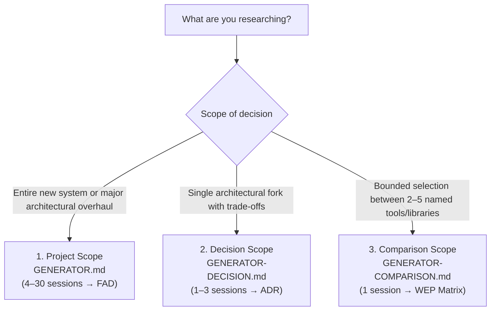
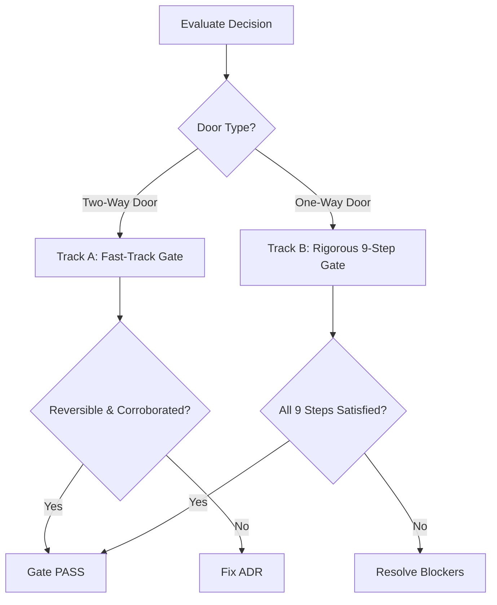

# Manual Workflow Guide
### Complete Guide to Evidence-Grounded Research Without an MCP Server

> **Audience:** Developers and technical architects who want to use Vivechak by copying and pasting prompts into web-based AI interfaces (ChatGPT Deep Research, Gemini Deep Research, Claude 3.7 Sonnet with Search, Perplexity Pro) without running the MCP server or CLI tooling.

---

## Overview

Vivechak is an evidence-grounded research meta-framework. While it ships with a 9-tool Model Context Protocol (MCP) server for automated agent integration, **the methodology itself is entirely interface-agnostic**. You can execute the full research pipeline by hand using web browser AI chats, your favorite text editor, and standard Markdown files.

Whether executed through an automated agent or manually through copy-paste:
- Every factual claim requires an **Evidence Grade (A–E)** with verification metadata.
- Every architectural decision is classified as a **One-Way Door** (irreversible) or **Two-Way Door** (reversible).
- Research sessions are structured with standard **5-Block Prompts** (`BRIEF`, `SCOPE`, `APPROACH`, `DELIVERABLE`, `FORMAT`).
- Decisions are locked only after satisfying formal **Phase 0 Exit Gates**.

### Manual Workflow vs. MCP Server

| Step | Manual Workflow (This Guide) | MCP Server (`vivechak serve`) |
|---|---|---|
| **Pipeline Generation** | Copy generator prompt into AI web chat; paste vision | Agent calls `prepare_generator` or reads generator directly |
| **Workspace Setup** | Manually create folders and copy templates from repo | Agent calls `init` to auto-scaffold workspace and templates |
| **Prompt Delivery** | Copy fenced ```` ```prompt ```` blocks into fresh AI chats | Agent calls `next_session` to retrieve next unblocked prompt |
| **Session Saving** | Copy AI chat response, save to `research/sessions/*.md` | Agent calls `save_session` to validate and persist artifact |
| **Decision Registry** | Update `research/DECISIONS.md` using template format | Agent calls `record_decision` to validate schema and append |
| **Gate Verification** | Audit checklist in `research/templates/PHASE-0-GATE.template.md` | Agent calls `run_gate` or `validate` to verify DAG & evidence |

---

## The Three Scope Levels

Choose the entry point that matches the size and blast radius of your decision space:



---

## 1. Project Scope (Full Pipeline Workflow)

Use this workflow when designing a new product, platform, or large-scale subsystem. The pipeline scales dynamically (Tier 0 to Tier 3) and produces a complete **Founding Architecture Document (FAD)** backed by locked **Architectural Decision Records (ADRs)**.

### Step 1: Get the Generator Prompt

1. Open [`GENERATOR.md`](../GENERATOR.md) in your editor or browser.
2. Locate the prompt inside the outer Markdown code fence (starting at `# GENERATE: Research Pipeline for a Technical Project` and ending before the closing fence and `## Set Up Your Project`).
3. Copy the entire contents of that prompt.

### Step 2: Fill in the `PROJECT VISION` Section

Inside the copied text, locate the `## PROJECT VISION` block:

```markdown
## PROJECT VISION

[PASTE YOUR PROJECT DESCRIPTION HERE]
```

Replace `[PASTE YOUR PROJECT DESCRIPTION HERE]` with an open-ended, natural-language brain dump of your project. Write everything you know—and everything you don't know:
- **What and Why:** Core user problems, value proposition, operational model.
- **Audience & Scale:** Target users, expected concurrency, initial vs. 3-year data volume.
- **Known Constraints:** Budget, deployment model (cloud/on-prem), geography, regulatory exposure (GDPR, HIPAA, PCI, SOC2).
- **Technical Opinions:** Preferred languages, frameworks, or cloud providers you strongly lean towards.
- **Uncertainties:** Anything you are actively wondering about (e.g., datastore selection, state sync, queuing, caching).

#### Concrete Example:

```markdown
## PROJECT VISION

We are building LogMesh, an edge-native log aggregation and anomaly detection
platform for distributed Kubernetes clusters running across multiple cloud providers
and on-prem bare metal. 

Target Users: DevOps and platform engineering teams managing 50–500 microservices
across multi-region clusters.
Workload: Ingesting 20,000–100,000 events/sec per cluster at peak. We need sub-second
query latency for real-time alerting, but must retain compressed cold logs for 90 days.

Constraints:
- Customers will include FinTech and healthcare startups: strict tenant isolation,
  GDPR and SOC2 compliance are required from day one. Log payloads may contain PII.
- Must run as a self-hosted Helm chart or lightweight daemonset on edge clusters,
  with an optional managed central SaaS dashboard.
- Modest infrastructure budget for customers: low memory footprint (<256MB RAM per edge node).

Strong Opinions:
- Edge collector written in Go or Rust for low memory footprint and static binaries.
- Central dashboard in Next.js / TypeScript.

Uncertainties:
- Central analytical datastore: ClickHouse vs. VictoriaLogs vs. OpenSearch vs. DuckDB.
- Transport and streaming: NATS JetStream vs. Apache Kafka vs. Vector pipeline.
- Anomaly detection architecture: In-stream WASM filters vs. central periodic batch models.
```

### Step 3: Send to AI and Extract the Deliverables

1. Open a fresh browser chat with a frontier AI model (**Claude 3.7 Sonnet**, **ChatGPT o3/4o with Web Search**, or **Gemini 2.5 Pro**).
2. Paste the generator prompt containing your filled vision.
3. Submit the prompt.

The AI will output two distinct deliverables:
1. `RESEARCH-PIPELINE.md`: Contains project archetype extraction, 8-dimension complexity score (0–24), execution DAG (Layer 0 through Sink), and copy-paste-ready research prompts for each session.
2. `DECISIONS.md`: The initial decision registry seeded with proposed hypotheses (`D-001`, `D-002`, etc.) in YAML frontmatter format.

> [!TIP]
> **Saving the files:** If the AI delivers them as downloadable Markdown artifacts, download both. If output as inline chat text, copy each document starting from its respective title down to the end of its section, and save them locally.

### Step 4: Set Up the `research/` Directory

In your project repository root, create the `research/` directory structure and copy the 5 operational templates from the Vivechak repository:

```
my-project/
└── research/
    ├── RESEARCH-PIPELINE.md         ← Generated file from Step 3
    ├── DECISIONS.md                 ← Generated file from Step 3
    ├── sessions/                    ← Create this empty directory for session notes
    └── templates/                   ← Copy these 5 templates from vivechak/templates/
        ├── COMPARISON-SESSION.template.md
        ├── CONFLICT-RESOLUTION.template.md
        ├── DECISIONS.template.md
        ├── FOUNDING-ARCHITECTURE.template.md
        └── PHASE-0-GATE.template.md
```

#### Why Copy Templates Locally?
These templates act as strict operational schemas. Having them inside `research/templates/` makes your repository **100% self-contained**. Any collaborator or AI coding agent can run sessions, resolve conflicts, and run gates without needing access to the upstream Vivechak repo.

### Step 5: Execute Research Sessions

Open `research/RESEARCH-PIPELINE.md`. Review the **Execution DAG** and begin with **Layer 0** sessions.

```
                    ┌─────────────────────────┐
                    │ Layer 0: Landscape      │
                    │ T1-01, T1-02 (Parallel) │
                    └───────────┬─────────────┘
                                │
                    ┌───────────▼─────────────┐
                    │ Layer 1: Decisions      │
                    │ T2-01, T2-02 (Informed) │
                    └───────────┬─────────────┘
                                │
                    ┌───────────▼─────────────┐
                    │ Sink: Grand Synthesis   │
                    │ SYN-01 (FAD Blueprint)  │
                    └─────────────────────────┘
```

#### Execution Protocol for Each Session:
1. **Find the Prompt:** In `RESEARCH-PIPELINE.md`, find the session entry (e.g., `### T1-01: Analytical Datastore Landscape`). Look for the prompt enclosed in ```` ```prompt ```` code fences.
2. **Open a FRESH AI Chat:** Never reuse an existing chat thread. Always start a fresh session to eliminate context drift, hallucination accumulation, and confirmation bias.
3. **Enable Deep Research / Web Search:** Ensure your model has active web browsing or deep research capabilities enabled (e.g., Gemini Deep Research, ChatGPT Deep Research, or Claude with Search).
4. **Copy & Paste:** Copy the exact text inside the ```` ```prompt ```` fence and paste it into the fresh chat. Send it.
5. **Inspect the Output:**
   - Verify that factual claims include evidence grades (e.g., `Grade A · corroborated · fresh | fetched`).
   - Check that recommendations are separated from rejected alternatives.
   - Confirm that the top contenders include concrete failure modes and disconfirming evidence.
6. **Save the Artifact:** Copy the full Markdown response and save it directly into `research/sessions/` using the exact filename specified in the session metadata table (e.g., `research/sessions/T1-01-analytical-datastore-landscape.md`).

> [!IMPORTANT]
> **Respecting Dependencies:** Layer 0 sessions are completely unblocked and run in parallel. Layer 1 sessions may depend on Layer 0. If a session specifies `Context: T1-01 (selected datastore)`, copy the 1-2 sentence recommendation from `research/sessions/T1-01-...md` and paste it into the context slot of the downstream prompt.

### Step 6: Record Decisions

As research sessions finish, translate their findings into firm architectural decisions in `research/DECISIONS.md`.

1. Open `research/DECISIONS.md` and find the decision record corresponding to the completed session (e.g., `D-001: Analytical Datastore Selection`).
2. Update the YAML frontmatter:
   - Change `status: proposed` to `status: accepted` (or `rejected`).
   - Fill in `confidence: high | medium | low`.
   - Add references to evidence citations in `evidence_refs: [E-001, E-004]`.
   - Ensure `informed_by_sessions: [T1-01, T2-01]` reflects all relevant sessions.
   - Set a measurable `review_trigger` (e.g., `"Ingestion volume exceeds 150k events/sec or storage costs exceed $2,500/month"`).
   - Set `review_date` (e.g., 6 months from today).
   - If `door_type: one-way`, set `human_reviewed: true` only after a human principal architect reviews the rationale.
3. Fill the body sections according to [`templates/DECISIONS.template.md`](../templates/DECISIONS.template.md):
   - **Context & Problem Statement**
   - **Evaluated Options** (with inline evidence grades)
   - **Decision Outcome & Causal Rationale**
   - **Rejected Alternatives & Tradeoffs**
   - **Failure Modes & Reversal Triggers**

#### Concrete ADR Example:

```markdown
---
id: D-001
title: "Analytical Datastore: ClickHouse vs. VictoriaLogs"
status: accepted
door_type: one-way
date: 2026-09-27
confidence: high
evidence_refs: [E-101, E-104, E-108]
informed_by_sessions: [T1-01]
supersedes: null
superseded_by: null
amends: null
review_trigger: "Edge log retention requirements exceed 180 days or memory per edge container exceeds 350MB"
review_date: 2027-03-27
prediction: "ClickHouse handles 100k events/sec at <150MB RAM on edge with zstd compression ratio > 8x"
tags: [storage, logs, edge]
authored_by: "Principal Architect"
human_reviewed: true
schema_version: "1.1"
---

# D-001: Analytical Datastore: ClickHouse vs. VictoriaLogs

## Context & Problem Statement
LogMesh requires an embedded or lightweight daemonset datastore capable of ingesting
50k–100k events/sec with sub-second analytical queries over a 7-day rolling window on edge nodes.

## Evaluated Options
1. **ClickHouse (Embedded / Single Binary)** — Evidence: E-101 (Grade A · official docs | fetched)
2. **VictoriaLogs** — Evidence: E-104 (Grade B · empirical benchmarks | fetched)
3. **OpenSearch** — Evidence: E-108 (Grade A · official docs | fetched)

## Decision Outcome
**Chosen Option:** ClickHouse (single binary / embedded mode).

### Rationale
ClickHouse provides column-oriented vector execution with demonstrated 10x–14x zstd compression
on structured JSON logs (E-101). VictoriaLogs has a smaller binary size but lacks multi-column
secondary indexing needed for high-cardinality regex filtering on Kubernetes pod namespaces.

## Rejected Alternatives & Tradeoffs
- **OpenSearch:** Rejected due to excessive JVM memory footprint (>2GB heap required), violating
  our strict edge memory constraint of <256MB RAM per node (E-108).
- **VictoriaLogs:** Rejected because custom log queries require pipeline transformation syntax
  unfamiliar to SQL-native DevOps teams, increasing customer adoption friction.

## Failure Modes & Reversal Triggers
- If memory consumption under burst ingestion exceeds 300MB RAM for >10 minutes, trigger evaluation
  of VictoriaLogs or out-of-process central shipping.
- Scheduled review date: 2027-03-27.
```

### Step 7: Handling Conflicts

When two research sessions produce contradictory findings—or when you run the same session across two different models (e.g., Claude recommends Kafka, but ChatGPT Deep Research recommends NATS JetStream):

1. Do not average the results or pick your favorite.
2. Create a new file in `research/sessions/` named `CHK-01-[decision-name]-conflict.md` using [`templates/CONFLICT-RESOLUTION.template.md`](../templates/CONFLICT-RESOLUTION.template.md).
3. **Build the Analysis of Competing Hypotheses (ACH) Matrix:**
   - Place hypotheses as **rows** (Option A, Option B).
   - Place evidence items as **columns** ($E_1, E_2, E_3$).
   - Rate each cell:
     - `CC`: Consistent and Confirmatory
     - `C`: Consistent but not diagnostic
     - `N`: Neutral
     - `I`: Inconsistent (disconfirming)
     - `II`: Strongly Inconsistent
4. **Evaluate Inconsistencies:** The hypothesis with the **fewest inconsistencies** wins.
5. If the decision is a **One-Way Door**, run a 30-minute **Gary Klein Premortem**:
   > *"Assume it is 12 months from now and this decision caused a catastrophic production outage. What caused it?"*
6. Document the resolution and update the corresponding ADR in `research/DECISIONS.md`.

### Step 8: Synthesis (Compiling the FAD)

Once all research sessions are complete and all decisions in `research/DECISIONS.md` are locked:

1. Create `research/FAD.md` (or in project root `FAD.md`) using [`templates/FOUNDING-ARCHITECTURE.template.md`](../templates/FOUNDING-ARCHITECTURE.template.md).
2. **Execute Map-Reduce Synthesis:**
   - **Filter & Group:** Group sessions by architectural domain (Persistence, Transport, Edge Runtime, UI).
   - **Map:** Extract key findings and locked ADR decisions.
   - **Reduce:** Write unified architectural chapters.
3. Fill out the required sections:
   - **1. Executive Summary:** 2–5 paragraph technical synthesis readable by stakeholders.
   - **2. Locked Decision Registry:** Summary table of all D-NNN decisions with evidence citations.
   - **3. Architecture & Primitives (Wardley Mapping):** Clearly distinguish between **Composed** (commodity off-the-shelf: ClickHouse, NATS, Next.js) and **Built** (custom proprietary IP: edge filter engine, anomaly heuristic engine).
   - **4. System Architecture Diagram:** A complete Mermaid diagram showing data flow and network boundaries.
   - **5. Cross-Cutting Concerns:** Security, compliance (GDPR/SOC2), and observability.
   - **6. Risk Register & Reversal Triggers:** Consolidated risks with measurable triggers.
   - **7. Project Structure Specification:** Directory tree, module boundaries, and dependency manifests.
   - **8. Traceability Matrix:** Mapping each FAD section back to session IDs and evidence IDs.
4. Set frontmatter `status: sealed`.

### Step 9: Running the Phase 0 Exit Gate

Before writing a single line of application code, conduct the Phase 0 Gate audit using [`templates/PHASE-0-GATE.template.md`](../templates/PHASE-0-GATE.template.md).

Create `research/PHASE-0-GATE.md` and audit every decision:



#### Track A: Fast-Track Gate (Two-Way Doors)
Check three conditions:
- [x] Logged in ADR with `door_type: two-way`.
- [x] Reversibility confirmed (can be swapped without major refactoring).
- [x] At least one corroborated source supports the choice.

#### Track B: Rigorous 9-Step Gate (One-Way Doors)
Every irreversible architectural pillar must satisfy all 9 criteria:
- **B1. DAG Closure:** All dependent research sessions completed in `status: final`.
- **B2. Contradiction Resolution:** No unresolved conflicting evidence or contested claims.
- **B3. Evidentiary Threshold:** Zero uncorroborated Grade C/D/E claims under pinning pillars; critical claims backed by Grade A or B.
- **B4. Verification Integrity:** 100% of critical citations verified as `fetched` or `cached` (zero `recalled` LLM memory citations).
- **B5. Rejected Alternatives Documented:** Causal, evidence-backed rationale for every rejected option.
- **B6. Decay Triggers Assigned:** Concrete, measurable `review_trigger` condition and date.
- **B7. Premortem Protocol:** Gary Klein 12-month failure exercise completed with top 3 failure modes and mitigations logged.
- **B8. Human Architect Review:** Explicit sign-off by a named human engineer (`human_reviewed: true`).
- **B9. Founding Architecture Document Sealed:** `FAD.md` completed and committed to git.

### Step 10: What "Passing the Gate" Means

When `research/PHASE-0-GATE.md` records an overall **PASS**:
1. **Phase 0 (Research & Architecture) is officially closed.**
2. Commit all artifacts to your git repository (`git add research/ FAD.md && git commit -m "docs: seal Phase 0 research and architecture"`).
3. **Start Coding:** Proceed to repository scaffolding, CI/CD pipeline setup, and feature development in Phase 1.
4. Your `FAD.md` serves as the invariant specification. If an implementation hurdle arises that contradicts the FAD, you do not silently hack around it; you review the decision's reversal trigger and update the ADR.

---

## 2. Decision Scope (Single Decision Workflow)

Use this workflow when you face a single, high-stakes architectural fork in an ongoing project (e.g., *"Should we migrate from REST to gRPC for internal service communications?"*).

### Step 1: Open `GENERATOR-DECISION.md`

Open [`GENERATOR-DECISION.md`](../GENERATOR-DECISION.md) and copy the generator prompt into a fresh AI web chat.

### Step 2: Fill the Context Block

Populate the ```` ```context ```` block with your decision details:

```context
DECISION: Should we use Apache Kafka or NATS JetStream for our telemetry ingest pipeline?
OPTIONS: Apache Kafka, NATS JetStream, AWS Kinesis
CONTEXT: Go-based microservices architecture; 40,000 telemetry msgs/sec; deployed on EKS; small 4-person platform team with zero Kafka operational experience.
STAGE: pre-build
LEANING: NATS JetStream, because of lower operational overhead and native Go integration.
DATE: 2026-09-27
IDS: D-104, S-TELEMETRY
```

### Step 3: Receive Output

The AI will return two ready-to-use files:
1. `D-104-PLAN.md`: Decision profile (Reversibility, Novelty, Blast Radius, Regulatory Exposure), Door classification, and 1 to 3 session prompts (`L` Landscape, `C` Comparison, and `F` Falsification/Premortem).
2. `D-104-telemetry-queue.md`: The proposed ADR skeleton with YAML frontmatter.

### Step 4: Execute Sessions and Lock ADR

1. Run each session prompt in a fresh browser chat with web search enabled.
2. Save session outputs to `research/sessions/D-104-S1-...md`.
3. Update `D-104-telemetry-queue.md` with the winning option, causal trade-offs, evidence grades, and reversal triggers.
4. If classified as a One-Way Door, require human review before marking `status: accepted`.

---

## 3. Comparison Scope (Bounded Options Workflow)

Use this workflow for a focused evaluation between 2 to 5 named tools, libraries, or vendors with known criteria (e.g., comparing CSS frameworks, test runners, or auth providers).

### Step 1: Open `GENERATOR-COMPARISON.md`

Open [`GENERATOR-COMPARISON.md`](../GENERATOR-COMPARISON.md) and copy the text into an AI chat.

### Step 2: Fill the Context Block

```context
OPTIONS: Vitest, Jest, Node Native Test Runner
CRITERIA: ESM compatibility, TypeScript execution speed, watch mode performance, CI memory footprint
CONTEXT: Next.js 15 monorepo; 1,200 unit tests; migrating away from legacy Babel setup.
DATE: 2026-09-27
ID: D-TEST-RUNNER
```

### Step 3: Execute the Generated Research Prompt

The AI returns a `SCOPE CHECK` line and a single 5-block research prompt.
1. Copy the prompt into a fresh AI chat with web search enabled.
2. Submit the prompt.

### Step 4: Save the Output (Done in 1 Session!)

The AI returns a complete **Weighted Evaluation Matrix (WEP)** artifact following [`templates/COMPARISON-SESSION.template.md`](../templates/COMPARISON-SESSION.template.md).

The artifact includes:
- Recommendation isolated from alternatives
- Weighted scoring table (criteria weights summing to 1.0, 1–5 scores with evidence references)
- Sensitivity analysis (testing top criteria weights at $\pm 20\%$)
- Concrete failure modes for top contenders
- Full Sources & Evidence Ledger (Grades A–E)

Save the output to `research/sessions/D-TEST-RUNNER-cmp-test-runner.md`. No full ADR or FAD is required.

---

## Practical Tips & Troubleshooting

### 1. Which AI Models Work Best?

For best results, select models with deep research capabilities and fresh search indices:

| Model / Service | Ideal For | Notes |
|---|---|---|
| **Gemini 2.5 Pro / Deep Research** | Deep multi-source web investigations, benchmark retrieval | Exceptional at crawling official documentation and RFCs |
| **ChatGPT o3 / Deep Research** | Complex DAG generation, architectural trade-offs, logic | Strong causal reasoning for ADRs and ACH matrices |
| **Claude 3.7 Sonnet (with Search)** | Prompt generation, FAD synthesis, crisp technical writing | Produces clean Markdown with strict adherence to templates |
| **Perplexity Pro** | Fast empirical verification, gathering peer postmortems | Excellent citation cards for building Evidence Ledgers |

> [!WARNING]
> **Avoid Standard Unassisted Chat:** Never run research sessions with offline models or models with browsing disabled. LLM memory recall is capped at **Grade D** under Vivechak methodology. One-Way Doors cannot be locked on Grade D evidence.

### 2. Handling Sessions with Poor or Vague Output

If a session produces generic summaries, hallucinated benchmarks, or lacks evidence grades:
1. **Never argue with the AI in a long thread.** Model adherence degrades significantly in long conversational turns.
2. **Re-anchor with the 5-Block structure:** Check if the prompt lost its `DELIVERABLE` or `FORMAT` block.
3. **Split the session:** If an AI produces shallow findings, the scope is likely too broad. Split it into two targeted sub-sessions (e.g., split `T1-01: Storage & Caching` into `T1-01A: Primary Datastore` and `T1-01B: Distributed Caching`).
4. **Try an alternative engine:** Run the exact same prompt in another frontier model. Comparing outputs frequently reveals where one model took lazy shortcuts.

### 3. When to Use Conflict Resolution

Do not trigger a full ACH conflict resolution for minor aesthetic differences or trivial syntax preferences. Trigger [`templates/CONFLICT-RESOLUTION.template.md`](../templates/CONFLICT-RESOLUTION.template.md) when:
- Two sessions recommend fundamentally incompatible architectures (e.g., Event Sourcing vs. CRUD).
- Two models dispute a core empirical benchmark or concurrency limit.
- A recommended tool has severe documented production failure modes discovered in recent postmortems.

### 4. Parallel Execution of Sessions

- **Browser Tab Farm:** You can open 5 browser tabs simultaneously and run all Layer 0 sessions in parallel across different tabs or AI models.
- **Model Triangulation:** For critical One-Way Doors (e.g., primary datastore or multi-tenant security boundary), run the exact same session prompt through **both** Claude 3.7 Sonnet and ChatGPT Deep Research. Compare their Evidence Ledgers to spot vendor bias or stale documentation.

### 5. Transitioning to the MCP Server Later

If you start your project using this manual workflow and later decide to install the Vivechak MCP server:
- Your workspace is **100% compatible**.
- Run `vivechak doctor` in your terminal: it will validate your existing `research/` folder, check frontmatter schemas, and verify DAG integrity.
- You can mix and match: use the CLI/MCP server for status checks and validation, while continuing to run deep research sessions in your browser.
