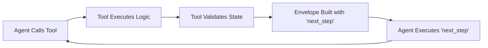
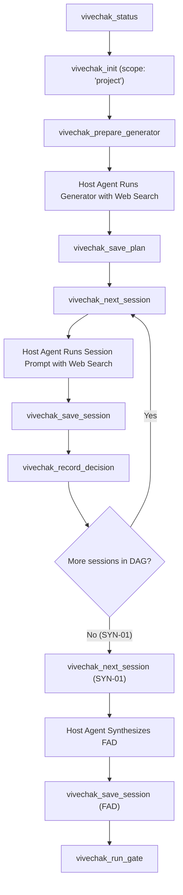
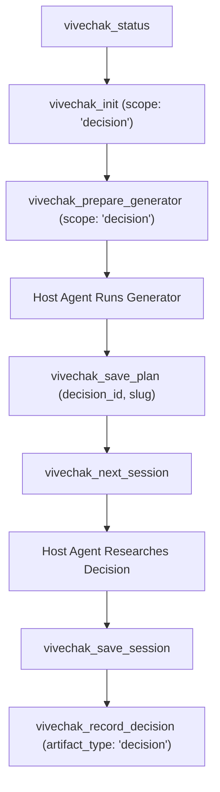
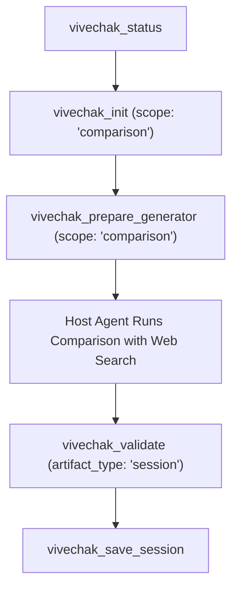

# MCP Tools Reference

> **Last verified against code:** 2026-09-28 (v0.1.0)
> Tool schemas and behaviors described here should match `internal/mcp/server.go`. If you find discrepancies, please file an issue.

The Model Context Protocol (MCP) server for [Vivechak](../README.md) exposes 9 specialized tools designed to run evidence-grounded research pipelines directly inside any MCP-compatible AI host, agent runtime, or IDE.

Vivechak supports two execution models:
1. **MCP Server Workflow**: Autonomous or semi-autonomous execution where the host agent calls MCP tools to prepare prompts, manage DAG session progression, validate outputs, record ADRs, and verify Phase 0 exit gates.
2. **Manual Workflow**: Copying static generator prompts ([`GENERATOR.md`](../GENERATOR.md), [`GENERATOR-DECISION.md`](../GENERATOR-DECISION.md), [`GENERATOR-COMPARISON.md`](../GENERATOR-COMPARISON.md)) into browser-based AI chats and tracking markdown deliverables by hand.

---

## Architecture & Concepts

### Standardized Response Envelope

Every Vivechak tool returns a unified JSON envelope defined by [`Envelope`](../internal/mcp/envelope.go). The envelope standardizes execution status, payloads, advisory warnings, and procedural next steps:

```json
{
  "success": true,
  "message": "Session R-01 saved as valid (0 warnings, 0 errors)",
  "data": { ... },
  "warnings": [],
  "next_step": "Run vivechak_next_session to get the next research session prompt.",
  "meta": {
    "api": 1,
    "tool": "vivechak_save_session",
    "truncated": false
  }
}
```

#### Envelope Field Specification

| Field | Type | Description |
|---|---|---|
| `success` | `boolean` | Indicates whether the tool operation completed without unhandled fatal errors. |
| `message` | `string` | Human-readable operational summary describing the outcome. |
| `data` | `object` | Tool-specific payload (varies by tool; omitted on certain error states). |
| `warnings` | `string[]` | Non-fatal advisory issues (e.g., missing evidence grades, oversized prompts, draft saves). |
| `next_step` | `string` | Actionable instructions prescribing what the AI agent should do next. |
| `meta.api` | `integer` | Envelope schema version (currently `1`). |
| `meta.tool` | `string` | Name of the tool that generated the response. |
| `meta.truncated` | `boolean` | Set to `true` if large payloads (e.g., prompts > 10,000 tokens) were truncated under default settings. |

#### Dual-Channel Delivery
Per [`Envelope.ToResult()`](../internal/mcp/envelope.go), the server delivers responses simultaneously via:
1. **`StructuredContent`**: Native MCP structured JSON payload for clients supporting JSON object inspection.
2. **`TextContent`**: Pretty-printed JSON string fallback in `Content` to prevent client parsing errors (e.g., Cursor drops structured-only responses; Gemini CLI rejects missing structured content).

#### Tool Error Handling
Per the MCP specification, runtime operational errors (such as missing required fields, invalid scopes, or uninitialized workspaces) are returned as tool execution results with `isError: true` via [`ErrorResult()`](../internal/mcp/envelope.go), preserving the envelope structure and providing remediation instructions in `next_step` instead of crashing the JSON-RPC connection.

---

### The Guided Worker Pattern

Vivechak tools do not just return raw data; they implement the **Guided Worker pattern**. Every response contains an explicit, deterministic `next_step` string that directs the host agent to the next logical action in the pipeline.



This prevents AI agents from getting stuck, drifting into unapproved tasks, or losing track of DAG dependencies across multi-turn context windows.

---

### Workspace Resolution Chain

Every tool that interacts with the filesystem resolves the workspace root directory using a 4-step hierarchy via [`ResolveWorkspace()`](../internal/core/workspace.go):

1. **Explicit argument**: `project_root` parameter passed directly to the tool call.
2. **Environment variable**: `VIVECHAK_PROJECT_ROOT` environment variable if set.
3. **Directory discovery**: Traversing upward from the current working directory (`CWD`) searching for an existing `research/` directory.
4. **Resolution Error**: If none succeed, the tool returns an error instructing the user to run `vivechak_init`.

---

## Tool Call Sequences by Scope Level

Vivechak operates across three distinct research scope levels defined in [`Scope`](../internal/core/scope.go):

### 1. Project Scope (Full Research Pipeline &rarr; FAD)
*Duration:* 4–30 sessions.  
*Outcome:* Full `RESEARCH-PIPELINE.md`, individual session outputs, architectural decisions, and a final Founding Architecture Document (`FAD.md`).



**Step-by-step workflow:**
1. Call `vivechak_status` to orient and verify workspace presence.
2. Call `vivechak_init` with `scope: "project"` to scaffold `research/`, `research/sessions/`, and copy template files.
3. Call `vivechak_prepare_generator` with `scope: "project"` and your comprehensive project description in `context`.
4. Run the returned generator prompt in a research session with live web search enabled.
5. Save the generated pipeline using `vivechak_save_plan`.
6. Loop through sessions:
   - Call `vivechak_next_session` to receive the next dependency-cleared research prompt with upstream context injected.
   - Run the session prompt with web search enabled.
   - Save the raw session report using `vivechak_save_session`.
   - Record any Architectural Decision Records (ADRs) produced in that session using `vivechak_record_decision`.
7. When all research tracks finish, call `vivechak_next_session` for `SYN-01` (Synthesis). All prior session outputs are automatically aggregated into the prompt.
8. Persist the generated `research/FAD.md` using `vivechak_save_session` (or `vivechak_record_decision`).
9. Call `vivechak_run_gate` to perform automated verification of the Phase 0 Exit Gate (Track A structural completeness and Track B mechanical quality).

*Manual Alternative:* Copy [`GENERATOR.md`](../GENERATOR.md), replace the placeholder with your project vision, run it in an AI web session, and manually save outputs to `research/RESEARCH-PIPELINE.md`.

---

### 2. Decision Scope (Single Architectural Decision &rarr; ADR)
*Duration:* 1–3 sessions.  
*Outcome:* Bounded decision plan and formal ADR (`D-xxx-decision.md`).



**Step-by-step workflow:**
1. Call `vivechak_status` to inspect workspace.
2. Call `vivechak_init` with `scope: "decision"`.
3. Call `vivechak_prepare_generator` with `scope: "decision"`, passing the architectural dilemma in `context`.
4. Execute the prompt in a web research session.
5. Call `vivechak_save_plan` with `scope: "decision"`, `decision_id: "D-015"`, `slug: "cache-layer"`, and the generated plan in `content`.
6. Execute research sessions via `vivechak_next_session` and `vivechak_save_session`.
7. Persist the resulting ADR via `vivechak_record_decision` with `artifact_type: "decision"` and `decision_id: "D-015"`.

*Manual Alternative:* Copy [`GENERATOR-DECISION.md`](../GENERATOR-DECISION.md) into an AI session, inject context, and manually write ADRs to `research/D-xxx-decision.md`.

---

### 3. Comparison Scope (Bounded Options Comparison &rarr; WEP Matrix)
*Duration:* 1 session.  
*Outcome:* Weighted Evaluation Matrix (WEP) comparing 2–4 concrete technologies or architectures.



**Step-by-step workflow:**
1. Call `vivechak_init` with `scope: "comparison"`.
2. Call `vivechak_prepare_generator` with `scope: "comparison"`, specifying the competing options and evaluation criteria in `context`.
3. Run the returned comparison prompt with web search.
4. (Optional) Run `vivechak_validate` to verify frontmatter and evidence grades.
5. Call `vivechak_save_session` or `vivechak_save_plan` with `scope: "comparison"` to persist the comparison document.

*Manual Alternative:* Copy [`GENERATOR-COMPARISON.md`](../GENERATOR-COMPARISON.md), specify options, and paste output directly into `research/COMPARISON.md`.

---

## Tools Reference

### 1. `vivechak_init`
**Title:** Initialize Vivechak Workspace  
**Annotations:** Read-Only: `false` | Idempotent: `true` | Destructive: `false` | Open-World: `false`

#### Description
Create a Vivechak research workspace in the target directory.

#### What It Does
Initializes a new Vivechak research workspace by creating the `research/`, `research/sessions/`, and `research/templates/` directories, then copies the 5 embedded markdown template assets ([`DECISIONS.template.md`](../templates/DECISIONS.template.md), [`CONFLICT-RESOLUTION.template.md`](../templates/CONFLICT-RESOLUTION.template.md), [`COMPARISON-SESSION.template.md`](../templates/COMPARISON-SESSION.template.md), [`FOUNDING-ARCHITECTURE.template.md`](../templates/FOUNDING-ARCHITECTURE.template.md), [`PHASE-0-GATE.template.md`](../templates/PHASE-0-GATE.template.md)). The tool is strictly idempotent: if called on an already initialized workspace, it reports the existing state without overwriting files.

#### Input Parameters
Defined in [`InitInput`](../internal/mcp/tool_init.go):

| Parameter | Type | Required | Description |
|---|---|---|---|
| `project_root` | `string` | Optional | Workspace root path (optional; uses resolution chain if omitted). |
| `scope` | `string` | Optional | Research scope: `project` \| `decision` \| `comparison` (default: `project`). |

#### Response (`data` field)
When initializing a new workspace:
- `workspace_root` (`string`): Absolute filesystem path to the workspace root.
- `scope` (`string`): Selected research scope (`project`, `decision`, or `comparison`).
- `templates_copied` (`string[]`): Names of the templates written to `research/templates/`.
- `directories_created` (`string[]`): Directories created on disk.

When called on an existing workspace, returns [`WorkspaceInfo`](../internal/core/workspace.go) (`root`, `initialized`, `has_pipeline`, `has_decisions`, `session_count`, `template_count`, `scope`).

#### Example
**Request:**
```json
{
  "project_root": "d:/dev/pro/my-cloud-app",
  "scope": "project"
}
```

**Response:**
```json
{
  "success": true,
  "message": "Initialized project workspace at d:/dev/pro/my-cloud-app (5 templates copied)",
  "data": {
    "workspace_root": "d:/dev/pro/my-cloud-app",
    "scope": "project",
    "templates_copied": [
      "DECISIONS.template.md",
      "CONFLICT-RESOLUTION.template.md",
      "COMPARISON-SESSION.template.md",
      "FOUNDING-ARCHITECTURE.template.md",
      "PHASE-0-GATE.template.md"
    ],
    "directories_created": [
      "research",
      "research/sessions",
      "research/templates"
    ]
  },
  "next_step": "Run vivechak_prepare_generator with your project description to get the generator prompt. Execute that prompt in a session with web search enabled.",
  "meta": {
    "api": 1,
    "tool": "vivechak_init"
  }
}
```

#### Common Warnings
- `W-TEMPLATE-MISSING: <name> not found in embedded assets`: Triggered if a specific template could not be loaded from internal binary assets.

---

### 2. `vivechak_prepare_generator`
**Title:** Prepare Generator Prompt  
**Annotations:** Read-Only: `true` | Idempotent: `true` | Destructive: `false` | Open-World: `false`

#### Description
Return the appropriate generator prompt with context slots filled in, ready for execution.

#### What It Does
Loads the embedded generator template corresponding to the requested scope ([`GENERATOR.md`](../GENERATOR.md) for `project`, [`GENERATOR-DECISION.md`](../GENERATOR-DECISION.md) for `decision`, or [`GENERATOR-COMPARISON.md`](../GENERATOR-COMPARISON.md) for `comparison`) and injects the caller's context into the `[PASTE YOUR PROJECT DESCRIPTION HERE]` placeholder. It computes character and token count estimates and returns the fully assembled prompt ready for execution in an AI browser or search session. This tool is read-only and does not write to disk.

#### Input Parameters
Defined in [`PrepareGeneratorInput`](../internal/mcp/tool_prepare_generator.go):

| Parameter | Type | Required | Description |
|---|---|---|---|
| `project_root` | `string` | Optional | Workspace root path (optional; uses resolution chain if omitted; used to auto-detect workspace scope if scope is omitted). |
| `scope` | `string` | Optional | Research scope: `project` \| `decision` \| `comparison` (default: `project`). |
| `context` | `string` | **Required** | Project vision, decision context, or comparison context to inject into the generator prompt. |

#### Response (`data` field)
- `scope` (`string`): Resolved scope (`project`, `decision`, or `comparison`).
- `generator_file` (`string`): Underlying generator template name used.
- `prompt` (`string`): The complete, injected prompt text.
- `char_count` (`integer`): Character count of the prepared prompt.
- `approx_tokens` (`integer`): Approximate token count (`char_count / 4`).

#### Example
**Request:**
```json
{
  "scope": "decision",
  "context": "We need to choose between Redis and Apache Cassandra for distributed session caching supporting 50k req/sec with sub-5ms read latency."
}
```

**Response:**
```json
{
  "success": true,
  "message": "Prepared decision generator prompt (8240 chars, ~2060 tokens)",
  "data": {
    "scope": "decision",
    "generator_file": "GENERATOR-DECISION.md",
    "prompt": "# Vivechak Decision Generator\n\n## Context\n\nWe need to choose between Redis and Apache Cassandra for distributed session caching supporting 50k req/sec with sub-5ms read latency.\n...",
    "char_count": 8240,
    "approx_tokens": 2060
  },
  "next_step": "Execute this prompt in a fresh AI session with web search enabled. Save the output using vivechak_save_plan.",
  "meta": {
    "api": 1,
    "tool": "vivechak_prepare_generator"
  }
}
```

#### Common Warnings
- Returns an error (`isError: true`) if `context` is empty or whitespace-only, or if `scope` is not one of `project`, `decision`, or `comparison`.

---

### 3. `vivechak_save_plan`
**Title:** Save Research Plan  
**Annotations:** Read-Only: `false` | Idempotent: `true` | Destructive: `false` | Open-World: `false`

#### Description
Validate and persist an agent-generated research plan.

#### What It Does
Persists the research pipeline or session plan generated by the AI model. For `project` scope, it saves the Directed Acyclic Graph (DAG) specification to `research/RESEARCH-PIPELINE.md` and writes `decisions_content` (or initializes the registry) to `research/DECISIONS.md`. For `decision` scope, it writes `research/[decision_id]-plan.md` and writes `decisions_content` to `research/[decision_id]-[slug].md` (the proposed ADR). For `comparison` scope, it writes `research/[decision_id]-comparison.md` (or `research/[decision_id]-cmp-[slug].md`). All writes use advisory file locking with a 5-second timeout and atomic temporary file renames to prevent partial corruption.

#### Input Parameters
Defined in [`SavePlanInput`](../internal/mcp/tool_save_plan.go):

| Parameter | Type | Required | Description |
|---|---|---|---|
| `project_root` | `string` | Optional | Workspace root path. |
| `scope` | `string` | Optional | Research scope: `project` \| `decision` \| `comparison` (auto-detected from workspace if omitted). |
| `content` | `string` | **Required** | The generated plan content (Markdown). |
| `decisions_content` | `string` | Optional | Initial decision registry content (project) or proposed ADR content (decision). |
| `decision_id` | `string` | Optional | Decision identifier for decision/comparison scope (e.g., `D-015`). |
| `slug` | `string` | Optional | URL-safe slug for the decision (e.g., `database-selection`). |

#### Response (`data` field)
- `workspace_root` (`string`): Path to workspace root.
- `scope` (`string`): Research scope of the saved plan.
- `saved_files` (`string[]`): Array of relative paths written (e.g., `["research/RESEARCH-PIPELINE.md", "research/DECISIONS.md"]`).

#### Example
**Request:**
```json
{
  "scope": "project",
  "content": "# Research Pipeline\n\n```mermaid\ngraph TD\n  T1-01[Storage Engine] --> T2-01[Query API]\n```\n\n## Session T1-01: Storage Engine Selection\n- **Door Type**: one-way\n- **Output**: research/sessions/T1-01.md\n..."
}
```

**Response:**
```json
{
  "success": true,
  "message": "Saved project plan (1 files) at d:/dev/pro/my-cloud-app",
  "data": {
    "workspace_root": "d:/dev/pro/my-cloud-app",
    "scope": "project",
    "saved_files": [
      "research/RESEARCH-PIPELINE.md"
    ]
  },
  "next_step": "Run vivechak_next_session to get the first research session prompt. Execute it in a fresh AI session with web search, then save the output with vivechak_save_session.",
  "meta": {
    "api": 1,
    "tool": "vivechak_save_plan"
  }
}
```

#### Common Warnings
- Returns an error if `decision_id` is omitted when `scope` is `decision` or `comparison`.
- Returns an error if the file lock cannot be acquired within 5 seconds (`"could not acquire lock: another process may be writing"`).

---

### 4. `vivechak_status`
**Title:** Vivechak Status  
**Annotations:** Read-Only: `true` | Idempotent: `true` | Destructive: `false` | Open-World: `false`

#### Description
Scan workspace and report research progress.

#### What It Does
Inspects the current workspace filesystem to determine whether Vivechak is initialized, whether `RESEARCH-PIPELINE.md` and `DECISIONS.md` exist, the number of completed sessions in `research/sessions/`, the number of installed templates, and the active scope. If no workspace is located, it returns cleanly with `initialized: false` and guides the host agent to initialize one.

#### Input Parameters
Defined in [`StatusInput`](../internal/mcp/tool_status.go):

| Parameter | Type | Required | Description |
|---|---|---|---|
| `project_root` | `string` | Optional | Workspace root path. |

#### Response (`data` field)
When initialized ([`WorkspaceInfo`](../internal/core/workspace.go)):
- `root` (`string`): Absolute path to the workspace root.
- `initialized` (`boolean`): `true`.
- `has_pipeline` (`boolean`): `true` if `research/RESEARCH-PIPELINE.md` exists.
- `has_decisions` (`boolean`): `true` if `research/DECISIONS.md` exists.
- `session_count` (`integer`): Count of `.md` session reports inside `research/sessions/`.
- `template_count` (`integer`): Count of template files in `research/templates/`.
- `scope` (`string`): Inferred scope (e.g., `project`).

When uninitialized:
- `initialized` (`boolean`): `false`.
- `error` (`string`): Error message explaining resolution failure.

#### Example
**Request:**
```json
{
  "project_root": "d:/dev/pro/my-cloud-app"
}
```

**Response:**
```json
{
  "success": true,
  "message": "Workspace at d:/dev/pro/my-cloud-app: 2 sessions, 5 templates",
  "data": {
    "root": "d:/dev/pro/my-cloud-app",
    "initialized": true,
    "has_pipeline": true,
    "has_decisions": true,
    "session_count": 2,
    "template_count": 5,
    "scope": "project"
  },
  "next_step": "Run vivechak_next_session for the next actionable session, or vivechak_record_decision to record decisions from completed sessions.",
  "meta": {
    "api": 1,
    "tool": "vivechak_status"
  }
}
```

#### Common Warnings
- None. Returns informative uninitialized status when called outside a valid workspace.

---

### 5. `vivechak_next_session`
**Title:** Get Next Session  
**Annotations:** Read-Only: `true` | Idempotent: `true` | Destructive: `false` | Open-World: `false`

#### Description
Return the next actionable research session prompt with upstream findings injected into context slots.

#### What It Does
Parses `research/RESEARCH-PIPELINE.md` into an in-memory DAG and scans `research/sessions/` for completed files. It identifies unblocked sessions whose upstream dependencies are satisfied, extracts findings from completed ancestor sessions, and injects those findings directly into the next session prompt's context slots. For synthesis sessions (`SYN-01`), it automatically aggregates findings across all completed sessions in the pipeline.

#### Input Parameters
Defined in [`NextSessionInput`](../internal/mcp/tool_next_session.go):

| Parameter | Type | Required | Description |
|---|---|---|---|
| `project_root` | `string` | Optional | Workspace root path. |
| `session_id` | `string` | Optional | Specific session ID to retrieve (optional; returns next actionable if omitted). |
| `verbose` | `boolean` | Optional | If `true`, include full upstream findings without truncating prompts over 10K tokens. |

#### Response (`data` field)
When an actionable session is ready:
- `session_id` (`string`): Session identifier (e.g., `T1-01`).
- `title` (`string`): Session title.
- `layer` (`integer`): DAG execution layer (0-indexed or 1-indexed).
- `door_type` (`string`): Decision irreversibility classification (`one-way` or `two-way`).
- `decision_ref` (`string`): Associated ADR ID (e.g., `D-001`).
- `dependencies` (`string[]`): List of upstream session IDs.
- `output_file` (`string`): Expected output path (`research/sessions/T1-01.md`).
- `total_sessions` (`integer`): Total number of sessions in the pipeline.
- `completed_sessions` (`integer`): Number of completed sessions.
- `already_completed` (`boolean`): Whether this specific session was already run.
- `prompt` (`string`): Assembled 5-block prompt with upstream findings injected.
- `prompt_char_count` (`integer`): Character count.
- `prompt_approx_tokens` (`integer`): Estimated token count.
- `other_ready_sessions` (`string[]`, optional): Other unblocked sessions that can execute in parallel.

When all sessions are finished:
- `all_complete` (`boolean`): `true`.
- `total_sessions` / `completed_sessions` (`integer`).

When sessions remain but are blocked by incomplete dependencies:
- `blocked_sessions` (`object[]`): List of remaining sessions and their unsatisfied dependencies (`[{"session_id": "T2-01", "blocked_by": ["T1-01"]}]`).

#### Example
**Request:**
```json
{
  "project_root": "d:/dev/pro/my-cloud-app"
}
```

**Response:**
```json
{
  "success": true,
  "message": "Session T1-02: Message Queue Selection (1/6 complete)",
  "data": {
    "session_id": "T1-02",
    "title": "Message Queue Selection",
    "layer": 1,
    "door_type": "one-way",
    "decision_ref": "D-002",
    "dependencies": ["T0-01"],
    "output_file": "research/sessions/T1-02.md",
    "total_sessions": 6,
    "completed_sessions": 1,
    "already_completed": false,
    "prompt": "## BRIEF\nEvaluate message brokers (Kafka, RabbitMQ, NATS) for telemetry ingestion...\n\n## CONTEXT FROM UPSTREAM SESSIONS\n### T0-01 Architecture Constraints\n- Target throughput: 100k events/sec\n- Retention required: 7 days\n\n## DELIVERABLE\nProduce session report with evidence grades.",
    "prompt_char_count": 2840,
    "prompt_approx_tokens": 710,
    "other_ready_sessions": ["T1-03"]
  },
  "next_step": "Execute the prompt for session T1-02 in a fresh AI session with web search enabled. Save the output with vivechak_save_session using session_id='T1-02'. Also ready: T1-03 (these can run in parallel).",
  "meta": {
    "api": 1,
    "tool": "vivechak_next_session",
    "truncated": false
  }
}
```

#### Common Warnings
- `W-OUTPUT-SIZE: Prompt exceeds 10K tokens and was truncated. Use verbose=true for full prompt.`: Fired when upstream injected context causes the prompt to exceed 10,000 tokens and `verbose` is `false`.
- `W-INJECTION-SIZE: Injected upstream context is N KB (exceeds 100 KB threshold). Consider consolidating upstream sessions.`: Fired when aggregate upstream findings injected into context slots exceed 100 KB.
- `W-INJECT-FAILED: context injection failed for <session_id>: <error> — using raw prompt without upstream findings`: Fired if upstream context injection encounters a file read or parsing error.

---

### 6. `vivechak_save_session`
**Title:** Save Session Output  
**Annotations:** Read-Only: `false` | Idempotent: `true` | Destructive: `false` | Open-World: `false`

#### Description
Validate and persist a completed research session output.

#### What It Does
Validates the research session Markdown output against the 4-level validation ladder defined in [`ValidateSession()`](../internal/core/validate.go) and saves it to `research/sessions/<session_id>.md`. The tool checks YAML frontmatter syntax, required metadata fields (`session_id`, `title`, `date`), non-empty body, and inline evidence grades (`A-E`). If blocking issues (Level 2) are detected, the file is safely saved as a draft with status `draft`.

#### Input Parameters
Defined in [`SaveSessionInput`](../internal/mcp/tool_save_session.go):

| Parameter | Type | Required | Description |
|---|---|---|---|
| `project_root` | `string` | Optional | Workspace root path. |
| `session_id` | `string` | **Required** | Session identifier (e.g., `R-01`, `T1-01`, `SYN-01`). |
| `content` | `string` | **Required** | Completed session output (Markdown with YAML frontmatter). |

#### Response (`data` field)
- `workspace_root` (`string`): Workspace path.
- `session_id` (`string`): Session ID.
- `file_path` (`string`): Relative output file path (`research/sessions/<session_id>.md`).
- `status` (`string`): Validation status: `valid`, `valid-with-warnings`, or `draft`.
- `validation_passed` (`boolean`): Whether validation passed without blocking Level 2 issues (`true` if valid or valid-with-warnings, `false` if draft).
- `validation` ([`ValidationResult`](../internal/core/validate.go)): Object containing `status` and `issues` array.

#### Example
**Request:**
```json
{
  "session_id": "T1-01",
  "content": "---\nsession_id: T1-01\ntitle: Distributed Cache Engine\ndate: 2026-09-27\nstatus: complete\n---\n\n## Findings\nRedis 7.2 demonstrates 110k ops/sec with sub-millisecond p99 latency A (official Redis benchmarks 2024). DragonFly shows 2.5x higher throughput B (Dragonfly technical whitepaper)."
}
```

**Response:**
```json
{
  "success": true,
  "message": "Session T1-01 saved as valid (0 warnings, 0 errors)",
  "data": {
    "workspace_root": "d:/dev/pro/my-cloud-app",
    "session_id": "T1-01",
    "file_path": "research/sessions/T1-01.md",
    "status": "valid",
    "validation_passed": true,
    "validation": {
      "status": "valid"
    }
  },
  "next_step": "Run vivechak_next_session for the next session, or vivechak_record_decision to record decisions from this session's findings.",
  "meta": {
    "api": 1,
    "tool": "vivechak_save_session"
  }
}
```

#### Common Warnings
- `[L3-WARN] W-NO-EVIDENCE-GRADES: No inline evidence grades found (expected A-E grades per P3) (fix: Add evidence grades like 'A (official docs)' or 'B (peer-reviewed study)' to claims)`
- `[L2-BLOCK] V-MISSING-FIELD: Required frontmatter field "date" is missing (fix: Add 'date: <value>' to the frontmatter block)`
- `[L2-BLOCK] V-MISSING-FRONTMATTER: Session output has no YAML frontmatter`
- `[L2-BLOCK] V-INVALID-FRONTMATTER: YAML frontmatter is malformed: unclosed frontmatter block (fix: Ensure opening '---' has a matching closing '---' line)`

---

### 7. `vivechak_record_decision`
**Title:** Record Decision  
**Annotations:** Read-Only: `false` | Idempotent: `true` | Destructive: `false` | Open-World: `false`

#### Description
Save an Architectural Decision Record (ADR) or conflict resolution.

#### What It Does
Validates and persists an ADR or Analysis of Competing Hypotheses (ACH) conflict resolution to `research/<decision_id>-decision.md` or `research/<decision_id>-conflict-resolution.md`. Evaluates required frontmatter (`decision_id`, `title`, `status`), verifies presence of `door_type` (`one-way` or `two-way`), and checks that the document body is substantive (>100 characters) with context, consequences, and evidence references.

#### Input Parameters
Defined in [`RecordDecisionInput`](../internal/mcp/tool_record_decision.go):

| Parameter | Type | Required | Description |
|---|---|---|---|
| `project_root` | `string` | Optional | Workspace root path. |
| `artifact_type` | `string` | **Required** | Type of artifact: `decision` \| `conflict-resolution`. |
| `decision_id` | `string` | **Required** | Decision identifier (e.g., `D-001`, `D-015`). |
| `content` | `string` | **Required** | Decision record or conflict resolution content (Markdown with YAML frontmatter). |

#### Response (`data` field)
- `workspace_root` (`string`): Workspace path.
- `decision_id` (`string`): Decision ID.
- `artifact_type` (`string`): `decision` or `conflict-resolution`.
- `file_path` (`string`): Path to written document.
- `status` (`string`): Validation status (`valid`, `valid-with-warnings`, or `draft`).
- `validation` ([`ValidationResult`](../internal/core/validate.go)): Detailed validation issues list.

#### Example
**Request:**
```json
{
  "artifact_type": "decision",
  "decision_id": "D-001",
  "content": "---\ndecision_id: D-001\ntitle: Adopt Redis Cluster for Session Persistence\nstatus: accepted\ndoor_type: one-way\n---\n\n## Context\nOur microservices require sub-5ms session access with multi-region failover.\n\n## Decision\nWe will deploy Redis Cluster across 3 availability zones.\n\n## Consequences\nHigh operational simplicity, but cross-region synchronization requires custom tooling."
}
```

**Response:**
```json
{
  "success": true,
  "message": "Saved decision D-001 as valid",
  "data": {
    "workspace_root": "d:/dev/pro/my-cloud-app",
    "decision_id": "D-001",
    "artifact_type": "decision",
    "file_path": "research/D-001-decision.md",
    "status": "valid",
    "validation": {
      "status": "valid"
    }
  },
  "next_step": "Run vivechak_next_session for the next research session, or vivechak_status to review overall progress.",
  "meta": {
    "api": 1,
    "tool": "vivechak_record_decision"
  }
}
```

#### Common Warnings
- `[L3-WARN] W-MISSING-DOOR-TYPE: Decision lacks door_type classification (fix: Add 'door_type: one-way' or 'door_type: two-way' per P2)`
- `[L3-WARN] W-SHORT-DECISION: Decision body is very short — may lack sufficient context (fix: Include Context, Decision, Consequences, and Evidence sections)`
- `[L2-BLOCK] V-MISSING-FIELD: Required field "status" missing from decision`

---

### 8. `vivechak_validate`
**Title:** Validate Artifact  
**Annotations:** Read-Only: `true` | Idempotent: `true` | Destructive: `false` | Open-World: `false`

#### Description
Dry-run validation on any Vivechak artifact (session output, plan, decision record, or FAD).

#### What It Does
Executes non-destructive dry-run validation against session reports, architectural decision records, research plans, or Founding Architecture Documents without modifying files on disk. Returns structural defects (L2 blocking), quality warnings (L3 advisory), and auto-construct recommendations (L1) with concrete hints on how to remediate each finding.

#### Input Parameters
Defined in [`ValidateInput`](../internal/mcp/tool_validate.go):

| Parameter | Type | Required | Description |
|---|---|---|---|
| `project_root` | `string` | Optional | Workspace root path. |
| `artifact_type` | `string` | **Required** | What to validate: `session` \| `decision` \| `conflict-resolution` \| `plan` \| `fad`. |
| `content` | `string` | **Required** | Content to validate (Markdown). |

#### Response (`data` field)
- `artifact_type` (`string`): Artifact type evaluated.
- `status` (`string`): Overall status (`valid`, `valid-with-warnings`, `draft`, or `invalid`).
- `error_count` (`integer`): Count of blocking L2 errors.
- `warning_count` (`integer`): Count of non-blocking L3 warnings.
- `validation` ([`ValidationResult`](../internal/core/validate.go)): Detailed issues list containing `level`, `code`, `message`, `field`, and `fix_hint`.

#### Example
**Request:**
```json
{
  "artifact_type": "session",
  "content": "---\nsession_id: T1-01\ntitle: Storage Engine Evaluation\n---\n\nWe evaluated BadgerDB and RocksDB. BadgerDB is faster on SSDs."
}
```

**Response:**
```json
{
  "success": true,
  "message": "Validation complete: draft (2 issues)",
  "data": {
    "artifact_type": "session",
    "status": "draft",
    "error_count": 1,
    "warning_count": 1,
    "validation": {
      "status": "draft",
      "issues": [
        {
          "level": 2,
          "code": "V-MISSING-FIELD",
          "message": "Required frontmatter field \"date\" is missing",
          "field": "date",
          "fix_hint": "Add 'date: <value>' to the frontmatter block"
        },
        {
          "level": 3,
          "code": "W-NO-EVIDENCE-GRADES",
          "message": "No inline evidence grades found (expected A-E grades per P3)",
          "fix_hint": "Add evidence grades like 'A (official docs)' or 'B (peer-reviewed study)' to claims"
        }
      ]
    }
  },
  "warnings": [
    "[L2-BLOCK] V-MISSING-FIELD: Required frontmatter field \"date\" is missing (fix: Add 'date: <value>' to the frontmatter block)",
    "[L3-WARN] W-NO-EVIDENCE-GRADES: No inline evidence grades found (expected A-E grades per P3) (fix: Add evidence grades like 'A (official docs)' or 'B (peer-reviewed study)' to claims)"
  ],
  "next_step": "Fix the blocking issues listed above and re-validate, or save as draft.",
  "meta": {
    "api": 1,
    "tool": "vivechak_validate"
  }
}
```

#### Common Warnings
- Returns all L2 blocking issues and L3 advisory warnings that would be encountered upon calling `vivechak_save_session` or `vivechak_record_decision`.

---

### 9. `vivechak_run_gate`
**Title:** Run Phase 0 Gate  
**Annotations:** Read-Only: `true` | Idempotent: `true` | Destructive: `false` | Open-World: `false`

#### Description
Execute the Phase 0 exit gate check (Track A + Track B).

#### What It Does
Executes the mechanical verification checks for the Phase 0 Exit Gate, tailored to the workspace scope:
- **Project Scope:**
  - **Structural Completeness (5 checks):** Confirms presence of `RESEARCH-PIPELINE.md`, all DAG sessions completed, all 5 core template files, `DECISIONS.md`, and `research/FAD.md`.
  - **Quality Indicators (3 checks):** Confirms at least 3 completed sessions for pipeline significance, verifies that `FAD.md` contains valid evidence grades, and mechanically validates ADRs (all decisions accepted, and all one-way doors define explicit reversal triggers).
- **Decision Scope:**
  - **Structural Completeness (3 checks):** Confirms at least 1 completed session, template directory present, and decision record/ADR exists (`[ID]-[slug].md` or `DECISIONS.md`).
  - **Quality Indicators (2 checks):** Confirms completed decision session, and verifies decision record is substantive (>100 bytes), accepted, with reversal triggers present for one-way doors.
- **Comparison Scope:**
  - **Structural Completeness (2 checks):** Confirms at least 1 completed session and template directory present.
  - **Quality Indicators (2 checks):** Confirms completed comparison session and valid inline evidence grades.

> [!IMPORTANT]
> `vivechak_run_gate` performs **mechanical validation only**. Semantic quality assessment (e.g., whether premortems are substantive, whether alternatives were genuinely explored) is the responsibility of the host AI agent.

#### Input Parameters
Defined in [`RunGateInput`](../internal/mcp/tool_run_gate.go):

| Parameter | Type | Required | Description |
|---|---|---|---|
| `project_root` | `string` | Optional | Workspace root path. |
| `verbose` | `boolean` | Optional | If `true`, return full gate issue details and breakdown. |

#### Response (`data` field)
- `workspace_root` (`string`): Workspace path.
- `scope` (`string`): Workspace scope (`project`, `decision`, or `comparison`).
- `gate_status` (`string`): Overall gate verdict: `PASS`, `WARN`, or `FAIL`.
- `gate_passed` (`boolean`): `true` only if all structural and quality checks pass.
- `structural_checks` (`object`):
  - `label`: `"Structural Completeness"`
  - `passed` (`boolean`): `true` if all structural checks passed.
  - `score` (`string`): Fraction passed (e.g., `"5/5"`).
  - `issues` (`string[]`, when `verbose=true`): List of structural failures.
- `quality_checks` (`object`):
  - `label`: `"Quality Indicators (Mechanical)"`
  - `passed` (`boolean`): `true` if all quality checks passed.
  - `score` (`string`): Fraction passed (e.g., `"3/3"`).
  - `issues` (`string[]`, when `verbose=true`): List of quality warnings.
- `track_a` / `track_b` (`object`): Backward-compatible aliases for `structural_checks` and `quality_checks`.
- `scope_note` (`string`): Reminder that semantic quality assessment rests with the host agent.

#### Example
**Request:**
```json
{
  "project_root": "d:/dev/pro/my-cloud-app",
  "verbose": true
}
```

**Response:**
```json
{
  "success": true,
  "message": "Phase 0 Gate: PASS (Structural Completeness: 5/5, Quality Indicators: 3/3)",
  "data": {
    "workspace_root": "d:/dev/pro/my-cloud-app",
    "scope": "project",
    "gate_status": "PASS",
    "gate_passed": true,
    "structural_checks": {
      "label": "Structural Completeness",
      "passed": true,
      "score": "5/5",
      "issues": []
    },
    "quality_checks": {
      "label": "Quality Indicators (Mechanical)",
      "passed": true,
      "score": "3/3",
      "issues": []
    },
    "track_a": {
      "label": "Structural Completeness",
      "passed": true,
      "score": "5/5",
      "issues": []
    },
    "track_b": {
      "label": "Quality Indicators (Mechanical)",
      "passed": true,
      "score": "3/3",
      "issues": []
    },
    "scope_note": "This gate performs MECHANICAL checks only. Semantic quality assessment is the host agent's responsibility."
  },
  "warnings": [],
  "next_step": "Gate passed! The research phase is complete. You can now begin implementation. Note: this gate checks structural completeness only — semantic quality (premortem substance, alternative genuineness) is YOUR responsibility.",
  "meta": {
    "api": 1,
    "tool": "vivechak_run_gate"
  }
}
```

#### Common Warnings
- `GATE-A: RESEARCH-PIPELINE.md not found`
- `GATE-A: FAD.md not found — synthesis not complete`
- `GATE-A: Only 3/5 templates found`
- `GATE-B: Only 1 sessions — minimum 3 recommended for a meaningful pipeline`
- `GATE-B: DECISIONS.md appears empty or trivial`
- `GATE-B: [L3-WARN] W-NO-EVIDENCE-GRADES: No inline evidence grades found`

---

## Validation Ladder & Warning Codes Reference

Vivechak organizes all artifact validation into a 4-level validation ladder defined in [`ValidationLevel`](../internal/core/validate.go):

| Level | Identifier | Behavior |
|---|---|---|
| **L1** | `L1-CONSTRUCT` | Auto-fills or suggests defaults for cosmetic omissions (e.g., defaults missing `status` to `draft`). Lowest severity. |
| **L2** | `L2-BLOCK` | Blocks marking the session or decision as valid. Files are saved as `draft`. Must be resolved before Phase 0 completion. |
| **L3** | `L3-WARN` | Advisory warnings adhering to the comply-or-explain principle. Files are saved as `valid-with-warnings`. |
| **L4** | `L4-GATE` | Evaluated project-wide by `vivechak_run_gate`. Checks structural completeness and quality across all research files. |

### Validation Code Catalog

| Issue Code | Level | Emitted By | Description & Fix Hint |
|---|---|---|---|
| `V-INVALID-FRONTMATTER` | L2 | `save_session`, `record_decision`, `validate` | YAML frontmatter cannot be parsed. Check YAML indentation and syntax. |
| `V-MISSING-FRONTMATTER` | L2 | `save_session`, `record_decision`, `validate` | Document lacks leading `---` frontmatter block. Add required YAML frontmatter. |
| `V-MISSING-FIELD` | L2 | `save_session`, `record_decision`, `validate` | A required field (`session_id`, `title`, `date`, `status`) is absent. |
| `V-EMPTY-BODY` | L2 | `save_session`, `validate` | Markdown document body after frontmatter is empty. |
| `V-MISSING-STATUS` | L1 | `save_session`, `validate` | No `status` field provided; server constructs `status: draft`. |
| `W-NO-EVIDENCE-GRADES` | L3 | `save_session`, `validate`, `run_gate` | No inline evidence grades matching `[A-E] (...)` detected. Add citations. |
| `W-MISSING-DOOR-TYPE` | L3 | `record_decision`, `validate` | ADR lacks `door_type` frontmatter. Specify `door_type: one-way` or `two-way`. |
| `W-SHORT-DECISION` | L3 | `record_decision`, `validate` | ADR body length is less than 100 characters. Expand Context and Consequences. |
| `W-OUTPUT-SIZE` | L3 | `next_session` | Assembled prompt exceeds 10,000 tokens. Truncated unless `verbose: true`. |
| `W-TEMPLATE-MISSING` | L3 | `init` | A template file could not be read from embedded binary assets. |
| `GATE-A: <check>` | L4 | `run_gate` | Track A structural check failed (missing pipeline, FAD, templates, or decisions). |
| `GATE-B: <check>` | L4 | `run_gate` | Track B mechanical quality check failed (<3 sessions, un-graded FAD, or empty decisions). |

---

## Best Practices for Host AI Agents

1. **Always Orient First:** Call `vivechak_status` at the beginning of any session. This establishes whether a workspace exists, which sessions have been completed, and what action is expected next.
2. **Follow `next_step`:** Do not invent your own directory structures or try to write files manually when MCP tools exist. The `next_step` instruction in each envelope points to the exact tool call required next.
3. **Use Live Web Search:** Research prompts emitted by `vivechak_prepare_generator` and `vivechak_next_session` are explicitly designed for models with active web search tools. Always run them in sessions where web retrieval is active.
4. **Include Evidence Grades:** When writing research findings and saving them via `vivechak_save_session`, grade every substantive claim using Vivechak's evidence scale (e.g., `A (official documentation)`, `B (peer-reviewed benchmark)`, `C (community experience reports)`). This ensures zero `W-NO-EVIDENCE-GRADES` warnings and clean passage of the Phase 0 Exit Gate.
5. **Separate ADRs:** When a research session reaches a conclusion on an architectural trade-off, call `vivechak_record_decision` immediately after `vivechak_save_session` to maintain an up-to-date registry in `research/DECISIONS.md`.
