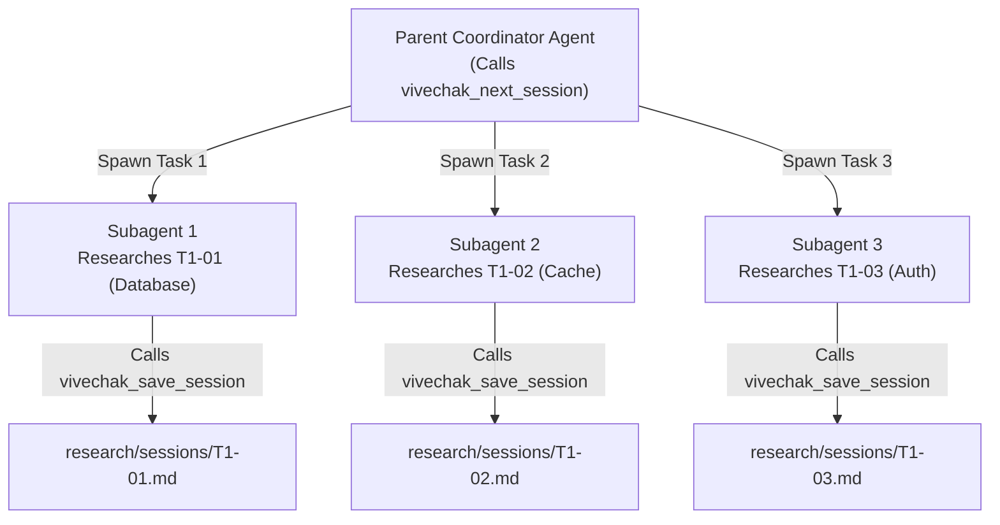

# Parallel Research Execution Guide
### Scaling Research Throughput with Concurrent Subagents & Swarms

---

## 1. Introduction

Frontier AI harnesses can execute multiple tasks in parallel by spawning concurrent subagents. Vivechak pipelines are organized as **Directed Acyclic Graphs (DAGs)** where independent sessions can run concurrently without race conditions.

This guide explains how parallel research execution works, how to detect parallel opportunities, and how Vivechak guarantees consistency across concurrent writers.

---

## 2. Detecting Parallel Opportunities

### The `⚡` Parallelism Hint

When calling `vivechak_next_session`, Vivechak evaluates the dependency graph against completed sessions. If more than one unblocked session is ready to execute, the response includes a **parallelism hint**:

```json
{
  "session_id": "T1-01",
  "layer": 1,
  "other_ready_sessions": ["T1-02", "T1-03"],
  "parallelism_hint": "⚡ 3 sessions ready to execute in parallel: [T1-01, T1-02, T1-03]. You can spawn subagents to research these simultaneously.",
  "prompt": "# RESEARCH BRIEF: Primary Database Engine..."
}
```

### Visualizing Parallel Tracks

Call `vivechak_visualize` to inspect ready and parallel nodes:
- Ready sessions are highlighted in **amber** (`#f59e0b`).
- Completed sessions are highlighted in **green** (`#22c55e`).
- Blocked downstream sessions are highlighted in **gray** (`#6b7280`).

---

## 3. Subagent Spawning Pattern

In an agent harness with subagent capabilities (such as Antigravity or Claude Code task runners), use this orchestration pattern:



### Recommended Coordinator Prompt
When dispatching a session to a subagent:
1. Provide the exact prompt returned by `vivechak_next_session`.
2. Instruct the subagent to perform its research and save the result directly using `vivechak_save_session`.
3. The parent agent waits for completion and queries `vivechak_next_session` for the next layer.

---

## 4. Concurrency Guarantees & Lock Behavior

Vivechak enforces file-level concurrency safety through advisory locks and atomic renames:

| Operation | Lock Target | Lock Timeout | Behavior Under Contention |
|---|---|---|---|
| `vivechak_save_session` | `research/sessions/[ID].md` | 5 seconds | Exponential backoff. Overwrites safe via atomic rename. |
| `vivechak_record_decision` | Target `D-*.md` + `research/DECISIONS.md` | 10 seconds | Registry compilation is serialized. Decisions sort naturally. |
| `vivechak_amend_session` | Target session file | 5 seconds | Stale downstream notifications computed from DAG. |
| `vivechak_replan` | `research/RESEARCH-PIPELINE.md` | 5 seconds | Graph mutation verified before serialization. |

### Windows Handle Collision Avoidance
On Windows, high-concurrency subagents writing in the same millisecond can experience file-locking collisions. Vivechak utilizes a monotonic process-wide counter (`tmpFileCounter`) in `store.WriteFileAtomic` to ensure temporary write files never collide, even under parallel subagent load.

---

## 5. Topological Execution Rules

1. **Intra-Layer Independence:** Sessions in the same layer that share no mutual dependencies are strictly order-independent. They can be started, paused, or finished in any sequence.
2. **Inter-Layer Synchronization:** A session in Layer 1 will remain blocked until **all** of its declared Layer 0 dependencies are completed.
3. **Grand Synthesis Barrier (`SYN-01`):** The final synthesis session (which compiles `research/FAD.md`) will **never** be unlocked until every preceding session in the DAG has completed successfully.
