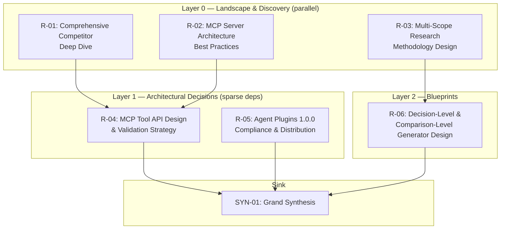

# Research Pipeline: Vivechak v2.0 — MCP Server & Methodology Evolution
## Generated manually following Vivechak v0.1.0 methodology (dogfooding)

**Project Repository:** https://github.com/bhaskarjha-dev/vivechak

---

## Pipeline Overview

### Project Parameters

- **Domain Archetype:** DevTools (developer infrastructure tool)
- **Primary Constraint:** Must serve existing Vivechak methodology; delivery mechanism, not methodology replacement
- **Key Open Questions:** MCP server architecture details, multi-scope generator design, competitive positioning, real-world validation approach
- **Regulatory Exposure:** None (0)
- **Stage:** Mid-project evolution (Vivechak v0.1.0 capabilities)
- **Repository:** https://github.com/bhaskarjha-dev/vivechak

### Complexity Score

| Dimension | Score | Rationale |
|---|---|---|
| Domain Novelty | 1 | MCP servers are an established category; multi-scope research methodology is novel but builds on existing framework |
| Technical Novelty | 1 | Known stack (Go + MCP SDK). No new paradigms. |
| Regulatory Exposure | 0 | No sensitive data processed |
| Reversibility | 1 | MCP server is a Two-Way Door. Methodology additions are additive. |
| Investment Horizon | 2 | Funded by creator's time. Intended for long-term maintenance. |
| Coordination Complexity | 0 | Single decision-maker |
| Expected Longevity | 2 | 1–3 years (methodology may evolve, but MCP server should be stable) |
| Integration Complexity | 1 | 1–2 external interfaces (MCP protocol + file system) |

**Total: 8 → Tier 1 (4–8 sessions)**

### Execution DAG



### How to Execute

1. **Run Layer 0 sessions in parallel** — they have no dependencies.
2. **Run Layer 1 sessions** after their Layer 0 dependencies complete. Inject key findings as context (3–5 sentences, not full outputs).
3. **Run Layer 2** after Layer 1 decisions are recorded.
4. **Run SYN-01** after all sessions are complete and decisions are locked.

**Session normalization:** Each session = one independent deep research execution (single prompt to a frontier AI with web search). If using standard chat, multiple turns may be needed per session.

**Templates:** Use Vivechak templates from `templates/` for:
- Recording decisions: `DECISIONS.template.md`
- Resolving conflicts: `CONFLICT-RESOLUTION.template.md`
- Compiling FAD: `FOUNDING-ARCHITECTURE.template.md`
- Running exit gate: `PHASE-0-GATE.template.md`

**Troubleshooting:**
- Vague or off-topic output → try a different model or split into sub-sessions
- Contradictory recommendations → use CONFLICT-RESOLUTION template
- Gate reveals gaps → spawn targeted follow-up sessions (don't re-run entire pipeline)

---

## Research Sessions

---

### R-01: Comprehensive Competitor Deep Dive

| Field | Value |
|---|---|
| **Session ID** | R-01 |
| **Title** | Comprehensive Competitive Landscape Analysis |
| **Layer** | 0 (Landscape & Discovery) |
| **Door Type** | N/A (research, not decision) |
| **Decision ID** | Informs overall positioning |
| **Dependencies** | None |
| **Output Filename** | `sessions/R-01-competitor-deep-dive.md` |

**Decision Context:** This is open-ended landscape research. It doesn't directly drive a single ADR but informs strategic positioning, feature prioritization, and differentiation across all decisions.

```prompt
# BRIEF

Conduct an exhaustive competitive landscape analysis for Vivechak (https://github.com/bhaskarjha-dev/vivechak), a meta-framework that generates evidence-grounded research pipelines for technical projects. Vivechak transforms a project vision (or a specific architectural decision) into structured, multi-session research with evidence grading (A–E), cross-session synthesis, decision tracking (ADR format), and an exit gate.

The audience is the project's creator who needs a brutally honest assessment of the competitive landscape — not just direct competitors, but every tool, service, methodology, or behavioral pattern that competes for the same developer attention and time.

# SCOPE

- Date: 2026-09-23
- In scope:
  - Direct competitors: any tool that generates structured research pipelines for software architecture decisions
  - Adjacent tools: ADR generators, design doc tools, AI architecture advisors, research orchestration platforms
  - Cross-domain analogs: systematic review tools (medical/legal/intelligence), structured analytic techniques applied to software
  - Behavioral competitors: the habits developers have instead of using a tool like Vivechak ("just ask ChatGPT," "one Deep Research session," "design docs," "hire a consultant," "vibe code and pray")
  - Emerging threats: AI capabilities that could make Vivechak's orchestration obsolete (multi-session deep research, agent-native architecture reasoning)
  - Open source projects on GitHub, Product Hunt launches (2025-2026), HN launches, paid SaaS tools
- Out of scope: General AI coding assistants (Cursor, Claude Code) unless they have specific architectural research features
- Source priorities: Official product pages, GitHub repos, Product Hunt, HN discussions, peer-reviewed comparisons over blog posts

# APPROACH

Start with broad landscape queries across multiple search vectors:
- "AI architecture decision tool 2026"
- "structured research pipeline software"
- "automated architectural decision records"
- "AI-powered design document generator"
- "technology selection tool"
- "systematic review software architecture"
- "pre-development research framework"
- "technical due diligence AI tool"

Then go deeper on anything found. For each competitor or adjacent tool:
- What exactly does it do?
- How does it compare to Vivechak's capabilities?
- Where is it stronger? Where is Vivechak stronger?
- Is it a current threat or a future threat?
- What can Vivechak learn from it?

Search Product Hunt for recent launches (2025-2026) in the developer tools, AI tools, and productivity categories.

Search GitHub trending repos and "awesome" lists related to:
- Architecture decision records
- Software architecture tools
- AI research tools
- Developer decision-making

Investigate cross-domain analogs:
- How do medical systematic review tools (Covidence, Rayyan) handle structured multi-source research?
- How do intelligence analysis tools (Analysis of Competing Hypotheses) handle evidence grading?
- How do legal research tools (Westlaw, LexisNexis) handle structured investigation?
- What can Vivechak borrow from these domains?

If your research reveals critical concerns, dependencies, risks, or opportunities not listed in the coverage checklist, investigate and include them. The stated scope defines the minimum — not the maximum — of what this session should cover.

Actively seek disconfirming evidence. If you find evidence that the competitive landscape is MORE threatening than Vivechak's current assessment assumes, report it prominently.

# DELIVERABLE

Coverage checklist:
- [ ] Complete inventory of direct competitors (even partial ones)
- [ ] Adjacent tools with overlap analysis
- [ ] Cross-domain analog assessment (what Vivechak can borrow)
- [ ] Behavioral competitor analysis with estimated "market share"
- [ ] Emerging threats with timeline estimates
- [ ] Feature comparison matrix (Vivechak vs top 5 closest tools)
- [ ] Strategic gaps: what competitors do that Vivechak doesn't
- [ ] Borrowed innovations: what Vivechak should steal from adjacent tools
- [ ] Inline evidence grades for all factual claims
- [ ] "Discovered Concerns" section for any material findings beyond scope

Output format: Single Markdown artifact with YAML frontmatter (id: R-01, title, date, status: draft, topic: competitive-landscape).
Filename: sessions/R-01-competitor-deep-dive.md

# FORMAT

YAML frontmatter followed by:
Research Question → Key Findings (3–7 bullets) → Detailed Findings by Category → Feature Comparison Matrix → Strategic Implications → Open Questions & Risks → Sources & Evidence Ledger
```

---

### R-02: MCP Server Architecture Best Practices

| Field | Value |
|---|---|
| **Session ID** | R-02 |
| **Title** | MCP Server Architecture Patterns for Workflow Management |
| **Layer** | 0 (Landscape & Discovery) |
| **Door Type** | One-way door (architecture of the server) |
| **Decision ID** | D-001 (MCP Server Architecture Pattern) |
| **Dependencies** | None |
| **Output Filename** | `sessions/R-02-mcp-server-architecture.md` |

**Decision Context:**
- **D-001: MCP Server Architecture Pattern**
  - Door type: One-way (hard to change once users depend on tool API)
  - Competing hypotheses: (A) "The Guide" — server manages workflow, agent does thinking; (B) "The Worker" — server does LLM calls; (C) "The Hybrid" — both approaches
  - Current lean: Approach A, but needs validation against real MCP server patterns

```prompt
# BRIEF

Research MCP (Model Context Protocol) server architecture patterns, specifically for servers that manage multi-step workflows (not simple single-tool servers). The goal is to determine the best architecture for a Vivechak (https://github.com/bhaskarjha-dev/vivechak) MCP server that manages a research pipeline workflow: initializing workspaces, tracking session DAG state, validating research outputs, and guiding an AI agent through a structured research process.

The audience is an architect designing a production MCP server in Go that will be used by AI agents (Claude, Cursor, Antigravity, VS Code) to orchestrate Vivechak research pipelines.

# SCOPE

- Date: 2026-09-23
- Focus: Go MCP SDK (github.com/modelcontextprotocol/go-sdk) — this is the official Tier 1 Go SDK
- In scope:
  - How do existing MCP servers handle multi-step workflows?
  - State management patterns (file-based vs in-memory vs database)
  - MCP Resources vs Tools vs Prompts — when to use each
  - Error handling and validation patterns
  - Tool discoverability: how to name/describe tools so agents use them correctly
  - How do Claude Desktop, Cursor, VS Code discover and configure MCP servers?
  - Production MCP servers in Go — examples, patterns, lessons
  - Testing patterns for MCP servers
  - The "Guide" vs "Worker" pattern — which do successful workflow MCP servers use?
- Out of scope: Building chatbots, LLM-calling servers, ML pipelines
- Source priorities: Official MCP docs (modelcontextprotocol.io), Go SDK source code and examples, production MCP server repos, MCP spec updates (July 2026+)

# APPROACH

Start by reviewing the official Go MCP SDK documentation and examples. Understand the current best practices for structuring an MCP server in Go.

Then search for production MCP servers that manage workflows (not just single tools):
- GitHub search for Go MCP servers
- MCP server directories/registries
- Blog posts about building MCP servers for complex workflows
- Any MCP server that tracks state across multiple tool calls

Investigate these specific architectural questions:
1. Should workflow state live in the MCP server's memory, in files, or in a database?
2. Should the server use MCP Resources to expose the research pipeline as readable data, or should everything go through Tools?
3. Should the server use MCP Prompts to provide pre-built prompt templates?
4. How should the server handle long-running operations (e.g., validating a large research output)?
5. What naming conventions make MCP tools discoverable and intuitive for AI agents?
6. How do you test MCP servers effectively?

If your research reveals critical concerns, dependencies, risks, or opportunities not listed above, investigate and include them.

Surface disagreements rather than smooth them. Actively seek disconfirming evidence against the "Guide" pattern (Approach A).

# DELIVERABLE

Coverage checklist:
- [ ] Best practices for multi-step workflow MCP servers
- [ ] State management pattern recommendation with evidence
- [ ] MCP primitive usage guide (Resources vs Tools vs Prompts — when to use each)
- [ ] Tool naming and description patterns for agent discoverability
- [ ] Go MCP SDK specific patterns and idioms
- [ ] Testing strategy for MCP servers
- [ ] Example production MCP servers analyzed (architecture, patterns, lessons)
- [ ] "Guide" vs "Worker" pattern validation
- [ ] Inline evidence grades for all claims
- [ ] Open risks and "Discovered Concerns"

Output: sessions/R-02-mcp-server-architecture.md

# FORMAT

YAML frontmatter (id: R-02, title, date, status: draft, topic: mcp-architecture, informs_decisions: [D-001]). Body: Research Question → Key Findings → Recommendation → Alternatives Considered → Detailed Findings → Open Questions & Risks → Sources & Evidence Ledger
```

---

### R-03: Multi-Scope Research Methodology Design

| Field | Value |
|---|---|
| **Session ID** | R-03 |
| **Title** | Multi-Scope Research: Project, Decision, and Comparison Levels |
| **Layer** | 0 (Landscape & Discovery) |
| **Door Type** | Two-way door (additive methodology change) |
| **Decision ID** | D-002 (Multi-Scope Methodology Design) |
| **Dependencies** | None |
| **Output Filename** | `sessions/R-03-multi-scope-methodology.md` |

**Decision Context:**
- **D-002: Multi-Scope Methodology Design**
  - Door type: Two-way (new generators are additive, can be reverted)
  - Competing hypotheses: (A) Three fixed scope levels (Project/Decision/Comparison); (B) Continuous scope spectrum with adaptive scaling; (C) Single generator that handles all scopes via input type detection
  - Current lean: (A) but needs validation

```prompt
# BRIEF

Research how structured research methodologies handle different scope levels — from investigating an entire system architecture down to comparing two specific technology options. The goal is to design Vivechak's (https://github.com/bhaskarjha-dev/vivechak) multi-scope capability: extending the existing project-level pipeline generator to also handle decision-level and comparison-level research.

Current Vivechak (v0.1.0) only supports project-level research — you paste a full project vision, get a 4–30 session pipeline, and produce a Founding Architecture Document. But the methodology is genuinely useful at smaller scopes:

- **Decision-level:** "Should we use MCP or build a custom plugin system?" → 1–3 focused sessions → produces a grounded ADR
- **Comparison-level:** "PostgreSQL vs CockroachDB for our write-heavy workload" → 1 session → produces a weighted evaluation matrix

The audience is a framework designer who needs to extend the methodology to multiple scope levels without breaking the existing project-level workflow.

# SCOPE

- Date: 2026-09-23
- In scope:
  - How do other structured research methodologies handle scope variation?
  - Medical systematic reviews: how do they distinguish full systematic reviews from rapid reviews from scoping reviews?
  - Intelligence analysis: how does scope affect the analysis framework?
  - Software architecture: RFC processes at different scales (company-wide vs team-level vs single-feature)
  - How should complexity scoring adapt for decision-level vs project-level?
  - What output format makes sense for each scope level?
  - How do existing AI research tools (Gemini Deep Research, Perplexity) handle different research depths?
- Out of scope: Implementation details of MCP tools
- Source priorities: Academic methodology literature, PRISMA guidelines, intelligence analysis handbooks, software RFC processes

# APPROACH

Start by investigating how OTHER structured research methodologies handle scope:
1. Medical research: Cochrane systematic reviews vs rapid reviews vs scoping reviews — what changes at each level? What stays the same?
2. Intelligence analysis: how does Analysis of Competing Hypotheses (ACH) scale from tactical to strategic?
3. Software architecture: Google Design Docs, Spotify Decision Records, Amazon's 6-pager — how do they scale from team-level to org-level?

Then evaluate three design options for Vivechak:
- (A) Three fixed generators (GENERATOR.md, GENERATOR-DECISION.md, GENERATOR-COMPARISON.md) with distinct input formats
- (B) One generator that detects scope from input and adapts
- (C) A continuous scope parameter (1-10 depth) that scales the pipeline

For each option, evaluate:
- Usability: how easy is it for a developer or agent to pick the right one?
- Methodology integrity: does reducing scope compromise evidence quality?
- Implementation complexity
- What stays the same across all scope levels? (This is the methodology core)
- What changes? (This is the scope-dependent adaptation)

If your research reveals scope levels we haven't considered, or evidence that the three-level model is wrong, report it prominently.

# DELIVERABLE

Coverage checklist:
- [ ] Cross-domain scope handling analysis (medical, intelligence, software)
- [ ] Design option evaluation matrix with evidence
- [ ] Recommendation for Vivechak's scope model
- [ ] What stays constant across all scopes (the methodology invariants)
- [ ] What adapts per scope level (input format, session count, output format)
- [ ] How complexity scoring adapts for decision-level vs project-level
- [ ] Risks of scope expansion (dilution, misuse, quality degradation)
- [ ] Inline evidence grades
- [ ] Open questions

Output: sessions/R-03-multi-scope-methodology.md

# FORMAT

YAML frontmatter (id: R-03, title, date, status: draft, topic: multi-scope, informs_decisions: [D-002]). Body: Research Question → Key Findings → Recommendation → Alternatives Considered → Detailed Findings → Open Questions & Risks → Sources & Evidence Ledger
```

---

### R-04: MCP Tool API Design & Validation Strategy

| Field | Value |
|---|---|
| **Session ID** | R-04 |
| **Title** | Vivechak MCP Tool API Design & Output Validation |
| **Layer** | 1 (Architectural Decisions) |
| **Door Type** | One-way door (public API surface) |
| **Decision ID** | D-003 (MCP Tool API Surface) |
| **Dependencies** | Hard: R-01 (competitive landscape — what features matter), R-02 (MCP architecture patterns) |
| **Output Filename** | `sessions/R-04-mcp-tool-api-design.md` |

**Decision Context:**
- **D-003: MCP Tool API Surface**
  - Door type: One-way (once agents depend on tool names/schemas, changing them breaks users)
  - Competing hypotheses: (A) 10 fine-grained tools (current proposal); (B) 5 coarse-grained tools (fewer, more capable); (C) Dynamic tool registration based on pipeline state
  - Context from R-01: what features do competitors offer that should inform our API?
  - Context from R-02: what MCP patterns work best for workflow tools?

```prompt
# BRIEF

Design the MCP tool API surface for Vivechak (https://github.com/bhaskarjha-dev/vivechak) — the specific tools, their names, input schemas, output formats, and the validation strategy for research outputs.

This is a one-way door decision: once AI agents and users depend on tool names and schemas, changing them is a breaking change. The API surface must be designed for longevity, discoverability, and methodology enforcement.

Current proposed tools (from earlier analysis):
1. vivechak_init — workspace setup
2. vivechak_get_generator_prompt — returns appropriate generator prompt
3. vivechak_save_pipeline — parse and save generated pipeline
4. vivechak_status — pipeline progress report
5. vivechak_next_session — DAG-aware next session(s)
6. vivechak_save_session — validate and save research output
7. vivechak_record_decision — record/update ADR
8. vivechak_validate — validate any artifact
9. vivechak_synthesize — prepare FAD synthesis context
10. vivechak_run_gate — execute Phase 0 Gate

The audience is an API designer who must balance: completeness (cover the full workflow), simplicity (agents must understand what to call), and methodology enforcement (tools should make it hard to skip evidence grading or ignore decision tracking).

Context from R-01 (competitive landscape): [Inject key findings — what features do the closest competitors offer? What gaps does Vivechak fill?]

Context from R-02 (MCP architecture): [Inject key findings — what patterns work for workflow MCP tools? How should state be managed? Resources vs Tools vs Prompts?]

# SCOPE

- Date: 2026-09-23
- In scope:
  - Tool naming conventions and discoverability
  - Input schema design (what parameters, what types, what's required vs optional)
  - Output format design (what does each tool return?)
  - Validation strategy: what does vivechak_save_session actually validate?
    - Evidence grade presence and format
    - YAML frontmatter completeness
    - Minimum quality rubric thresholds
    - How strict vs lenient should validation be?
  - Error handling: what happens when validation fails?
  - MCP Resources: should the pipeline be exposed as a readable Resource?
  - MCP Prompts: should generator prompts be exposed as MCP Prompts?
  - Versioning strategy for tool schemas
- Out of scope: Implementation code, deployment infrastructure

# APPROACH

Research how successful MCP servers design their tool APIs:
- What naming patterns do popular MCP servers use?
- How many tools is too many? Too few?
- How do agents decide which tool to call? (tool description quality matters)
- What input schema patterns make tools easy to use?
- How do workflow MCP servers handle state across calls?

Then design the Vivechak tool API by evaluating:
- Should tools be fine-grained (10 tools) or coarse-grained (5 tools)?
- What validation checks should vivechak_save_session perform?
- How should the server enforce methodology compliance without being annoying?
- Should the server return structured data or natural language?

If your research reveals that the proposed 10-tool design is suboptimal, propose an alternative with evidence.

# DELIVERABLE

Coverage checklist:
- [ ] Final tool list with names, descriptions, input schemas, output schemas
- [ ] Tool granularity recommendation with evidence
- [ ] Validation specification for vivechak_save_session (what it checks, how strict)
- [ ] MCP Resources and Prompts usage recommendation
- [ ] Naming convention rationale
- [ ] Versioning strategy
- [ ] Error handling patterns
- [ ] Agent discoverability assessment (will agents understand these tools?)
- [ ] Inline evidence grades
- [ ] Open questions

Output: sessions/R-04-mcp-tool-api-design.md

# FORMAT

YAML frontmatter (id: R-04, title, date, status: draft, topic: api-design, informs_decisions: [D-003]). Body: Research Question → Key Findings → Recommendation → Detailed API Specification → Validation Strategy → Open Questions & Risks → Sources & Evidence Ledger
```

---

### R-05: Agent Plugins 1.0.0 Compliance & Distribution Strategy

| Field | Value |
|---|---|
| **Session ID** | R-05 |
| **Title** | Agent Plugins 1.0.0 Compliance & Cross-Platform Distribution |
| **Layer** | 1 (Architectural Decisions) |
| **Door Type** | Two-way door (packaging format) |
| **Decision ID** | D-004 (Distribution Strategy) |
| **Dependencies** | None (can run in parallel with R-04) |
| **Output Filename** | `sessions/R-05-agent-plugins-distribution.md` |

**Decision Context:**
- **D-004: Distribution Strategy**
  - Door type: Two-way (packaging is a thin wrapper, easily changed)
  - Competing hypotheses: (A) Agent Plugins 1.0.0 only; (B) Agent Plugins + standalone `go install`; (C) Agent Plugins + Homebrew + platform packages

```prompt
# BRIEF

Research the Agent Plugins 1.0.0 specification in depth and design the distribution strategy for Vivechak's (https://github.com/bhaskarjha-dev/vivechak) MCP server (a Go binary).

The MCP server is written in Go, producing a single static binary. The distribution strategy must optimize for: minimum installation friction, maximum platform coverage (Windows, Mac, Linux), and compatibility with all major AI agent hosts (Claude Desktop, Cursor, VS Code, Antigravity, ChatGPT, GitHub Copilot, Kiro).

The audience is a DevTools engineer who needs to ship a Go binary to developers using diverse AI agents on diverse operating systems.

# SCOPE

- Date: 2026-09-23
- In scope:
  - Agent Plugins 1.0.0 specification deep dive (agent-plugins.org)
    - Exact directory structure required
    - plugin.json schema and required fields
    - mcp.json format for Go binary servers
    - skills/ directory usage
    - How agent hosts discover and install plugins
  - Distribution channels for a Go binary MCP server:
    - Agent Plugins packaging
    - `go install` from GitHub
    - GitHub Releases (pre-built binaries)
    - Homebrew (Mac)
    - Scoop/Chocolatey (Windows)
    - Platform package managers (apt, dnf)
  - Installation UX for each major agent host
  - How to handle binary updates and versioning
  - Cross-compilation strategy (GOOS/GOARCH matrix)
- Out of scope: Server implementation details, pricing

# APPROACH

Start with the Agent Plugins 1.0.0 specification. Read the official docs at agent-plugins.org. Understand every field, every option, every convention.

Then investigate how each major agent host discovers and configures plugins:
- Claude Desktop: configuration format, marketplace, manual install
- Cursor: configuration format, plugin discovery
- VS Code: extension marketplace, MCP configuration
- Antigravity: MCP server configuration
- ChatGPT, GitHub Copilot, Kiro: any plugin/MCP support

Design the distribution matrix: which channels for which platforms. Prioritize channels that minimize user friction.

If your research reveals that Agent Plugins 1.0.0 has limitations for Go binary distribution, or if there are better distribution channels, report prominently.

# DELIVERABLE

Coverage checklist:
- [ ] Agent Plugins 1.0.0 spec deep dive (complete field reference)
- [ ] Vivechak plugin.json and mcp.json specification
- [ ] Distribution channel matrix (channel × platform × agent host)
- [ ] Installation UX per agent host (exact steps for user)
- [ ] Cross-compilation build matrix
- [ ] Update/versioning strategy
- [ ] Recommendation on distribution channels to prioritize
- [ ] Inline evidence grades
- [ ] Open questions

Output: sessions/R-05-agent-plugins-distribution.md

# FORMAT

YAML frontmatter (id: R-05, title, date, status: draft, topic: distribution, informs_decisions: [D-004]). Body: Research Question → Key Findings → Recommendation → Distribution Strategy → Open Questions & Risks → Sources & Evidence Ledger
```

---

### R-06: Decision-Level & Comparison-Level Generator Design

| Field | Value |
|---|---|
| **Session ID** | R-06 |
| **Title** | Generator Prompt Design for Decision-Level and Comparison-Level Research |
| **Layer** | 2 (Blueprints) |
| **Door Type** | Two-way door (additive generators) |
| **Decision ID** | D-002 (Multi-Scope Methodology Design) |
| **Dependencies** | Hard: R-03 (multi-scope methodology findings) |
| **Output Filename** | `sessions/R-06-generator-design.md` |

**Decision Context:**
- **D-002: Multi-Scope Methodology Design** (continued from R-03)
  - This session designs the ACTUAL generator prompts based on R-03's methodology findings
  - Context from R-03: [Inject recommendation on scope model, methodology invariants, scope-dependent adaptations]

```prompt
# BRIEF

Design the Decision-Level and Comparison-Level generator prompts for Vivechak (https://github.com/bhaskarjha-dev/vivechak), based on the multi-scope methodology findings from R-03.

Current Vivechak has one generator prompt (GENERATOR.md, ~18KB) that takes a full project vision and produces a multi-session research pipeline + decision registry. We need two additional, simpler generators:

1. **GENERATOR-DECISION.md** (~5KB target): Takes a "decision context" (what decision, what constraints, what project stage) and produces 1–3 focused research session prompts + a proposed ADR.

2. **GENERATOR-COMPARISON.md** (~2KB target): Takes specific options + criteria and produces a single research session prompt using the Weighted Evaluation Protocol.

The audience is the Vivechak framework designer who must create prompts that are: methodology-compliant (evidence grading, bounded exploration, structured falsification), self-contained (no reference to external docs), and usable by any frontier AI with web search.

Context from R-03 (multi-scope methodology): [Inject key findings — scope model recommendation, methodology invariants, scope-dependent adaptations, how complexity scoring adapts]

# SCOPE

- Date: 2026-09-23
- In scope:
  - GENERATOR-DECISION.md prompt design
    - Input format: decision context (not project vision)
    - Complexity scoring adaptation for single decisions
    - Output: 1–3 session prompts + proposed ADR
    - What methodology elements carry over vs. are omitted
  - GENERATOR-COMPARISON.md prompt design
    - Input format: options + criteria + context
    - Output: single session prompt with WEP structure
    - When to use this vs decision-level
  - Integration: how do these generators interact with the MCP server?
  - Consistency: how to maintain methodology quality at reduced scope
- Out of scope: Modifying the existing project-level GENERATOR.md

# APPROACH

Start by analyzing the existing GENERATOR.md to identify:
1. What is the methodology CORE (must carry to all scope levels)?
2. What is PROJECT-SPECIFIC (only relevant at project scope)?
3. What can be simplified for decision/comparison scope?

Then design each generator:
- Draft the prompt structure (what sections, what instructions)
- Specify the input format
- Specify the output format
- Test: would this prompt produce useful output for real-world examples?
  - Example 1: "Should Vivechak use MCP or build a custom plugin system?"
  - Example 2: "PostgreSQL vs CockroachDB for a write-heavy SaaS workload"
  - Example 3: "Should we adopt server-side rendering for our Next.js app?"

If your research from R-03 suggests the three-level model is wrong, design an alternative that matches R-03's recommendation.

# DELIVERABLE

Coverage checklist:
- [ ] GENERATOR-DECISION.md complete prompt draft
- [ ] GENERATOR-COMPARISON.md complete prompt draft
- [ ] Methodology invariants (what stays across all scopes)
- [ ] Scope-dependent adaptations (what changes)
- [ ] Test evaluation against 3 real-world examples
- [ ] Integration notes for MCP server
- [ ] Quality risks at reduced scope + mitigations
- [ ] Inline evidence grades where applicable
- [ ] Open questions

Output: sessions/R-06-generator-design.md

# FORMAT

YAML frontmatter (id: R-06, title, date, status: draft, topic: generator-design, informs_decisions: [D-002]). Body: Research Question → Key Findings → GENERATOR-DECISION.md Draft → GENERATOR-COMPARISON.md Draft → Test Results → Integration Notes → Open Questions
```

---

### SYN-01: Grand Synthesis

| Field | Value |
|---|---|
| **Session ID** | SYN-01 |
| **Title** | Grand Synthesis: Vivechak v2.0 Architecture |
| **Layer** | Sink |
| **Door Type** | N/A (synthesis) |
| **Decision ID** | All |
| **Dependencies** | Hard: R-04, R-05, R-06 (all Layer 1/2 sessions) |
| **Output Filename** | `sessions/SYN-01-grand-synthesis.md` |

```prompt
# BRIEF

Synthesize all research findings from sessions R-01 through R-06 into a coherent architectural vision for Vivechak v2.0 (https://github.com/bhaskarjha-dev/vivechak).

Read all session outputs in research/sessions/. Read all decisions in research/DECISIONS.md. Identify any unresolved conflicts, gaps, or contradictions.

Produce a synthesis that:
1. Confirms or challenges the 4-wave execution plan (methodology expansion → MCP server → packaging → demand proof)
2. Identifies any decisions that are still contested or under-evidenced
3. Provides a clear technical blueprint for the MCP server
4. Provides the finalized generator prompt designs
5. Identifies risks that emerged across sessions

# SCOPE

- Date: 2026-09-23
- In scope: Synthesis of all session findings, conflict resolution, gap analysis, final architecture recommendation
- Out of scope: Implementation code

# DELIVERABLE

Coverage checklist:
- [ ] Architecture overview (one page)
- [ ] Decision summary (all D-NNN decisions with final verdicts)
- [ ] Conflict resolution (any contradictions across sessions)
- [ ] Gap analysis (what's still unknown after all research)
- [ ] Risk register (aggregated across all sessions)
- [ ] Updated execution plan (if research changes the wave sequence)
- [ ] Inline evidence grades

Output: sessions/SYN-01-grand-synthesis.md

# FORMAT

YAML frontmatter (id: SYN-01, title, date, status: draft, topic: synthesis). Body: Architecture Overview → Decision Summary → Cross-Session Conflicts → Gap Analysis → Risk Register → Updated Execution Plan → Sources
```

---

## Phase 0 Exit Gate Criteria

### Track A: Evidence Sufficiency

- [ ] All 6 research sessions completed with outputs in `sessions/`
- [ ] All research outputs contain inline evidence grades (A–E)
- [ ] Every one-way door decision (D-001, D-003) has ≥1 Grade A/B corroborated source
- [ ] Synthesis session (SYN-01) completed with no unresolved conflicts
- [ ] Competitive landscape (R-01) identifies no existential threats

### Track B: Decision Readiness

- [ ] All proposed decisions (D-001 through D-004) have reached `accepted` status
- [ ] One-way door decisions (D-001, D-003) have premortem completed
- [ ] Review triggers set for all accepted decisions
- [ ] No decision has `low` confidence without explicit risk acceptance

---

## Initial Decision Registry

See `DECISIONS.md` in this directory for the initial decision registry with proposed decisions D-001 through D-004.
