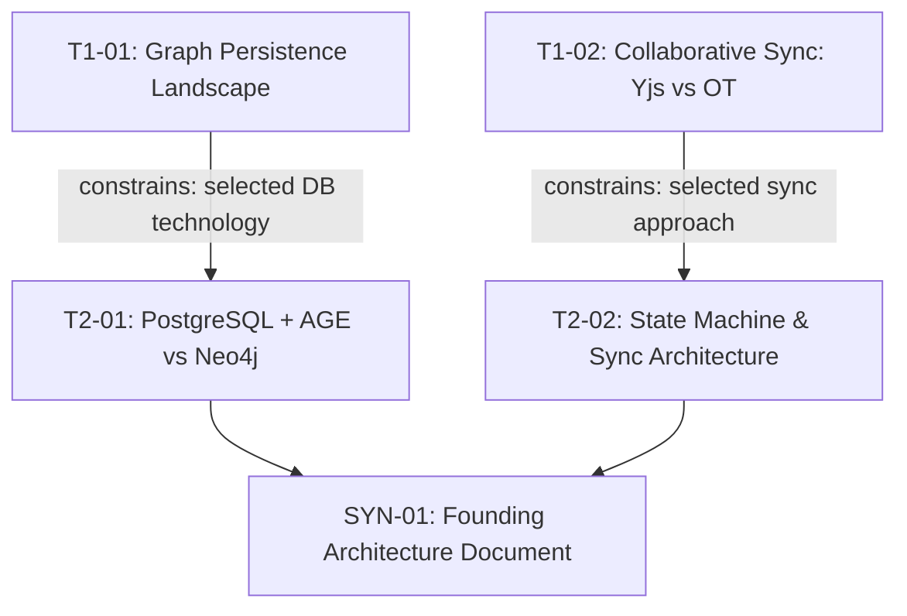

# Sample Adoption Walkthrough: Project "Katha"
### End-to-End Walkthrough of a Tier 1 Project using Vivechak (विवेचक) v1.1

This document shows a complete, concrete walkthrough of applying Vivechak to a hypothetical project (**Katha** — an AI-assisted interactive storytelling platform for indie authors).

---

## Step 1: The Raw Project Vision Dump

The author pastes this open-ended vision into [`GENERATOR.md`](../GENERATOR.md):

> *"We want to build Katha, an interactive web app for indie novelists. Authors write chapters, and the AI maintains a real-time character graph, detects plot inconsistencies, and suggests branching outlines. Target users are solo authors and small writer rooms. Needs collaborative editing, persistent story graphs, and low-latency LLM streaming. We have standard EU/US users (GDPR compliance for user stories), but no payment data initially (Stripe later). We prefer TypeScript/Next.js for the frontend, but we're unsure about the database (graph DB vs Postgres with pgvector/jsonb) and collaborative sync architecture (Yjs CRDTs vs WebSocket OT)."*

---

## Step 2: The Generated Unified Research Pipeline

The frontier AI consumes the vision dump and emits **two files**: `RESEARCH-PIPELINE.md` (pipeline with inline prompts) and `DECISIONS.md` (decision registry) file:

### Pipeline Overview (top of generated file)

**Inferred Archetype & Complexity Score:**
- **Primary Archetype:** AI/ML Systems + B2B SaaS
- **Complexity Score:** 8 / 24 → **Tier 1 (4–8 Sessions)**

| Dimension | Score | Rationale |
|---|---|---|
| Domain Novelty | 1 | Interactive story assistance is established, but real-time consistency graphs are novel |
| Technical Novelty | 2 | Real-time collaborative CRDTs + streaming LLM graph extraction |
| Regulatory Exposure | 1 | Standard user accounts, GDPR PII |
| Reversibility | 2 | Core persistence (graph vs relational) is a One-Way Door |
| Investment Horizon | 1 | Bootstrapped MVP |
| Coordination Complexity | 0 | Solo founder + AI engineering agents |
| Expected Longevity | 1 | Multi-month product launch |
| Integration Complexity | 0 | Standard LLM APIs (Anthropic, OpenAI) |

**Execution DAG:**



### Research Sessions (body of generated file)

Each session in the pipeline contains **three parts**: metadata table, decision reference, and the copy-paste-ready research prompt. The full decision records live in the separate `DECISIONS.md`. Here is what session T1-01 looks like:

---

#### T1-01: Graph Persistence Landscape — Primary Datastore Selection

| Field | Value |
|---|---|
| **ID** | T1-01 |
| **Layer** | 0 (Landscape & Discovery) |
| **Door Type** | One-Way |
| **Decision** | D-001 |
| **Dependencies** | None (parallel) |
| **Output File** | `sessions/T1-01-graph-persistence-landscape.md` |

**Informs Decision:** D-001 (Primary Datastore: Relational vs Graph) — One-Way Door
**Competing Hypotheses:** PostgreSQL 16 (relational + extensions) vs Neo4j (dedicated graph) vs Memgraph
*Full decision record in DECISIONS.md*

```prompt
# RESEARCH BRIEF: T1-01 Primary Datastore Selection (Relational vs Graph)

## BRIEF
Investigate datastore architectures for a collaborative fiction authoring platform
requiring real-time character relationship graphs, full-text chapter search, and
semantic embeddings. This informs Decision D-001 (One-Way Door). Audience: Principal
Architect needing production tradeoffs between PostgreSQL 16 (relational + extensions)
versus dedicated Graph DBs (Neo4j, Memgraph).

## SCOPE
- Temporal Anchor: Today's date (2026).
- In-Scope: Query latency on 10k-node graphs, operational maintenance overhead for a solo team, ACID guarantees for chapter text.
- Out-of-Scope: Distributed multi-region sharding.
- Sources: Official documentation, reproducible benchmarks, tech postmortems.

## APPROACH
Start with broad architectural tradeoffs. Dynamically investigate query performance
of Postgres recursive CTEs and Apache AGE vs Neo4j. Seek disconfirming evidence against
using specialized graph databases for small-to-medium author graphs (<50k nodes).
If your research reveals critical concerns, dependencies, risks, or opportunities not
listed in the coverage checklist, investigate and include them. The stated scope defines
the minimum — not the maximum — of what this session should cover. Justify any scope
expansion with evidence.

## DELIVERABLE
Concrete recommendation with causal rationale. Weighted scoring matrix with
project-derived criteria, 1–5 scores with evidence references, and sensitivity
check. Inline evidence grades (A–E with modifiers). Failure modes and reversal
triggers for scale. Discovered Concerns section if applicable.

## FORMAT
Single complete Markdown file artifact with YAML frontmatter.
Filename: T1-01-graph-persistence-landscape.md
```

---

## Step 3: Execute Sessions & Record Decisions

For each session, copy the prompt from the ```` ```prompt ```` block, paste into a fresh AI session with web search, and save the output to `research/sessions/` using the filename specified in the metadata table.

After reviewing each session's output, record the decision using `templates/DECISIONS.template.md`:

```yaml
---
id: D-001
title: "Primary Datastore: PostgreSQL 16 with pgvector and Recursive CTEs"
status: accepted
door_type: one-way
date: 2026-08-19
confidence: high
evidence_refs: [E-001, E-004]
informed_by_sessions: [T1-01, T2-01]
review_trigger: "Re-evaluate if character graph traversal exceeds 200ms at p95 or graph size > 500k edges"
human_reviewed: true
schema_version: "1.0"
---
```

---

## Step 4: Synthesize into FAD

After all research sessions complete, compile the Founding Architecture Document using the Map-Reduce process:

### Map Phase — Extract from Each Session

| Session | Key Finding | Recommendation | Decision |
|---|---|---|---|
| T1-01 | PostgreSQL 16 + recursive CTEs handles graph traversal up to ~50k nodes at <50ms p95 | PostgreSQL over Neo4j for this scale | D-001 |
| T1-02 | Yjs CRDTs outperform OT for offline-first collaborative editing with <100ms sync | Yjs over custom WebSocket OT | D-002 |
| T2-01 | Apache AGE extension adds Cypher support without separate graph DB operational overhead | PostgreSQL + AGE, not raw CTEs | Refines D-001 |
| T2-02 | Hocuspocus provides production-ready Yjs backend; custom sync server premature | Hocuspocus for sync layer | D-002 |

### Reduce Phase — Merge into FAD Sections

**Section 3 (Architecture & Primitives):**

| Component | Chosen Solution | Rationale | Decision Ref |
|---|---|---|---|
| Primary Datastore | PostgreSQL 16 + Apache AGE | Graph traversal at target scale, single operational surface | D-001 |
| Collaborative Sync | Yjs + Hocuspocus | Proven CRDT library with managed backend, offline-first | D-002 |
| LLM Integration | Anthropic Claude API | Streaming support, structured output for character graphs | D-003 |
| Auth | Clerk | Commodity — compose, not build | Convention |

---

## Step 5: Phase 0 Exit Gate

### Decision Routing

| D-ID | Decision | Door Type | Track | Status |
|---|---|---|---|---|
| D-001 | Primary Datastore | One-Way | B | PASS |
| D-002 | Collaborative Sync | One-Way | B | PASS |
| D-003 | LLM Provider | Two-Way | A | PASS |

### Track B Verification (D-001, D-002)

- [x] B1: DAG Closure — all sessions terminated in `status: final`
- [x] B3: Evidentiary Threshold — D-001 backed by Grade A (PostgreSQL docs) + Grade B (benchmark)
- [x] B7: Premortem — "What if graph traversal exceeds 200ms at p95?" → Migration path to dedicated Neo4j documented
- [x] B8: Human Architect Review — reviewed by [Author]

**Gate Verdict: PASS** → Proceed to scaffolding.

---

## Step 6: Start Coding

With the FAD sealed and the Phase 0 Gate passed, use `FAD.md` as the architectural source of truth for implementation. Feed it directly into your development workflow — whether that's an AI coding agent, a human development team, or both.
