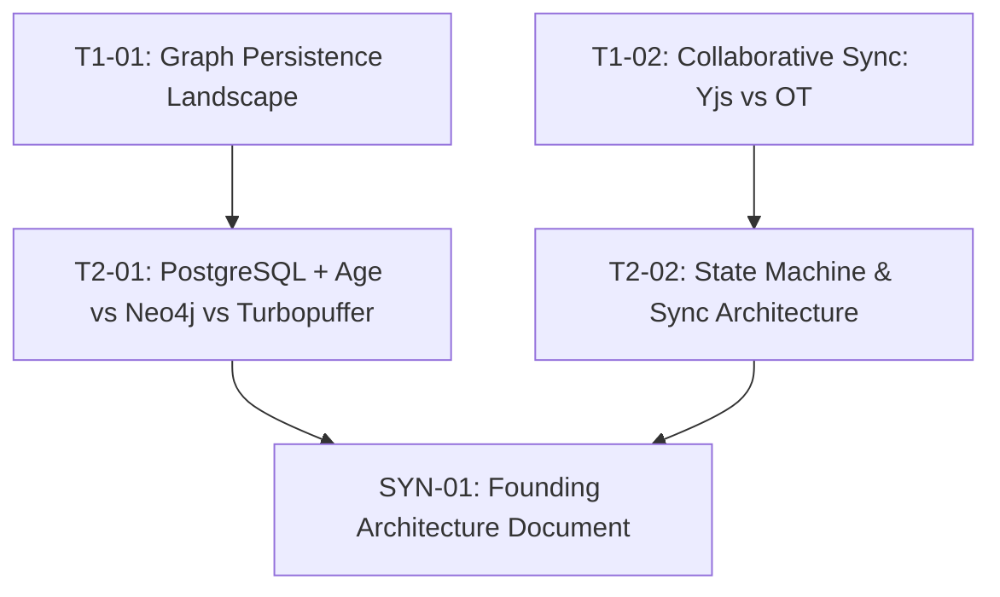

# Sample Adoption Walkthrough: Project "Katha"
### End-to-End Walkthrough of a Tier 1 Project using Vivechak (विवेचक)

This document shows a complete, concrete walkthrough of applying Vivechak to a hypothetical project (**Katha** — an AI-assisted interactive storytelling platform for indie authors).

---

## Step 1: The Raw Project Vision Dump

The author pastes this open-ended vision into [`GENERATOR.md`](../GENERATOR.md):

> *"We want to build Katha, an interactive web app for indie novelists. Authors write chapters, and the AI maintains a real-time character graph, detects plot inconsistencies, and suggests branching outlines. Target users are solo authors and small writer rooms. Needs collaborative editing, persistent story graphs, and low-latency LLM streaming. We have standard EU/US users (GDPR compliance for user stories), but no payment data initially (Stripe later). We prefer TypeScript/Next.js for the frontend, but we're unsure about the database (graph DB vs Postgres with pgvector/jsonb) and collaborative sync architecture (Yjs CRDTs vs WebSocket OT)."*

---

## Step 2: Generated Research Pipeline (`RESEARCH-PIPELINE.md`)

The frontier AI consumes the vision dump and emits:

### Inferred Archetype & Complexity Score
- **Primary Archetype:** AI/ML Systems + B2B SaaS
- **Complexity Score:** 8 / 24 → **Tier 1 (4–8 Sessions)**

| Dimension | Score | Rationale |
|---|---|---|
| Domain Novelty | 1 | Interactive story assistance is established, but real-time consistency graphs are novel |
| Technical Novelty | 2 | Real-time collaborative CRDTs + streaming LLM graph extraction |
| Regulatory Exposure | 1 | Standard user accounts, GDPR PII |
| Reversibility | 2 | Core persistence (graph vs relational) is a One-Way Door |
| Investment Horizon | 1 | Bootstrapped MVP |
| Coordination Complexity | 0 | Solo founder + AI engineering agents |
| Expected Longevity | 1 | Multi-month product launch |
| Integration Complexity | 0 | Standard LLM APIs (Anthropic, OpenAI) |

### Session Matrix (DAG)



---

## Step 3: Sample 5-Block Prompt (`PROMPT-LIBRARY.md` Excerpt)

```markdown
# RESEARCH BRIEF: T1-01 Primary Datastore Selection (Relational vs Graph)

## BRIEF
Investigate datastore architectures for a collaborative fiction authoring platform
requiring real-time character relationship graphs, full-text chapter search, and
semantic embeddings. This informs Decision D-001 (One-Way Door). Audience: Principal
Architect needing production tradeoffs between PostgreSQL 16 (relational + extensions)
versus dedicated Graph DBs (Neo4j, Memgraph).

## SCOPE
- Temporal Anchor: Today's date (2026).
- In-Scope: Query latency on 10k-node graphs, operational maintenance overhead for a solo team, ACID guarantees for chapter text.
- Out-of-Scope: Distributed multi-region sharding.
- Sources: Official documentation, reproducible benchmarks, tech postmortems.

## APPROACH
Start with broad architectural tradeoffs. Dynamically investigate query performance
of Postgres recursive CTEs and Apache AGE vs Neo4j. Seek disconfirming evidence against
using specialized graph databases for small-to-medium author graphs (<50k nodes).

## DELIVERABLE
Concrete recommendation with causal rationale. Evaluated options table with Grade A-E
citations. Failure modes and reversal triggers for scale.

## FORMAT
Standard Vivechak Markdown artifact with YAML frontmatter.
```

---

## Step 4: Sample Decision Record (`research/decisions/D-001.md`)

```yaml
---
id: D-001
title: "Primary Datastore: PostgreSQL 16 with pgvector and Recursive CTEs"
status: accepted
door_type: one-way
date: 2026-08-19
confidence: high
evidence_refs: [E-001, E-004]
informed_by_sessions: [T1-01, T2-01]
review_trigger: "Re-evaluate if character graph traversal exceeds 200ms at p95 or graph size > 500k edges"
human_reviewed: true
schema_version: "3.0"
---
```

---

## Step 5: Phase 0 Exit Gate & Kramak Handoff

Once all sessions are complete:
1. Compile [`FAD.md`](../templates/FOUNDING-ARCHITECTURE.template.md) (Founding Architecture Document).
2. Audit against [`PHASE-0-GATE.template.md`](../templates/PHASE-0-GATE.template.md) (Two-Track Gate).
3. **Handoff to [Kramak](https://github.com/bhaskarjha-dev/kramak):** Feed `FAD.md` directly into Kramak's planning perspective to begin autonomous implementation loops.
