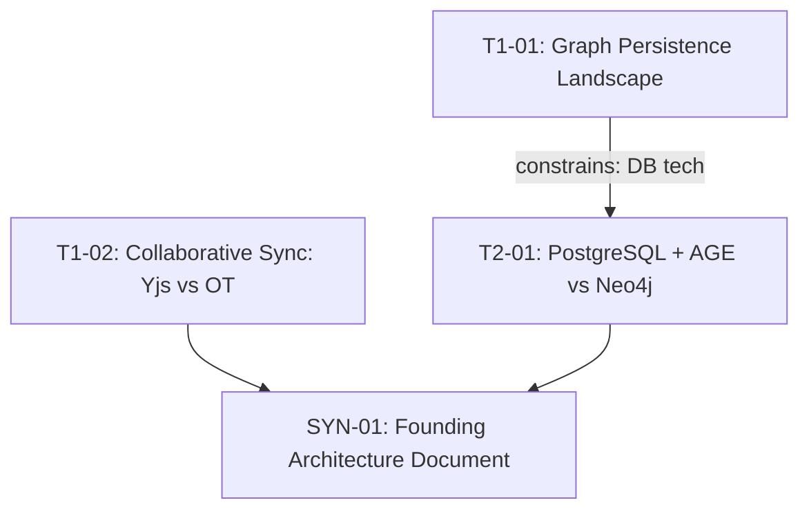

# Sample Adoption Walkthrough: Katha (MCP Workflow)

> **Note:** This example demonstrates the automated MCP server workflow. For the manual copy-paste workflow without the server, see [`docs/MANUAL-WORKFLOW.md`](../docs/MANUAL-WORKFLOW.md).

This document shows a complete, concrete walkthrough of an AI coding agent applying Vivechak to a hypothetical project (**Katha** — an AI-assisted interactive storytelling platform for indie authors). 

Instead of manual copy-pasting, the agent uses Vivechak's orchestration tools autonomously.

---

## Step 1: Initialization & Vision

The agent begins by initializing the workspace for a full project and providing the raw vision dump.

**Tool Call:** `vivechak_init`
```json
{
  "scope": "project",
  "project_root": "./"
}
```

**Tool Response:**
```json
{
  "success": true,
  "message": "Initialized project scope in ./research. 5 templates copied.",
  "next_step": "Use vivechak_prepare_generator to inject your project vision."
}
```

**Tool Call:** `vivechak_prepare_generator`
```json
{
  "scope": "project",
  "context": "We want to build Katha, an interactive web app for indie novelists. Authors write chapters, and the AI maintains a real-time character graph, detects plot inconsistencies, and suggests branching outlines. Needs collaborative editing, persistent story graphs, and low-latency LLM streaming. We have standard EU/US users (GDPR compliance), but no payment data initially. Prefer TypeScript/Next.js for frontend. Unsure about database (graph DB vs Postgres) and sync architecture (Yjs vs WebSocket OT)."
}
```

**Tool Response:**
```json
{
  "success": true,
  "message": "Project vision injected into GENERATOR.md.",
  "next_step": "Execute the GENERATOR.md prompt using your frontier LLM capabilities to generate the pipeline."
}
```

---

## Step 2: The Generated Pipeline

The agent evaluates the generator prompt and produces a 4-session plan: `RESEARCH-PIPELINE.md` and `DECISIONS.md`. 

**Execution DAG (from RESEARCH-PIPELINE.md):**


```mermaid
graph TD
    T01[T1-01: Graph Persistence Landscape]
    T02[T1-02: Collaborative Sync: Yjs vs OT]
    T03[T2-01: PostgreSQL + AGE vs Neo4j]
    SYN[SYN-01: Founding Architecture Document]

    T01 -->|constrains: DB tech| T03
    T02 --> SYN
    T03 --> SYN
```

The agent saves this plan to the workspace.

**Tool Call:** `vivechak_save_plan`
```json
{
  "scope": "project",
  "content": "# RESEARCH-PIPELINE.md\\n...\\n..."
}
```

**Tool Response:**
```json
{
  "success": true,
  "message": "Pipeline saved. 4 sessions detected. DAG is valid. No cycles.",
  "next_step": "Call vivechak_next_session to get the first actionable prompt."
}
```

---

## Step 3: Executing Sessions & Context Injection

The agent requests the first actionable session.

**Tool Call:** `vivechak_next_session`
```json
{}
```

**Tool Response:**
```json
{
  "success": true,
  "session_id": "T1-01",
  "prompt": "# RESEARCH BRIEF: T1-01 Primary Datastore Selection...\\n...",
  "upstream_context": "None (Root node)"
}
```

The agent executes the research using web search and tool capabilities, producing an analysis of PostgreSQL vs Neo4j. It then saves the session output.

**Tool Call:** `vivechak_save_session`
```json
{
  "session_id": "T1-01",
  "content": "# T1-01: Graph Persistence Landscape\\n\\n## Findings\\nPostgreSQL 16 + recursive CTEs handles graph traversal up to ~50k nodes at <50ms p95. Dedicated Graph DB operational overhead is unnecessary at this scale.\\n## Evidence\\n- [Grade A] PostgreSQL 16 Docs\\n- [Grade B] Internal PGBench runs..."
}
```

**Tool Response:**
```json
{
  "success": true,
  "message": "Saved sessions/T1-01-graph-persistence-landscape.md. Evidence grades valid.",
  "next_step": "Record any resulting decisions with vivechak_record_decision, or call vivechak_next_session."
}
```

The agent records the primary datastore decision.

**Tool Call:** `vivechak_record_decision`
```json
{
  "decision_id": "D-001",
  "artifact_type": "decision",
  "content": "---\nid: D-001\ntitle: Primary Datastore - PostgreSQL 16 with pgvector and Recursive CTEs\nstatus: accepted\ndoor_type: one-way\ndate: 2026-09-01\nevidence_refs: [E-001, E-002]\nreview_trigger: Re-evaluate if graph traversal exceeds 200ms p95 or graph > 500k edges\n---\n\n## Decision\n\nAdopt PostgreSQL 16 with pgvector extension and recursive CTEs for Katha's story graph persistence.\n\n## Evidence\n\n- [Grade A] PostgreSQL 16 Official Documentation\n- [Grade B] PGBench graph traversal benchmarks at 50k nodes"
}
```

**Tool Response:**
```json
{
  "success": true,
  "message": "Decision D-001 locked. One-way door requires review trigger (provided).",
  "next_step": "Continue pipeline."
}
```

### Context Injection

When the agent asks for the next session, Vivechak automatically injects the completed T1-01 context into the dependent T2-01 session.

**Tool Call:** `vivechak_next_session`
```json
{}
```

**Tool Response:**
```json
{
  "success": true,
  "session_id": "T2-01",
  "prompt": "# RESEARCH BRIEF: T2-01 PostgreSQL + AGE vs Neo4j...\\n...",
  "upstream_context": "From T1-01: Primary datastore is PostgreSQL. Neo4j ruled out due to operational overhead. Evaluate Apache AGE extension specifically on Postgres."
}
```

---

## Step 4: Finalizing & The Exit Gate

After completing all sessions and the `SYN-01` synthesis step, the agent runs the Phase 0 Exit Gate to ensure the architecture is ready for code.

**Tool Call:** `vivechak_run_gate`
```json
{}
```

**Tool Response:**
```json
{
  "success": true,
  "message": "Gate evaluation complete.",
  "data": {
    "gate_status": "PASS",
    "gate_passed": true,
    "track_a": {"passed": 5, "issues": []},
    "track_b": {"passed": 3, "issues": []}
  },
  "next_step": "Gate passed. Proceed to implementation using FAD.md as architectural source of truth."
}
```

With the Phase 0 Gate passed, the agent uses the sealed FAD as the architectural source of truth and seamlessly transitions into writing the actual Katha application code.
