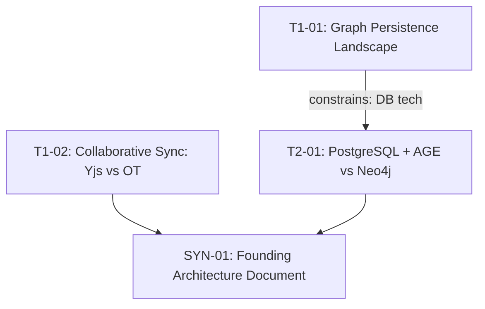

# Sample Adoption Walkthrough: Project Scope (Katha Platform Architecture)

> **Scope:** Project Scope (`ScopeProject`)  
> **Investment:** 4–30 Sessions (Hours–Days)  
> **Overhead:** Full DAG, Mandatory Track A / Track B Phase 0 Gate  
> **Deliverables:** `research/RESEARCH-PIPELINE.md`, `research/DECISIONS.md`, `research/FAD.md` (Founding Architecture)  

> **Note:** This example demonstrates the automated MCP server workflow. For the manual copy-paste workflow without the server, see [`docs/MANUAL-WORKFLOW.md`](../docs/MANUAL-WORKFLOW.md).

This document shows a complete, concrete walkthrough of an AI coding agent applying Vivechak to architect a brand-new system from scratch (**Katha** — an AI-assisted interactive storytelling platform for indie authors). 

Instead of manual copy-pasting, the agent uses Vivechak's orchestration tools autonomously.

---

## Step 1: Initialization & Vision

The agent begins by initializing the workspace for a full project and providing the raw vision in a single call to `vivechak_start`:

**Tool Call:** `vivechak_start`
```json
{
  "scope": "project",
  "question": "We want to build Katha, an interactive web app for indie novelists. Authors write chapters, and the AI maintains a real-time character graph, detects plot inconsistencies, and suggests branching outlines. Needs collaborative editing, persistent story graphs, and low-latency LLM streaming. We have standard EU/US users (GDPR compliance), but no payment data initially. Prefer TypeScript/Next.js for frontend. Unsure about database (graph DB vs Postgres) and sync architecture (Yjs vs WebSocket OT)."
}
```

**Tool Response:**
```json
{
  "ok": true,
  "message": "Project workspace initialized. Synthesize the research pipeline DAG and save it.",
  "data": {
    "scope": "project",
    "brief": "# GENERATE: Architectural Pipeline DAG (Project Scope)\n\n## VISION\nWe want to build Katha...\n\n## DEPENDENCY DAG GENERATION\nTopologically decompose into 4-6 focused sessions with explicit inputs/outputs..."
  },
  "next": {
    "tool": "vivechak_save",
    "args": {
      "kind": "plan",
      "scope": "project",
      "id": "DAG"
    },
    "why": "Save the synthesized RESEARCH-PIPELINE.md containing one yaml vivechak-plan block."
  }
}
```

---

## Step 2: The Generated Pipeline

The agent evaluates the generator prompt and produces a 4-session plan: `RESEARCH-PIPELINE.md` and `DECISIONS.md`. The pipeline's `yaml vivechak-plan` block lists the sessions, their dependencies and the one `kind: synthesis` session; each session's prompt sits under `## Sessions` in its `### <id>: <title>` section. The Mermaid diagram below is for people; the server reads only the block.

**Execution DAG (from RESEARCH-PIPELINE.md):**


```mermaid
graph TD
    T01[T1-01: Graph Persistence Landscape]
    T02[T1-02: Collaborative Sync: Yjs vs OT]
    T03[T2-01: PostgreSQL + AGE vs Neo4j]
    SYN[SYN-01: Founding Architecture Document]

    T01 -->|constrains: DB tech| T03
    T02 --> SYN
    T03 --> SYN
```

The agent saves this plan to the workspace.

**Tool Call:** `vivechak_save`
```json
{
  "kind": "plan",
  "id": "DAG",
  "content": "# Research Pipeline: Katha\n\n```yaml vivechak-plan\nplan: PROJECT\nsessions:\n  - {id: T1-01, title: Graph Persistence Landscape, layer: 1, door: one-way, informs: [D-001], depends: []}\n  - {id: T1-02, title: \"Collaborative Sync: Yjs vs OT\", layer: 1, door: two-way, depends: []}\n  - {id: T2-01, title: PostgreSQL + AGE vs Neo4j, layer: 2, door: one-way, informs: [D-001], depends: [T1-01]}\n  - {id: SYN-01, title: Founding Architecture Document, layer: 3, kind: synthesis, depends: [T1-02, T2-01]}\ndecisions:\n  - {id: D-001, title: Primary graph datastore, door: one-way}\n```\n\n## Sessions\n\n### T1-01: Graph Persistence Landscape\n| Field | Value |\n|---|---|\n| **Layer** | 1 |\n| **Door Type** | one-way |\n| **Informs Decision** | D-001 |\n\n```prompt\n# Brief for T1-01: Graph Persistence Landscape\n```\n\n### T1-02: Collaborative Sync: Yjs vs OT\n```prompt\n# Brief for T1-02: Collaborative Sync\n```\n\n### T2-01: PostgreSQL + AGE vs Neo4j\n```prompt\n# Brief for T2-01: PostgreSQL + AGE vs Neo4j\n[UPSTREAM_FINDINGS]\n```\n\n### SYN-01: Founding Architecture Document\n```prompt\n# Brief for SYN-01: Founding Architecture Document\n[ALL_SESSION_FINDINGS]\n```\n"
}
```

**Tool Response:**
```json
{
  "ok": true,
  "message": "Saved project pipeline to research/RESEARCH-PIPELINE.md (4 sessions).",
  "data": {
    "file_path": "research/RESEARCH-PIPELINE.md"
  },
  "next": {
    "tool": "vivechak_next",
    "args": {},
    "why": "Call vivechak_next to retrieve the first unblocked session prompt."
  }
}
```

---

## Step 3: Executing Sessions & Context Injection

The agent requests the first actionable session.

**Tool Call:** `vivechak_next`
```json
{}
```

**Tool Response:**
```json
{
  "ok": true,
  "message": "Ready session T1-01: Graph Persistence Landscape",
  "data": {
    "session_id": "T1-01",
    "title": "Graph Persistence Landscape",
    "prompt": "# Brief for T1-01: Graph Persistence Landscape"
  },
  "next": {
    "tool": "vivechak_save",
    "args": {
      "kind": "session",
      "id": "T1-01"
    },
    "why": "Execute session T1-01 with web search and save the completed session Markdown."
  }
}
```

The agent executes the research using web search and tool capabilities, producing an analysis of PostgreSQL vs Neo4j. It then saves the session output.

**Tool Call:** `vivechak_save`
```json
{
  "kind": "session",
  "id": "T1-01",
  "content": "---\nsession_id: T1-01\ntitle: Graph Persistence Landscape\ndate: 2026-09-01\nstatus: complete\n---\n\n# T1-01: Graph Persistence Landscape\n\n## Key Findings\n- [Grade A] https://www.postgresql.org/docs/16/queries-with.html PostgreSQL 16 recursive CTEs handle graph traversal up to ~50k nodes at <50ms p95.\n- [Grade B] Internal PGBench runs show minimal CPU overhead with indexed foreign keys.\n- [Grade B] pgvector supports co-located vector search without external index sync.\n\n## Discovered Concerns\nRecursive CTE performance degrades beyond 10 traversal hops without depth limiting.\n\n## Delta\nContradicted initial assumption that dedicated graph database was required.\n\n## Recommendation\nAdopt PostgreSQL 16 with pgvector over Neo4j. Dedicated Graph DB operational overhead is unnecessary at this scale."
}
```

**Tool Response:**
```json
{
  "ok": true,
  "message": "Session T1-01 saved to research/sessions/T1-01.md.",
  "data": {
    "id": "T1-01",
    "file_path": "research/sessions/T1-01.md"
  },
  "next": {
    "tool": "vivechak_next",
    "args": {},
    "why": "Continue with the next unblocked session or record informed decisions."
  }
}
```

The agent records the primary datastore decision.

**Tool Call:** `vivechak_record_decision`
```json
{
  "id": "D-001",
  "content": "---\nid: D-001\ntitle: Primary Datastore - PostgreSQL 16 with pgvector and Recursive CTEs\nstatus: accepted\ndoor_type: one-way\ndate: 2026-09-01\nhuman_reviewed: false\nevidence_refs: [E-001, E-002]\nreview_trigger: Re-evaluate if graph traversal exceeds 200ms p95 or graph > 500k edges\n---\n\n## Context\nStory graph persistence requires low latency node retrieval with relational metadata.\n\n## Decision\nAdopt PostgreSQL 16 with pgvector extension and recursive CTEs for Katha's story graph persistence. Grade A (https://www.postgresql.org/docs/16/queries-with.html)\n\n## Rejected Alternatives\n- Neo4j: Operational overhead of maintaining a separate cluster with specialized backup procedures is unjustified at 50k nodes.\n- DynamoDB: Multi-hop graph traversals require client-side join logic and costly fan-out queries.\n\n## Evidence\n- [Grade A] https://www.postgresql.org/docs/16/queries-with.html\n- [Grade B] PGBench graph traversal benchmarks at 50k nodes"
}
```

**Tool Response:**
```json
{
  "ok": true,
  "message": "Saved decision D-001 as valid",
  "data": {
    "id": "D-001",
    "file_path": "research/D-001-decision.md",
    "decisions_file": "research/DECISIONS.md"
  },
  "next": {
    "tool": "vivechak_review",
    "args": {
      "mode": "red_team",
      "id": "D-001"
    },
    "why": "Run adversarial red-team review for One-Way Door D-001 and cite the returned record_id before Phase 0 Gate."
  }
}
```

### Context Injection

When the agent asks for the next session, Vivechak automatically injects the completed T1-01 context into the dependent T2-01 session.

**Tool Call:** `vivechak_next`
```json
{}
```

**Tool Response:**
```json
{
  "ok": true,
  "message": "Ready session T1-02: Collaborative Sync: Yjs vs OT",
  "data": {
    "session_id": "T1-02",
    "title": "Collaborative Sync: Yjs vs OT"
  },
  "next": {
    "tool": "vivechak_save",
    "args": {
      "kind": "session",
      "id": "T1-02"
    },
    "why": "Execute the session prompt with web search and save the output."
  }
}
```

---

## Step 4: Finalizing & The Exit Gate

After completing all sessions and synthesizing the FAD via `vivechak_save(kind="fad", id="SYN-01", content="<FAD markdown>")`, the agent runs the Phase 0 Exit Gate to ensure the architecture is ready for code:

**Tool Call:** `vivechak_gate`
```json
{
  "track": "all"
}
```

**Tool Response:**
```json
{
  "ok": true,
  "message": "Phase 0 Gate: FAIL (3 failing rules). Implementation is prohibited until resolved.",
  "data": {
    "verdict": "FAIL",
    "gate_file": "research/PHASE-0-GATE.md"
  },
  "next": {
    "tool": "vivechak_next",
    "args": {},
    "why": "Resolve failing rules in research/PHASE-0-GATE.md before coding."
  }
}
```

For any One-Way Door decisions, human architectural review is required before implementation:
```sh
vck signoff D-001 --reviewer "Lead Architect"
```

Once the Phase 0 Gate passes and required sign-offs are granted, the team uses the sealed FAD as the architectural source of truth to begin writing production code.

---

## Further Scope Walkthroughs

For complete end-to-end demonstrations of the other two scopes:
- **Decision Scope:** See [SAMPLE-DECISION.md](SAMPLE-DECISION.md) for resolving architectural forks and recording ADRs in active codebases.
- **Comparison Scope:** See [SAMPLE-COMPARISON.md](SAMPLE-COMPARISON.md) for rapid 5-minute library evaluations with WEP matrices.

