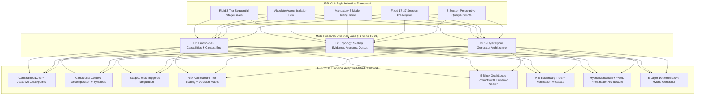
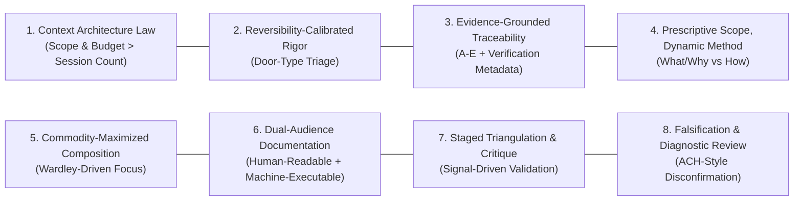
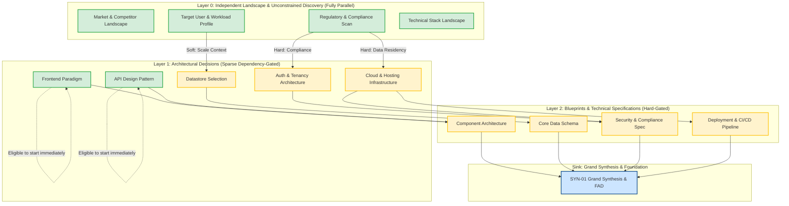
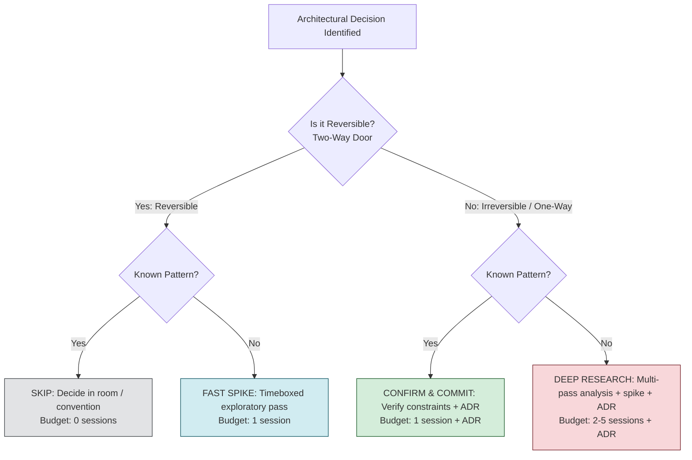
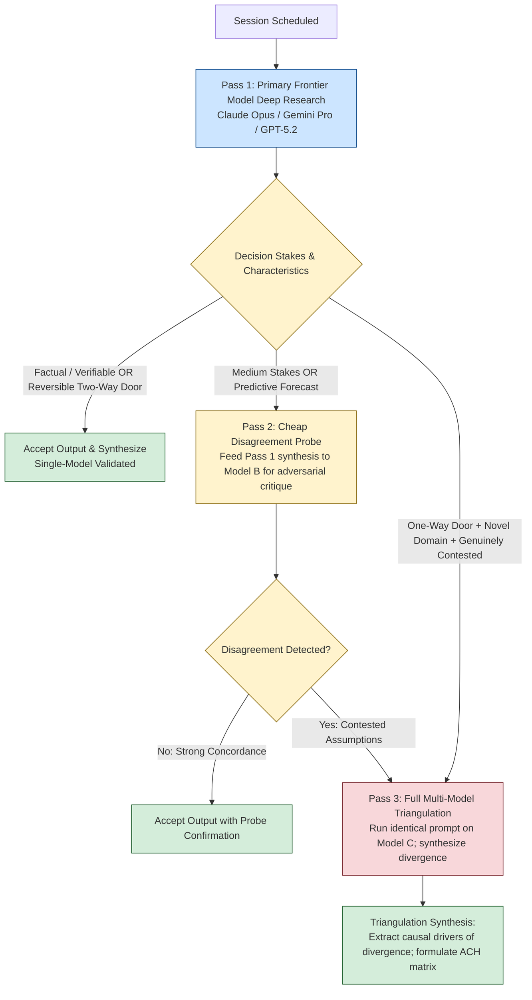
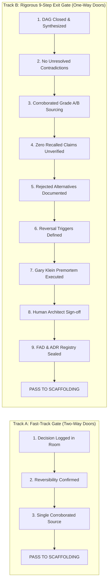
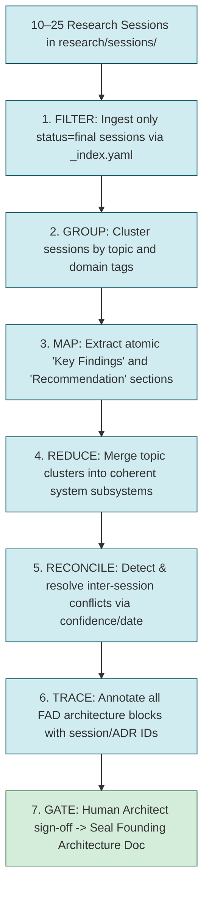
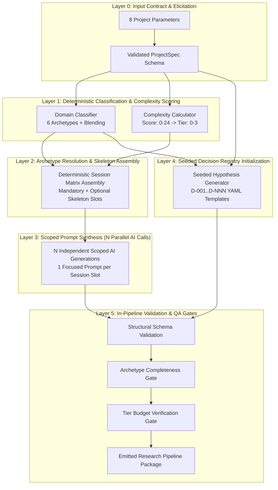

# URP v3.0 — Grand Synthesis & Meta-Framework Specification
### Grounded Architectural Synthesis of the Universal Research Pipeline
**Session ID:** SYN-01  
**Status:** Final Specification  
**Date:** August 2026  
**Evidence Base:** 11 Research Sessions (T1-01 through T3-01) spanning 13 primary empirical artifacts  
**Authorship:** Principal Research Methodology Architect  

---

## Executive Overview

The Universal Research Pipeline (URP) was established to transform technical pre-development from intuitive, unverified guesswork into an evidence-graded, structured research engine. URP v2.0 was formulated inductively from experience across six production software projects. While v2.0 established critical disciplines—notably the isolation of research topics, multi-model consensus, and 5-tier evidence grading—it codified several dogmas as absolute laws that lacked rigorous empirical grounding.

Between August 11 and August 18, 2026, a comprehensive, self-referential meta-research pipeline comprising 11 multi-faceted investigations (T1-01 through T3-01) was executed across frontier AI platforms (Claude Opus/Sonnet 4.6, GPT-5.2/o-series, Gemini Deep Research, Perplexity Sonar) and cross-referenced with established disciplines (medicine, intelligence analysis, decision science, jurisprudence, software engineering). 

This document—**SYN-01**—is the definitive Grand Synthesis for **URP v3.0**. It formalizes the transition from an *inductive, rigid, heuristic-driven framework* (v2.0) into an *empirical, adaptive, risk-calibrated meta-operating system* (v3.0).



---

## 1. Hypothesis Verdict Table (H-01 through H-10)

Each of the 10 founding hypotheses from `meta-research/DECISIONS.md` has been evaluated against empirical benchmarks, cross-domain literature, and direct architectural comparisons.

| ID | Hypothesis Statement | Verdict | Key Empirical Evidence & Citations | Confidence |
|---|---|---|---|---|
| **H-01** | **Aspect-Isolation as Universal Rule:** All research topics must be isolated into single-topic sessions to prevent catastrophic search budget dilution and attention saturation. | **REFINED** | • Anthropic BrowseComp regression shows token/tool budget explains 80–95% of performance variance, validating finite budget as a real constraint (T1-02, T2-01).<br>• However, absolute session isolation is refuted: Multi-Task Inference (MTI) benchmark demonstrates up to +12.4% accuracy and 1.46× faster inference on joint prompts when sub-tasks are interdependent (T2-01-ChatGPT).<br>• Over-isolation triggers the split-attention effect (Chandler & Sweller 1992), adds 4–15× token overhead, risks systemic blind spots (Uzzi et al. 2013, Tett 2015), and introduces error accumulation (T2-01-Claude).<br>• Frontier systems (Anthropic, OpenAI, Google) use conditional decomposition with mandatory synthesis inside a single task. | **High** |
| **H-02** | **Multi-Model Triangulation as Default:** Running identical prompts across Claude, ChatGPT, and Gemini is universally necessary to eliminate single-model bias. | **REFINED** | • On factual/verifiable questions, frontier models converge 70–90% and exhibit highly correlated errors (~60% shared incorrect answers on HELM, Kim et al. ICML 2025; Goel et al. ICML 2025), rendering multi-model checks redundant or misleadingly self-affirming (T2-02-Claude).<br>• Interpretation diversity is real specifically for ambiguous, subjective, or high-stakes trade-offs (Gao & Xiao 2026, Nonstandard Errors in AI Agents).<br>• Wisdom-of-crowds fails when voters share sources and correlated biases (Lorenz et al. 2011, Condorcet Jury Theorem limits). Full triangulation costs 3× human reconciliation time and risks manufactured confidence.<br>• Refined to a staged protocol: Single model by default → cheap critique probe for medium stakes → full triangulation only for high-stakes, irreversible, contested decisions. | **High** |
| **H-03** | **3-Tier Sequential Pipeline Structure:** Research must follow a strict linear sequence (Tier 1 Landscape → Tier 2 Architecture → Tier 3 Blueprints), with Tier 3 strictly sequential. | **REFINED** | • Rigid stage-gating forces artificial critical-path bottlenecks (e.g., Frontend Framework waiting on Competitor Landscape when zero information dependency exists) (T2-03).<br>• ~67% of Tier 2 sessions depend on 0 or 1 Tier 1 session, not all 5 (T2-03 dependency mapping).<br>• Distinguishing PMBOK mandatory (hard information) from discretionary (soft logical) dependencies allows independent sessions to run concurrently.<br>• Refined to a Constrained DAG with Bounded Adaptive Checkpoints: Tier labels serve as organizational taxonomy, not execution gates. | **High** |
| **H-04** | **Fixed 17–27 Session Count:** Most software projects require 17–27 research sessions for adequate pre-development diligence. | **REFUTED** | • 17–27 sessions is an arbitrary mean that severely over-researches simple/CRUD projects while failing to guarantee adequate depth for dangerous, novel decisions (T2-04).<br>• Cynefin (Snowden 1999) and Amazon 1-way/2-way door models prove research effort must be calibrated to reversibility and knowability.<br>• Defect and risk concentration (DORA, Walkinshaw et al. 2018) shows a small core of structural choices drives downstream failure.<br>• Refined into a 4-Tier Scaling Model (Minimal: 1–3, Light: 4–8, Standard: 9–16, Deep: 17–30) governed by an 8-dimension complexity score (0–24) and a per-decision reversibility routing matrix. | **High** |
| **H-05** | **Grade A–E Evidence Classification:** A 5-tier evidence grading system (A: primary to E: speculation) improves architectural decision quality. | **VALIDATED (With Structural Refinement)** | • 5 tiers is the optimal granularity (matches GRADE's 4-tier certainty model; avoids binary oversimplification and 36-cell Admiralty diagonal-collapse where 87% of ratings collapse to the diagonal) (T2-05).<br>• However, fixed rank by source type creates a "wavy lines" failure where stale Grade A outranks fresh, corroborated Grade B postmortems (Murad et al. 2016).<br>• Grade E improperly conflated fabrication (provenance) with staleness (recency).<br>• Lack of verification tracking leaves pipelines vulnerable to AI automation bias and confabulation (ChatGPT fabricated 2 citations when pressed in dental implant study; T1-02).<br>• Refined: A–E retained as base grades, Grade E narrowed strictly to untraceable/unverifiable; added 3 lightweight modifiers (`corroboration`, `recency`, `directness`) and mandatory `verification_method` metadata. | **High** |
| **H-06** | **Current 8-Section Prescriptive Prompt Anatomy:** Research prompts must contain 8 XML-tagged sections with exact pre-written search queries and minimum search counts. | **REFUTED** | • Expert personas (`<system>`) do not improve factual accuracy and frequently impair knowledge retrieval (Zheng et al. EMNLP 2024; Hu et al. 2026; Basil et al. 2025; T1-03, T2-06).<br>• Prescribed search queries (`<web_searches>`) are fundamentally anti-agentic, violating the ReAct (reason-act-observe) loop (Yao et al. 2023) and suppressing adaptive exploration (T1-02, T2-06).<br>• Negative bias constraints (`<bias_resistance>`) trigger ironic process / "white bear" rebound in transformers under load (T2-06).<br>• Mandatory output skeletons (`<output_spec>`) cause Procrustean distortion and degrade reasoning capacity (Tam et al. EMNLP 2024).<br>• Front-loaded, single-turn complete briefs dramatically outperform conversational drip-feeding (Laban et al. ICLR 2026).<br>• Refined to a 5-block anatomy (`brief`, `scope`, `approach`, `deliverable`, `format`): Prescriptive on WHAT/WHY/BOUNDARIES; directional on HOW/SEARCH PATH; coverage checklist instead of fixed skeleton. | **Very High** |
| **H-07** | **Markdown Artifact Output Contract:** All outputs must be delivered as complete, self-contained Markdown files. | **VALIDATED (With Frontmatter Extension)** | • Markdown is optimal for human scannability, git line-based diffs, and LLM comprehension (T2-07).<br>• Pure JSON/YAML fails for discursive narrative and git merging; full graph databases represent premature, unversionable infrastructure for 10–30 documents (T2-07).<br>• Pure Markdown lacks machine-parseable schemas for automated synthesis and typed cross-referencing.<br>• Refined to Hybrid Markdown + YAML Frontmatter (proven in static site generators, Obsidian, PEPs, ADRs): Standardized metadata header + 7 required H2 sections (with strict separation between Recommendation and Alternatives Considered for AI code generation) + auto-generated `_index.yaml`. | **High** |
| **H-08** | **~40/60 Compose/Build Ratio:** ~40% of architecture should be composed from best-in-class primitives while ~60% is custom domain logic. | **REFINED** | • A static 40/60 split is an arbitrary heuristic unsupported by empirical data; the optimal ratio varies fundamentally across domains (T1-01, T2-04).<br>• Standard SaaS may be 80% composed / 20% custom; novel algorithmic engines or protocol engineering may be 15% composed / 85% custom.<br>• Wardley mapping and Cynefin dictate: Compose 100% of commodity/utility components (Auth, DB, Storage, Queue, UI primitives); invest 100% of custom engineering into proprietary business state machines, algorithms, and core domain models. | **Medium-High** |
| **H-09** | **Phase 0 Gate with Strict Exit Criteria:** A rigid 9-step exit checklist must be satisfied before writing any code, with zero exceptions. | **REFINED** | • Absolute gates without reversibility triage create "checklist fatigue" and encourage bypass behaviors (clinical alert override rates reach 49–96% when uncalibrated) (T1-01, T2-05).<br>• Timeboxed technical spikes (XP, Kent Beck) are vital pre-development research tools to probe Cynefin-Complex unknowns before locking decisions.<br>• Refined to a Risk-Calibrated Phase 0 Gate: One-way doors enforce strict exit criteria (corroborated Grade A/B evidence, ADR locked, human review); two-way doors operate on fast tracks with ~70% information; technical spikes are formally integrated as research instruments. | **High** |
| **H-10** | **Template-Based Meta-Prompt Generator:** The generator should produce fixed template structures per project type via a single master prompt. | **REFUTED** | • Monolithic master meta-prompts suffer from non-determinism, inability to guarantee schema conformance, prompt drift, and cognitive degradation from simultaneously planning, writing, and structuring (T1-03, T3-01).<br>• Pure static templates suffer from combinatorial explosion and cannot synthesize specific, non-generic prompts from free-text vision.<br>• Established generator architectures (cookiecutter, Yeoman, Plop, Nx) demonstrate that scaffolding must be deterministic while prose synthesis must be scoped.<br>• Refined to a 5-Layer Hybrid Generator Architecture: Deterministic rules own classification, scoring, and skeleton assembly (Layers 0–2); scoped, parallel AI calls synthesize specific prompts and hypotheses (Layers 3–4); validation gates enforce quality throughout (Layer 5). | **High** |

---

## 2. URP v3.0 Core Principles (The Builder's Constitution)

The foundational axioms of URP have been revised from dogmatic constraints into an evidence-grounded operational constitution.



### Principle 1: The Context Architecture Law (Supersedes Aspect-Isolation Law)
* **What it states:** Research quality is governed by attention budget, context purity, and task boundaries—not by arbitrary session counts. Distinct research aspects must be investigated with protected, unpolluted context. Sub-tasks with low interdependency must be decomposed into dedicated research passes; sub-tasks with high interdependency must be evaluated jointly with explicit internal structure. Every decomposed investigation **must** conclude with an explicit synthesis pass.
* **Evidence base:** Anthropic BrowseComp regression ($R^2=0.80$ token usage); Chroma Research context rot across 18 models; MTI benchmark (+12.4% multi-task synergy); Chandler & Sweller split-attention effect (T1-02, T1-03, T2-01).
* **v2.0 Difference:** v2.0 mandated an absolute "one topic per session" rule with zero exceptions. v3.0 replaces blanket fragmentation with *conditional context decomposition and mandatory synthesis*.

### Principle 2: Reversibility-Calibrated Rigor (The Door-Type Axiom)
* **What it states:** The depth of research, evidentiary burden, and review overhead allocated to an architectural decision must scale directly with its reversibility and blast radius.
  * **One-Way Doors (Type 1):** Consequential, costly/impossible to reverse (primary datastore, core data model/tenancy, auth architecture, regulatory compliance, public API contracts). Warrants deep research, corroborated Grade A/B evidence, explicit options analysis, and human review.
  * **Two-Way Doors (Type 2):** Cheap, fast to reverse (UI framework, styling, CI tooling, non-core utility libraries). Warrants fast spikes or room decisions on ~70% information without multi-session research.
* **Evidence base:** Amazon shareholder letters (Bezos 2015); Legal standards of proof; DORA delivery metrics; Walkinshaw et al. defect concentration (T1-01, T2-04, T2-05).
* **v2.0 Difference:** v2.0 treated all 17–27 architectural decisions as carrying equal evidentiary weight. v3.0 establishes a dual-speed routing matrix.

### Principle 3: Evidentiary Grounding & Verification Provenance
* **What it states:** No technical assertion or architectural decision may be accepted without an explicit evidence grade (A through E), provenance tracking (`verification_method`), and contextual modifiers (`corroboration`, `recency`, `directness`). Unverified AI training-memory recall is capped at Grade D.
* **Evidence base:** GRADE framework (Guyatt et al.); WHO surgical checklist trial; AI automation bias studies; ChatGPT citation fabrication findings (T1-01, T1-02, T2-05).
* **v2.0 Difference:** v2.0 used an unadjusted single-letter grade that conflated staleness with fabrication and lacked verification tracking. v3.0 adds lightweight modifiers and strict verification metadata.

### Principle 4: Prescriptive Scope, Dynamic Method (The Anti-Cargo-Cult Rule)
* **What it states:** Research briefs must be fully front-loaded, comprehensive, and prescriptive regarding *what* to investigate, *why* it matters, *what boundaries* apply, and *what coverage* is required. Research briefs must be strictly directional regarding *how* to execute: no pre-scripted search queries, no artificial search counts, no expert role-playing personas, and no rigid output skeletons.
* **Evidence base:** Laban et al. (ICLR 2026 Outstanding Paper, 39% multi-turn drop); Zheng et al. / Basil et al. (persona debunking); Tam et al. (format restriction reasoning penalty); ReAct paradigm (Yao et al. 2023) (T1-03, T2-06).
* **v2.0 Difference:** v2.0 mandated 8-section prompts with 10–14 hardcoded search queries, personas, and rigid skeletons. v3.0 streamlines prompts into 5 functional blocks with dynamic search execution.

### Principle 5: Commodity-Maximized Composition
* **What it states:** Software architecture must ruthlessly compose standard infrastructure from battle-tested commodity primitives (Auth, DB, Storage, Queues, UI Components). Engineering bandwidth and deep research must be concentrated almost entirely on proprietary domain intelligence, core state machines, and differentiated business logic.
* **Evidence base:** Wardley mapping (genesis/custom vs commodity/utility); Martin Fowler (MonolithFirst / microservice premium); DORA loosely-coupled architecture findings (T1-01, T2-04).
* **v2.0 Difference:** v2.0 asserted an arbitrary ~40/60 ratio across all projects. v3.0 replaces this with a domain-calibrated Wardley evolution framework.

### Principle 6: Dual-Audience Artifact Architecture
* **What it states:** Technical documentation must bifurcate cleanly into human-readable narrative and machine-executable structure. Research outputs and ADRs must be authored in Git-native Markdown with YAML frontmatter, standardizing metadata and section anchors while leaving detailed analytical findings flexible. Recommendation and Rejected Alternatives must be strictly separated to prevent AI code-generation contamination.
* **Evidence base:** MADR 4.0; Python PEP standard; Diátaxis framework; GraphRAG / Header-based chunking literature; LLM code-generation ambiguity failure modes (T1-01, T2-07).
* **v2.0 Difference:** v2.0 used un-frontmatter'd Markdown files without machine-readable relationship graphs. v3.0 establishes an enforceable JSON-schema-validated hybrid format with auto-generated indexes.

### Principle 7: Staged Triangulation & Diagnostic Disagreement
* **What it states:** Multi-model consensus is an escalation tool, not a mandatory ritual. Single-model deep research is the default. Medium-stakes decisions utilize cheap cross-model critique probes. Full multi-model triangulation is reserved exclusively for high-stakes, irreversible, contested decisions or when cheap probes detect active divergence. Disagreement is treated as a diagnostic signal of problem ambiguity, not a vote to average out.
* **Evidence base:** Kim et al. (ICML 2025, correlated errors across 350+ models); Gao & Xiao (2026, Nonstandard Errors in AI Agents); Condorcet Jury Theorem limits (T2-02).
* **v2.0 Difference:** v2.0 mandated running identical prompts across 3 frontier models for every major decision. v3.0 institutes a 3-tier, cost- and risk-gated triangulation protocol.

### Principle 8: Structured Falsification & Diagnostic Review
* **What it states:** Architectural analysis must prioritize falsification over confirmation. Research prompts and decision records must explicitly test disconfirming evidence, document rejected alternatives with causal rationale, and schedule explicit decay triggers (`review_trigger`) to combat "resulting" bias.
* **Evidence base:** Heuer's Analysis of Competing Hypotheses (ACH); Annie Duke decision journaling; Superforecasting reference-class forecasting (T1-01, T2-05).
* **v2.0 Difference:** v2.0 recorded decisions without systematic falsification matrices, decay triggers, or scheduled re-evaluations.

---

## 3. URP v3.0 Pipeline Architecture

### 3.1 Pipeline Topology: Constrained DAG with Adaptive Checkpoints
URP v3.0 abandons rigid stage-gating in favor of a **Directed Acyclic Graph (DAG)** governed by explicit information dependencies and punctuated by bounded adaptive checkpoints.



#### Operational Execution Rules:
1. **The Inverted Dependency Default:** Every research session defaults to *unblocked* (eligible to execute immediately) unless an explicit hard *information dependency* is declared in its frontmatter.
2. **Hard vs. Soft Dependencies:**
   - **Hard (Information) Dependency:** Session B literally cannot formulate valid outputs without an artifact from Session A (e.g., Data Schema Blueprint requires Datastore Selection). Encoded as DAG edges that block execution.
   - **Soft (Contextual) Dependency:** Session B benefits from terminology or constraints from Session A (e.g., Frontend Framework benefits from Target User Research). Handled by injecting the living **Shared Context Brief** (`_index.yaml` + locked ADRs) into Session B's starting prompt, with zero execution blocking.
3. **Bounded Adaptive Checkpoints (CHK):**
   - Checkpoints occur at defined milestones (e.g., when a major branch closes or when an uncertainty flag is raised).
   - **Expansion Rule:** If a session reveals unexpected Cynefin-Complex trade-offs, the controller may spawn a maximum of 2 child sub-sessions (capped per checkpoint).
   - **Contraction Rule:** If a planned session's core question has been authoritatively resolved by an upstream session, it is closed immediately with a "Resolved upstream" ADR record.
4. **Incremental Synthesis:** Partial synthesis into the Founding Architecture Document (FAD) begins as soon as any structural branch (e.g., Auth + Data Layer) closes, rather than waiting for 100% corpus completion.

---

### 3.2 Adaptive Scaling Model: The 4-Tier System

URP v3.0 replaces the fixed 17–27 session rule with an 8-dimension scoring engine that establishes a project-level research appetite (budget ceiling) and a per-decision routing matrix.

#### Step 1: Project Complexity Scoring Rubric (0–24 Points)
Score each dimension from 0 (minimal) to 3 (maximal):

$$\text{Project Score} = \sum_{i=1}^{8} D_i \quad (\text{Range: } 0 - 24)$$

| Dimension ($D_i$) | 0 Points (Low) | 1 Point (Moderate) | 2 Points (Substantial) | 3 Points (Extreme / Novel) |
|---|---|---|---|---|
| **$D_1$: Domain Novelty** | Standard CRUD / e-commerce | Established B2B SaaS | Unconventional workflow | Entirely new category / paradigm |
| **$D_2$: Technical Novelty** | Team's standard production stack | Familiar language, new lib | New framework / paradigm | Unproven / cutting-edge infra |
| **$D_3$: Regulatory / Compliance** | Zero sensitive data | Internal / business data | PII, GDPR, SOC 2 scope | HIPAA, PCI-DSS, KYC/AML, FinTech |
| **$D_4$: Reversibility / Blast Radius** | Throwaway / easily rewritable | Modularly swappable | Core schema / multi-tenant | Deep platform infrastructure |
| **$D_5$: Investment / Downstream Cost** | Hackathon / weekend spike | Lean MVP / internal tool | Funded venture / production app | Enterprise mission-critical asset |
| **$D_6$: Team Size & Coordination** | Solo developer | Small team (2–4 engineers) | Mid-size team (5–12 engineers) | Multi-team / cross-org (>12) |
| **$D_7$: Expected Longevity** | Days to weeks (disposable) | Months (evaluative prototype) | 1–3 years (standard product) | 5+ years (core platform) |
| **$D_8$: Integration Complexity** | Standalone, no external APIs | 1–2 standard REST APIs | Multiple complex webhooks/APIs | Regulated banking rails / legacy ERP |

#### Step 2: Tier Mapping & Session Budget

| Score Range | Tier | Session Budget | Focus & Character |
|---|---|---|---|
| **0 – 4** | **Tier 0: Minimal** | **1 – 3 Sessions** | 1 fast spike on core unknown; all reversible items decided in the room. |
| **5 – 9** | **Tier 1: Light** | **4 – 8 Sessions** | Standard SaaS / internal tools. Fast spikes on stack; deep check only on core schema. |
| **10 – 15** | **Tier 2: Standard** | **9 – 16 Sessions** | Commercial product launch. Full landscape, core architecture ADRs, key blueprints. |
| **16 – 24** | **Tier 3: Deep** | **17 – 30 Sessions** | Highly novel, regulated, multi-tenant platform. Full multi-aspect deep research. |

> **🚨 Non-Negotiable Hard Override:** If $D_3$ (Regulatory Exposure) scores a **3** (financial rails, health records, payment card data, children's data), all intersecting decision categories automatically receive **Tier 3 Deep Research treatment**, regardless of total project score.

#### Step 3: Per-Decision Routing Matrix
Inside any project tier, each architectural decision is routed individually based on its intrinsic characteristics:



---

### 3.3 Multi-Model Triangulation Protocol

Triangulation is transformed from a static requirement to an **escalation-driven protocol**:



---

### 3.4 The Risk-Calibrated Phase 0 Exit Gate (The Two-Track Standard)

To prevent both premature development on ungrounded assumptions and bureaucratic "alert fatigue" on reversible choices, URP v3.0 establishes an operational **Two-Track Phase 0 Exit Gate**:



#### Track B: The 9-Step Pre-Codebase Exit Checklist (One-Way Doors)
1. **DAG Closure:** All required dependency paths in the research DAG have terminated in `status: final` session artifacts.
2. **Contradiction Resolution:** All cross-model and cross-source divergences have been resolved via explicit trade-off rationale or ACH synthesis.
3. **Evidentiary Threshold:** Zero uncorroborated Grade C/D/E claims underpin any irreversible architectural pillar.
4. **Verification Integrity:** 100% of critical citations carry `verification_method: fetched` or `cached` (zero `recalled` citations allowed for Type 1 decisions).
5. **Rejected Alternatives Documented:** Every locked ADR explicitly details evaluated and rejected competing options with causal rationale.
6. **Decay Triggers Assigned:** Every locked ADR contains an explicit `review_trigger` condition/timestamp.
7. **The Premortem Protocol (Gary Klein 1989):** The engineering team executes a formal 30-minute prospective hindsight exercise: *"Assume it is 12 months from now and the system suffered an catastrophic architectural failure. What caused it?"* Identified vulnerabilities must be mitigated in the FAD.
8. **Named Human Review:** An accountable human Principal Architect has logged a signature review on all Type 1 ADRs.
9. **Founding Architecture Document Sealed:** The master synthesis document (`FAD.md`) is compiled, committed to git, and ready to seed repository scaffolding.

---

## 4. URP v3.0 Research Prompt Design

### 4.1 The 5-Block Prompt Specification

URP v3.0 streamlines research prompts into five functional blocks, eliminating artificial persona prompts, pre-written search query scripts, and rigid skeletons.

```
+-------------------------------------------------------------------------------+
|                             URP v3.0 PROMPT ANATOMY                           |
+-------------------------------------------------------------------------------+
| 1. BRIEF: Goal, target deliverable, intended audience, decision being        |
|    informed, required analytical depth. (Replaces <system> & <context> header)|
+-------------------------------------------------------------------------------+
| 2. SCOPE: Boundaries, time window, in/out of scope, source preferences &      |
|    exclusions, current date anchor. (Absorbs <temporal_enforcement> & context)|
+-------------------------------------------------------------------------------+
| 3. APPROACH: Dynamic heuristics, exploration-before-narrowing, effort-budget  |
|    scaling rule, assumption declaration, contradiction surfacing.             |
|    (Replaces <web_searches>, <unbiased_constraint>, <bias_resistance>)       |
+-------------------------------------------------------------------------------+
| 4. DELIVERABLE: Required-coverage checklist, comparison parameters, inline    |
|    evidence grading, single-source confidence flags. (Replaces <output_spec>) |
+-------------------------------------------------------------------------------+
| 5. FORMAT: Markdown structure, frontmatter schema, artifact delivery tags.    |
|    (Preserves <output_format>)                                                |
+-------------------------------------------------------------------------------+
```

### 4.2 Standard v3.0 Prompt Template

```markdown
# RESEARCH BRIEF: [Topic Title]

## BRIEF
We are investigating [core technical/architectural question]. 
This research will directly inform Architectural Decision [D-XXX: Decision Title]. 
The target audience is a Principal Architect requiring rigorous, production-grade technical evaluation with concrete tradeoffs, operational failure modes, and verified benchmarks—not high-level introductory summaries.

## SCOPE
- **Temporal Anchor:** Today's date is [YYYY-MM-DD]. Focus heavily on developments, benchmarks, and releases within the last 18–24 months. Explicitly flag any findings originating prior to [YYYY-MM-DD - 2 years] as potentially stale.
- **In Scope:** [Explicit boundary 1], [Explicit boundary 2], [Explicit boundary 3].
- **Out of Scope:** [Explicit exclusion 1], [Explicit exclusion 2].
- **Source Priorities:** Prioritize primary sources (official engineering documentation, RFCs, official source code repositories, peer-reviewed benchmarks) and direct engineering postmortems over secondary aggregators, sponsored content, and SEO content farms.

## APPROACH
- **Exploration Strategy:** Begin with broad architectural landscape queries to map available solutions, then dynamically formulate targeted queries to investigate specific trade-offs, failure modes, and benchmarks.
- **Effort Calibration:** Scale search effort to the complexity discovered. Spend sufficient search calls to trace genuine technical contradictions across sources rather than stopping at the first consensus hit.
- **Epistemic Discipline:**
  - State all necessary assumptions explicitly rather than silently resolving ambiguity.
  - Surface technical disagreements between competing platforms/authors rather than smoothing them over.
  - Frame all inquiries neutrally; actively search for disconfirming evidence against favored options.

## DELIVERABLE
Deliver a structured Markdown document covering the following required checklist:
1. **Executive Summary & Recommendation:** Clear, unambiguous architectural guidance.
2. **Options Evaluation Matrix:** Comparative analysis covering [Criteria 1, Criteria 2, Criteria 3, Operational Overhead, Failure Modes].
3. **Deep Technical Analysis:** Detailed breakdown of top 2–3 viable contenders with code/config samples and architecture diagrams where relevant.
4. **Evidentiary Grading:** Assign inline evidence grades (A through E with modifiers and verification method) for all factual and benchmark claims.
5. **Open Risks & Reversal Triggers:** Explicit failure conditions under which this decision must be revisited.

## FORMAT
Deliver the entire output as a single, complete Markdown file artifact adhering to the URP v3.0 Output Schema (YAML frontmatter + standardized H2 sections).
```

---

## 5. URP v3.0 Evidence & Decision System

### 5.1 The Revised Evidence Grading Standard

Base grades represent the *initial evidentiary standing* based on source provenance, which is then adjusted via three orthogonal modifiers and a mandatory verification method.

#### Base Evidentiary Tiers (A through E)

| Base Grade | Source Classification | Operational Description | Starting Confidence |
|---|---|---|---|
| **Grade A** | **Primary / Authoritative** | Official source code, published RFCs, formal API specifications, vendor engineering documentation. | Very High (Subject to recency) |
| **Grade B** | **Empirical / Experimental** | Independently reproducible benchmarks, published engineering postmortems, peer-reviewed empirical studies. | High (When corroborated) |
| **Grade C** | **Vendor / Motivated** | Vendor whitepapers, commercial comparison pages, marketing benchmarks, sponsored evaluations. | Moderate (Requires corroboration) |
| **Grade D** | **Secondary / Opinion** | Unofficial tutorials, blog posts, community forums, AI training-data parametric recall without live fetch. | Low-to-Moderate |
| **Grade E** | **Untraceable / Speculative** | Unverifiable claims, model confabulations, unattributed speculation. (Strictly excludes stale real sources). | Zero (Cannot support 1-way doors) |

#### Contextual Modifiers & Verification Metadata
Every cited claim carries a composite signature: `[BaseGrade · Corroboration · Recency · Directness | VerificationMethod]`

1. **`corroboration`**:
   - `single`: Backed by exactly one source.
   - `corroborated`: Confirmed by $\ge 2$ independent, non-affiliated sources.
   - `contested`: Direct conflict or contradiction identified across authoritative sources.
2. **`recency`**:
   - `fresh`: Published/verified within the domain half-life (e.g., $<6$ months for fast-moving libraries; $<18$ months for mature infra).
   - `aging`: Approaching expected half-life; core claims require active verification.
   - `stale`: Exceeds expected half-life or superseded by newer major releases.
3. **`directness`**:
   - `direct`: Evaluates the exact workload, language, and deployment target under consideration.
   - `indirect`: Analogical evidence (e.g., benchmarking Postgres in C++ used to infer behavior in Node.js).
4. **`verification_method`** (Mandatory for AI Authorship):
   - `fetched`: Retrieved and validated live via tool/web call during this research session.
   - `cached`: Read from local repository file or previously verified artifact.
   - `recalled`: Generated from model parametric memory without live tool verification. (**Hard Rule: Automatically capped at Grade D**).
   - `secondhand`: Sourced from an article summarizing a primary source.
   - `human-provided`: Injected directly by a human engineer.

*Example Citation:*  
`Postgres 16 logical replication supports bi-directional failover under active-active topologies (Grade B · corroborated · fresh · direct | fetched)`

---

### 5.2 Standalone Evidence Record Schema (`E-NNN`)

Stored in `evidence/E-NNN-[slug].md` to enable cross-project reuse and blast-radius tracking (Shepard's Citations model):

```yaml
---
id: E-047
title: "PostgreSQL 16 Logical Replication Active-Active Throughput Benchmark"
grade: B
modifiers:
  corroboration: corroborated
  recency: fresh
  directness: direct
verification:
  method: fetched
  fetched_date: 2026-08-18
  fetched_by: research-agent-1
source:
  url: "https://engineering.example-corp.com/postgres-16-replication-benchmarks"
  type: "engineering-postmortem"
  author: "ExampleCorp Core Platform Team"
tags: [postgres, replication, benchmarks, throughput]
used_by: [D-001, D-118]
---

# E-047: PostgreSQL 16 Logical Replication Active-Active Throughput Benchmark

## Claim Summary
Postgres 16 logical replication sustains 42,000 writes/sec with sub-50ms replication lag under dual-region active-active topology before conflict-resolution lock contention begins.

## Corroborating Sources
1. Official PostgreSQL 16 Release Performance Notes (`https://postgresql.org/docs/16/release-notes`) (Grade A · direct)
2. GitLab Geo Replication Engineering Postmortem (`https://about.gitlab.com/handbook/geo-replication`) (Grade B · direct)

## Methodological Notes & Caveats
Benchmark conducted on AWS `r6i.4xlarge` instances with provisioned IOPS SSDs (io2). Throughput degrades by 35% if network round-trip time between regions exceeds 80ms.
```

---

### 5.3 Architectural Decision Record (ADR) Schema (`D-NNN`)

Stored in `decisions/D-NNN-[slug].md`.

```yaml
---
id: D-001
title: "Primary Datastore Selection for Real-Time Event Ledger"
status: accepted               # proposed | accepted | rejected | deprecated | superseded
door_type: one-way             # one-way | two-way (Sets required evidentiary bar)
date: 2026-08-18
confidence: high               # high | medium | low (Decoupled from evidence grade)
evidence_refs: [E-012, E-015, E-047]
informed_by_sessions: [T2-03, T2-05]
supersedes: null
superseded_by: null
amends: null
review_trigger: "Re-evaluate if ingestion volume exceeds 50k ops/sec or if storage surpasses 2TB"
tags: [database, persistence, event-ledger, storage]
authored_by: "research-pipeline-agent"
human_reviewed: true           # Mandatory for one-way door decisions
schema_version: "3.0"
---

# D-001: Primary Datastore Selection for Real-Time Event Ledger

## Context & Problem Statement
[Detailed description of technical requirements, throughput goals, latency limits, and architectural forces at play.]

## Evaluated Options
1. **Option 1: ScyllaDB Enterprise** — Evidence: E-012 (Grade B · corroborated · fresh · direct | fetched)
2. **Option 2: PostgreSQL 16 with TimescaleDB** — Evidence: E-047 (Grade B · corroborated · fresh · direct | fetched), E-015
3. **Option 3: Amazon DynamoDB** — Evidence: E-019 (Grade C · single · fresh · direct | fetched)

## Decision Outcome
**Chosen Option:** Option 2 — PostgreSQL 16 with TimescaleDB.

### Rationale
[Causal rationale mapping evidence directly to decision criteria, explaining why the chosen option outperforms competitors.]

## Rejected Alternatives & Tradeoffs
- **ScyllaDB Enterprise:** Rejected due to operational complexity for small engineering team ($D_6=1$) and high initial cluster licensing cost, despite superior 100k+ ops/sec throughput.
- **Amazon DynamoDB:** Rejected due to long-term data egress costs and vendor lock-in for analytical querying ($D_3$ compliance constraints).

## Failure Modes & Reversal Triggers
- If partition re-indexing times exceed 4 hours during maintenance windows, trigger immediate review of ScyllaDB migration path.
- Review trigger scheduled for 2027-02-18 or upon major version upgrade.
```

---

## 6. URP v3.0 Output Architecture

### 6.1 Unified Frontmatter Schema for Research Artifacts

Every research artifact (`research/sessions/T#-##-[slug].md`) adheres to the JSON-schema-validated frontmatter structure:

```yaml
---
id: T2-03
title: "Datastore Engine Trade-Off Analysis"
session_date: 2026-08-18
status: final                  # draft | in-review | final | superseded
topic: data-persistence
tags: [database, postgres, dynamodb, latency, storage]
related_sessions: [T1-02, T1-04]
supersedes: null
superseded_by: null
informs_decisions: [D-001, D-004]
confidence: high               # high | medium | low
open_questions: 0
schema_version: "3.0"
---
```

#### JSON Schema for CI Frontmatter Validation
```json
{
  "$schema": "http://json-schema.org/draft-07/schema#",
  "title": "URPv3SessionFrontmatter",
  "type": "object",
  "required": ["id", "title", "session_date", "status", "topic", "schema_version"],
  "properties": {
    "id": { "type": "string", "pattern": "^(T[1-3]-\\d{2}|SYN-\\d{2})$" },
    "title": { "type": "string", "minLength": 5 },
    "session_date": { "type": "string", "format": "date" },
    "status": { "enum": ["draft", "in-review", "final", "superseded"] },
    "topic": { "type": "string" },
    "tags": { "type": "array", "items": { "type": "string" } },
    "related_sessions": { "type": "array", "items": { "type": "string" } },
    "supersedes": { "type": ["string", "null"] },
    "superseded_by": { "type": ["string", "null"] },
    "informs_decisions": { "type": "array", "items": { "type": "string" } },
    "confidence": { "enum": ["high", "medium", "low"] },
    "open_questions": { "type": "integer", "minimum": 0 },
    "schema_version": { "type": "string", "enum": ["3.0"] }
  },
  "additionalProperties": true
}
```

---

### 6.2 Standardized 7-Section Document Skeleton

To ensure seamless human reading, automated RAG synthesis, and unambiguous AI code-generation consumption, the body must follow this exact section hierarchy:

1. `## Research Question` — Precise 1–2 sentence statement of what this session investigated.
2. `## Key Findings` — 3–7 self-contained, atomic bullet points extractable by synthesis agents.
3. `## Recommendation` — The explicit, unambiguous technical guidance (strictly isolated from rejected options).
4. `## Alternatives Considered` — Systematic breakdown of evaluated competing options and why they were rejected.
5. `## Detailed Findings` — Fully flexible analytical body (benchmarks, comparison tables, code/configuration blocks, architecture diagrams).
6. `## Open Questions & Risks` — Explicit unresolved items and downstream risks.
7. `## Sources & Evidentiary Ledger` — Numbered list of citations with full composite grade metadata.

---

### 6.3 The Map-Reduce Synthesis Workflow (10–25 Sessions $\to$ FAD)



1. **Filter:** Read auto-generated `_index.yaml`; include only sessions marked `status: final` (drafts explicitly excluded).
2. **Group:** Cluster filtered session metadata by `topic` (e.g., `data-persistence`, `identity-auth`, `api-edge`).
3. **Map:** Extract the standalone **Key Findings** and **Recommendation** sections from each file (designed for context-efficient summarization).
4. **Reduce:** Synthesize mapped topic blocks into unified subsystem architecture chapters.
5. **Reconcile:** Identify and resolve cross-cutting contradictions (e.g., Session A assumes REST, Session B assumes gRPC) using `confidence` and `session_date` weighting.
6. **Trace:** Ensure every architectural directive in the FAD backlinks to its originating `T#-##` session and `D-NNN` decision ID.
7. **Gate:** Subject the compiled FAD to Track B Phase 0 Gate review before committing to repo root.

---

## 7. URP v3.0 Generator Design (The 5-Layer Hybrid)

URP v3.0 replaces the monolithic `META-PROMPT-GENERATOR.md` with an engineered **5-Layer Deterministic/AI Hybrid Architecture**.



### 7.1 The 6 Domain Archetypes & Composition Rules
1. **B2B SaaS:** Multi-tenancy isolation, buyer vs user journey, RBAC/SAML, CRM integrations, seat/usage pricing.
2. **Developer Tools:** DX & time-to-first-value, CLI/SDK idioms, package manager distribution, open-source vs commercial licensing.
3. **FinTech:** Regulatory/KYC/AML compliance, banking rails, immutable ledger schemas, PCI-DSS, fraud detection.
4. **AI/ML Systems:** Model selection (foundation vs fine-tune), eval benchmarks, inference cost/latency, context window architecture, guardrails.
5. **Consumer Mobile:** App Store/Play Store compliance, offline-first sync, onboarding drop-off, push/retention loops, in-app billing.
6. **Real-Time / IoT:** Protocol selection (MQTT/WebSockets), edge vs cloud compute, fleet OTA updates, hardware power/memory constraints.

*Archetype Blending Rule (Yeoman `composeWith` Pattern):*  
When a project matches multiple domains (e.g., AI FinTech), the generator adopts the Primary Archetype's full session matrix and appends *only the non-overlapping differentiator sessions* from the Secondary Archetype.

---

## 8. v2.0 → v3.0 Change Log (The Definitive Diff)

```diff
===================================================================
URP FRAMEWORK EVOLUTION: v2.0 (Inductive) -> v3.0 (Empirical)
===================================================================

--- 1. PHILOSOPHY & CORE PRINCIPLES ---
- Principle 1: Aspect-Isolation Law (Absolute one-topic-per-session rule; zero exceptions).
+ Principle 1: Context Architecture Law (Conditional context decomposition + mandatory synthesis; joint evaluation when coupled).
- Principle 2: Mandatory Frontier Triangulation (All critical prompts must run across Claude, ChatGPT, and Gemini).
+ Principle 2: Staged Triangulation Protocol (Single model default -> cheap critique probe -> full triangulation for 1-way contested doors).
- Principle 3: Fixed ~40% Compose / ~60% Build Strategic Split across all projects.
+ Principle 3: Commodity-Maximized Composition (Wardley evolution mapping; 100% commodity compose, 100% proprietary custom build).
+ Principle 4: Reversibility-Calibrated Rigor (Amazon Type 1 one-way vs Type 2 two-way door decision triage).
+ Principle 5: Structured Falsification & Diagnostic Review (Analysis of Competing Hypotheses & Annie Duke review triggers).

--- 2. PIPELINE TOPOLOGY & SCALING ---
- Rigid 3-Tier Sequential Stage Gating (Tier 1 -> Tier 2 -> Tier 3; every stage blocks the next).
+ Constrained DAG with Bounded Adaptive Checkpoints (Dependency-gated; unblocked default; living Shared Context Brief).
- Fixed 17-27 Session Count prescription for all software ventures.
+ Risk-Calibrated 4-Tier Scaling Model (Tier 0: 1-3, Tier 1: 4-8, Tier 2: 9-16, Tier 3: 17-30) based on 8-dimension score (0-24).
+ Per-Decision Routing Matrix (Reversibility x Familiarity: Skip, Fast Spike, Confirm-and-Commit, Deep Research).
+ Dynamic Scope Expansion/Contraction Rules at structured checkpoints.
+ Operational Two-Track Phase 0 Exit Gate with Gary Klein Premortem protocol.

--- 3. PROMPT ANATOMY & RESEARCH HARNESS ---
- 8-Section Prescriptive Prompt Anatomy (<system>, <temporal_enforcement>, <context>, <unbiased_constraint>, <bias_resistance>, <web_searches>, <output_spec>, <output_format>).
+ 5-Block Streamlined Prompt Anatomy (BRIEF, SCOPE, APPROACH, DELIVERABLE, FORMAT).
- Persona / Role-play assignment (<system> "You are an expert X").
+ Explicit Target Audience, Decision Context, and Analytical Rigor in BRIEF (Persona removed to protect factual recall).
- Hardcoded Search Query Scripts (<web_searches> 10-14 exact queries + minimum counts).
+ Dynamic Search Heuristics & Effort-Scaling Budget in APPROACH (Adaptive ReAct loop execution).
- Negative Bias Suppression (<bias_resistance> "Do not suffer from confirmation bias").
+ Positive Epistemic Instructions (Explicit assumption declaration & contradiction surfacing).
- Rigid Output Skeletons (<output_spec> mandatory sub-sections).
+ Required-Coverage Checklist in DELIVERABLE (Flexible internal structure; Procrustean distortion eliminated).

--- 4. EVIDENCE GRADING & DECISION REGISTRY ---
- Static 5-tier A-E grading based solely on source prestige.
+ Dynamic A-E base grading with 3 contextual modifiers (corroboration, recency, directness).
- Grade E conflated AI hallucinations and stale real sources.
+ Grade E redefined strictly as "Untraceable / Unverifiable"; staleness decoupled into recency modifier.
+ Mandatory verification_method metadata (fetched, cached, recalled, secondhand, human-provided); recalled capped at Grade D.
+ Dedicated E-NNN Evidence Record Schema with used_by backlinks for blast-radius tracking.
+ Mandatory door_type classification (one-way vs two-way) on all D-NNN decision records.
+ Decoupled Decision Confidence from Evidence Grade.
+ Typed decision relationships (supersedes, amends, depends_on, conflicts_with) and review_trigger timestamps.

--- 5. OUTPUT ARCHITECTURE & REPOSITORY SPECIFICATION ---
- Pure Markdown files with unstructured headers and manual indexing.
+ Hybrid Markdown Body + YAML Frontmatter (JSON Schema validated via CI).
+ Standardized 7-Section Body Skeleton with strict isolation between Recommendation and Alternatives Considered.
+ Formal Map-Reduce Synthesis Workflow (Filter -> Group -> Map -> Reduce -> Trace -> Gate).
+ Auto-generated _index.yaml build artifact for programmatic RAG synthesis and traceability graph traversal.

--- 6. GENERATOR ARCHITECTURE ---
- Monolithic master prompt (META-PROMPT-GENERATOR.md) generating entire pipeline in one single-turn call.
+ 5-Layer Deterministic/AI Hybrid Generator (Deterministic scoring/skeleton assembly + N scoped parallel prompt synthesis calls + CI validation gates).
+ 6 Pre-built Domain Archetype Libraries with Yeoman-style composeWith blending.
```

---

## 9. The Inversion Test for Core Conclusions

To ensure URP v3.0 resists confirmation bias and dogma, each core architectural conclusion is subjected to **The Inversion Test**—stating the exact opposite claim and analyzing under what edge conditions the opposite holds valid.

| Core v3.0 Conclusion | Inverted Opposite Claim | When the Inverted Claim Holds (Boundary Conditions & Failure Modes) |
|---|---|---|
| **1. Dynamic search heuristics beat pre-scripted query lists.** | *Pre-scripted, deterministic query lists produce better, more consistent research than model-driven search.* | **Holds when:** Benchmarking longitudinal drift across identical queries over time, or in strict regulatory/compliance audits where exact legal discovery protocols must be proven to third-party auditors. |
| **2. Single-model default beats universal 3-model triangulation.** | *Mandatory 3-model triangulation is always worth the cost on every architectural decision.* | **Holds when:** Using smaller, budget-constrained, or heavily censored open-source models with high individual error variance, or in mission-critical aerospace/defense software where compute cost is negligible compared to catastrophic mission failure. |
| **3. DAG execution beats rigid sequential staging.** | *Rigid sequential staging produces higher quality than dependency DAGs.* | **Holds when:** Executed by novice human researchers who lack the discipline to maintain shared context briefs, or on tiny pipelines ($\le 5$ sessions) where mapping dependency graphs introduces more overhead than it saves. |
| **4. 5-block goal prompts beat 8-section prescriptive prompts.** | *8-section prescriptive prompts with exact templates outperform streamlined goal-oriented prompts.* | **Holds when:** Operating on legacy non-reasoning LLMs (GPT-3.5 / early Llama-2 class) that lack internal planning and require exhaustive procedural scaffolding to avoid degenerate generation. |
| **5. Lightweight modifiers beat full multi-axis matrices (Admiralty).** | *A full orthogonal multi-dimensional matrix (Source × Credibility × Recency × Replicability) is superior.* | **Holds when:** Automated algorithmic scoring systems (not humans or conversational agents) parse verified database records with zero cognitive friction and zero risk of diagonal collapse. |

---

## 10. Remaining Uncertainties & Future Research (The URP v4.0 Agenda)

While URP v3.0 establishes an empirical baseline, several frontiers remain open for ongoing investigation:

1. **Automated Dynamic Prompt Optimization at Runtime:**  
   *Question:* Can meta-prompt generation incorporate DSPy-style declarative compilation where research prompts iteratively self-optimize against retrieval performance on live test queries?
2. **Autonomous Tool-Use Calibration:**  
   *Question:* How can agent harnesses reliably suppress tool-overuse (the 30%+ redundant call problem documented in SMART/When2Tool benchmarks) without training-time reward reshaping?
3. **Formal Verification of Architecture Invariants:**  
   *Question:* How can FAD synthesis automatically emit executable **Fitness Functions** (ThoughtWorks Evolutionary Architecture) that run in GitHub Actions to continuously test codebase adherence against ADR constraints?
4. **Cross-Model Multi-Agent Debate for Reversible Probing:**  
   *Question:* What are the exact convergence conditions for multi-agent adversarial debate (Irving et al.) when evaluating Cynefin-Complex architectural tradeoffs without human moderation?
5. **Real-World Calibration Longitudinal Audit:**  
   *Question:* Track 50 production projects built with URP v3.0 over 24 months to measure the precise correlation between Phase 0 evidence grades and 2-year architectural refactoring rates.

---

## Final Verification & Seal of Synthesis

This Grand Synthesis (SYN-01) represents the formal completion of the URP v3.0 Meta-Research Pipeline. It is grounded in empirical findings from all 11 research sessions, cross-referenced across frontier AI platforms, and codified into actionable, testable architecture.

*Universal Research Pipeline v3.0 is hereby synthesized, specified, and declared ready for operational deployment.*
