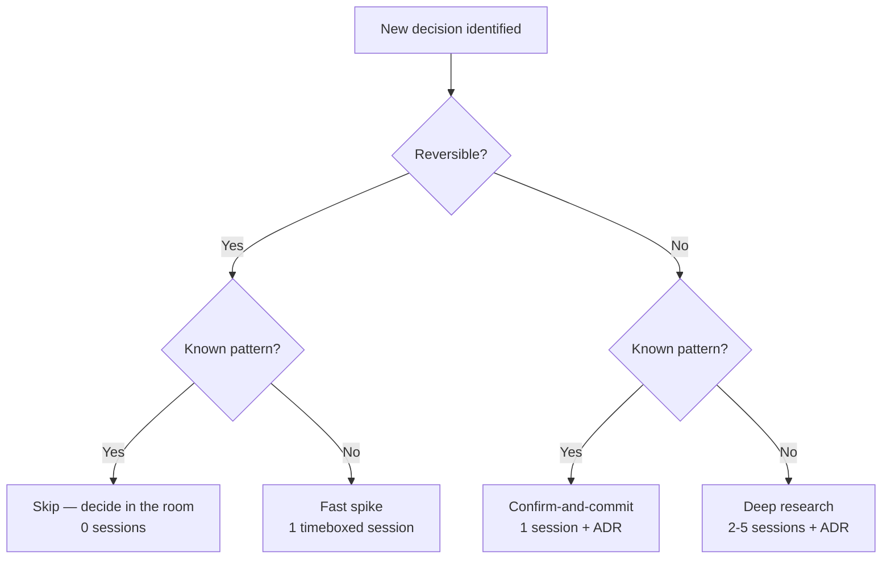

# Right-Sizing Pre-Development Research: A Risk-Calibrated Scaling Model

*A methodology brief on adapting research pipeline depth to project complexity*

---

## Executive Summary

A research pipeline that prescribes 17–27 sessions "for most software projects" is solving the wrong equation. It sizes the process to the average project instead of the project in front of it — which means it reliably over-researches the weekend hackathon and the well-trodden CRUD app, while offering no guarantee that it correctly covers the one or two truly dangerous decisions buried inside a novel, regulated platform.

This brief argues that pipeline depth should not be a single number chosen for "most projects." It should be the output of two separate mechanisms working together:

1. **A project-level complexity score** that sets an overall research *appetite* (a budget, not an estimate) — producing something closer to 1–3 sessions for a throwaway prototype and 17–30 for a genuinely novel, regulated, high-investment platform.
2. **A per-decision routing rule**, applied inside every project regardless of tier, that sends each individual architectural decision down a fast lane or a slow lane based on how reversible it is and how well-understood the pattern is — because every project, even a "Light" one, can contain one decision that deserves deep scrutiny, and even the deepest project is full of decisions that deserve none.

Existing calibration frameworks — Cynefin, Amazon's reversible/irreversible decision model, YAGNI, Real Options, Architecture Decision Records, and Basecamp's Shape Up — all converge on the same underlying claim from different directions: **the amount of deliberation a decision deserves is a function of how expensive it is to be wrong and how hard it is to undo, not of how important the project feels.** This brief synthesizes those frameworks into one scoring rubric, one routing matrix, and a set of adaptive triggers for re-scoring mid-project, then applies the resulting model to the three cases that motivated this review: a weekend hackathon, a well-understood CRUD app, and a novel regulated fintech platform.

---

## Contents

1. [The Problem with One-Size-Fits-All Pipelines](#1-the-problem-with-one-size-fits-all-pipelines)
2. [What Determines How Much Research a Project Needs](#2-what-determines-how-much-research-a-project-needs)
3. [What Existing Calibration Frameworks Teach Us](#3-what-existing-calibration-frameworks-teach-us)
4. [The Reversibility Taxonomy](#4-the-reversibility-taxonomy-sorting-decisions-before-sizing-the-project)
5. [Is There a Minimum Viable Research Core?](#5-is-there-a-minimum-viable-research-core)
6. [Research Theater: What Doesn't Move the Needle](#6-research-theater-what-doesnt-move-the-needle)
7. [The Proposed Model: Risk-Calibrated Adaptive Pipelines](#7-the-proposed-model-risk-calibrated-adaptive-pipelines)
8. [Worked Examples](#8-worked-examples)
9. [Quick-Reference Cheat Sheet](#9-quick-reference-cheat-sheet)
10. [Limitations and Open Questions](#10-limitations-and-open-questions)
11. [Sources](#sources)

---

## 1. The Problem with One-Size-Fits-All Pipelines

A fixed pipeline depth optimizes for the wrong variable. It asks "how much research does a software project need?" when the real question is "how much does *this* research reduce the odds of an expensive mistake, on *this* project, given what's already known?" Those questions have wildly different answers depending on three things that a fixed number can't see:

- **Whether the domain and the technology are already understood.** A CRUD inventory app and a novel embedded-lending product both count as "a software project," but one is executing a known pattern and the other is inventing one.
- **Whether the decisions ahead are reversible.** Choosing a CSS framework and choosing a multi-tenancy model are both "architectural decisions" in the loosest sense, but only one of them is expensive to undo once real data and real customers are attached to it.
- **What's actually at stake.** A weekend prototype that gets thrown away on Monday and a platform that a regulator will eventually audit are not the same category of commitment, even if both start from a blank repository.

Applying the same 17–27 session process to all three doesn't just waste time on the simple end — it can also create a false sense of security on the complex end, because a fixed-depth process gives no signal about whether the *right* 20 sessions were spent on the *right* questions. A pipeline that spends three sessions comparing CI/CD vendors and two sessions on the data model for a system that will process regulated financial transactions is not "thorough" — it's miscalibrated in exactly the way this brief exists to fix.

The rest of this document builds toward a model that replaces "how many sessions in general" with "how many sessions for this project, allocated to these decisions, re-checked at these triggers."

---

## 2. What Determines How Much Research a Project Needs

### 2.1 Eight load-bearing dimensions

Research depth should scale with the answers to eight questions, each of which independently increases the cost of getting something wrong or the difficulty of finding out you were wrong before it's expensive to fix.

| Dimension | Low end (0) | High end (3) | Why it matters |
|---|---|---|---|
| **Domain novelty** | Well-trodden pattern with many reference implementations | Inventing the category; no precedent to borrow from | Established domains come with pre-validated answers; novel ones don't, so every assumption needs checking |
| **Technical/stack novelty** | Team has shipped this exact stack before | Core technology nobody on the team (or few in the industry) has run in production | Unfamiliar tooling hides failure modes that only research or a spike will surface before build |
| **Regulatory & data-sensitivity exposure** | No meaningful compliance surface | Directly regulated: health data, payment data, financial services, children's data, government | Compliance retrofits are notoriously expensive and can carry legal exposure, not just engineering cost |
| **Reversibility/blast radius of anticipated decisions** | Nearly everything can be swapped later without much pain | Multiple foundational, hard-to-reverse decisions are expected up front | This is the project-level gut-check version of the taxonomy in Section 4 — a coarse pre-read before any specific decision has been scoped |
| **Investment level / cost of being wrong** | A few hours of one person's time | Material capital, runway, or reputational commitment riding on the outcome | Research is insurance; the premium should scale with what's insured |
| **Team size & coordination overhead** | One person who holds the whole system in their head | Multiple teams or organizations who must agree and stay aligned | Bigger groups need shared, written rationale (see Section 3.5 on ADRs) because tacit alignment doesn't scale |
| **Expected longevity** | Disposable — a days-to-weeks lifespan is expected | Meant to be foundational infrastructure running for years | Mistakes compound with time; a schema flaw discovered in year three is far costlier than one caught in week three |
| **Integration complexity** | Standalone, no material external dependencies | Many external systems, partners, or regulated data exchanges | Every integration is a contract the team doesn't fully control, and contracts need to be understood before they're built against |

These eight map directly onto the dimensions named in the original brief (domain novelty, technical novelty, regulatory requirements, team size, investment level, reversibility), with two additions — **longevity** and **integration complexity** — that turn out to matter enough in practice to warrant their own line rather than being folded into "investment level." A one-week internal tool and a ten-year platform can have identical investment levels in dollar terms and still deserve very different research depth, because only one of them has years for a bad decision to compound.

### 2.2 Why competitive pressure isn't on that list

Competitive or time pressure is real and belongs in the model, but it doesn't behave like the other seven dimensions, so it shouldn't be added to the same score. The other seven all point the same direction: more novelty, more regulation, more investment, more team size, more longevity, more integration, and less reversibility all argue for *more* research. Competitive pressure pulls the opposite way — it argues for speed, sometimes for the same project where the other seven dimensions argue for depth. A regulated fintech platform racing a well-funded competitor doesn't get to skip research on its ledger architecture just because speed matters; it needs to get faster *and* stay careful, which is a different problem than "needs less research."

For that reason, Section 7.3 treats competitive pressure as a **velocity modifier** rather than a scoring input: it changes how research sessions are sequenced and time-boxed, not how many of them a genuinely irreversible decision gets.

---

## 3. What Existing Calibration Frameworks Teach Us

None of the frameworks below were built for research pipelines specifically, but each one has already solved a version of this exact right-sizing problem in an adjacent context, and each contributes a distinct piece to the model in Section 7.

### 3.1 Cynefin — match the *method*, not just the *amount*, of investigation to the problem

Dave Snowden's Cynefin framework, developed in 1999, sorts situations into five domains — Clear (formerly "Simple"), Complicated, Complex, Chaotic, and Confused/Disorder — based on how knowable the relationship between cause and effect is. Each domain calls for a different response, not just a different quantity of response: Clear problems call for sense–categorize–respond (apply the known best practice); Complicated problems call for sense–analyze–respond (bring in expertise and analyze before acting); Complex problems call for probe–sense–respond (safe-to-fail experiments, because cause and effect are only visible in hindsight); and Chaotic problems call for act–sense–respond (stabilize first, analyze later).

**Lesson for pipeline calibration:** research pays off differently depending on the domain. A *Complicated* decision — say, choosing a consistency model for a well-understood distributed-systems pattern — genuinely benefits from expert research and analysis, because the answer exists and can be found by looking hard enough. A *Complex* decision — say, whether a brand-new product category will resonate with users — does not get better with more research sessions, because the cause-and-effect relationship doesn't exist yet to be discovered; it has to be *created* through a probe (a prototype, a pilot, an A/B test) and observed afterward. A pipeline that spends five research sessions trying to analyze its way to certainty on a Complex question is applying the wrong tool, not just too much of the right one. This is why the model in Section 7 treats "we hit a wall that more research can't resolve" as a trigger to redirect budget toward a probe rather than simply adding sessions.

### 3.2 Amazon's Type 1/Type 2 decisions — match process weight to reversibility

In his 2015 letter to Amazon shareholders, Jeff Bezos described two kinds of decisions. **Type 1 decisions** are "consequential and irreversible or nearly irreversible — one-way doors," and warrant being made "methodically, carefully, slowly, with great deliberation and consultation." **Type 2 decisions** are "changeable, reversible — two-way doors," and should be made quickly, by small groups or empowered individuals, often with only about 70% of the information one would ideally want. Bezos's central warning is that organizations tend to apply the heavyweight Type 1 process to *most* decisions, including the many that are actually Type 2, and the result is "slowness, unthoughtful risk aversion, failure to experiment sufficiently, and consequently diminished invention."

Two nuances from this framework matter for a research pipeline specifically. First, the 70%-information rule gives a concrete stopping condition for Type 2 research: once a session has moved the team from uncertain to roughly-confident, further sessions are net-negative, because the cost of delay is rising faster than the value of additional certainty. Second, and more subtly, reversibility is assessed at the *moment of decision*, not in hindsight — Amazon Prime and AWS are both examples of bets that were genuinely two-way doors at launch (each could have been unwound without major disruption) and only became load-bearing, hard-to-reverse infrastructure later, as the business grew around them. A pipeline needs a mechanism to notice when a decision's reversibility has quietly changed since it was first classified — which is exactly what Section 7.4's adaptive triggers are for.

### 3.3 YAGNI and the Last Responsible Moment — don't front-load what you don't yet need to know

"You Aren't Gonna Need It" originated with Ron Jeffries inside Extreme Programming in the late 1990s, with the core instruction to "always implement things when you actually need them, never when you just foresee that you [will] need them." It's normally applied to code, but the same logic applies to research: researching a question the team doesn't yet need answered is speculative work, and speculative work is exactly what YAGNI warns against, because the guess about what will matter later is frequently wrong.

Mary and Tom Poppendieck's **Last Responsible Moment**, from *Lean Software Development* (2003), gives this a sharper edge for irreversible decisions specifically: schedule them for "the last chance to make the decision before it is too late," because delaying a decision — while continuing to gather information — produces a better decision than committing early on incomplete knowledge. Martin Fowler's **MonolithFirst** post (2015) is a direct application of this logic to architecture: he observed that almost every successful microservices system evolved from a monolith that outgrew itself, while almost every system *started* as microservices ran into serious trouble, and attributes this directly to YAGNI — teams that split services before they understood their own domain boundaries paid a "microservice premium" for flexibility they hadn't yet earned the right to need.

**A necessary caution**, raised by architecture writers like Rebecca Wirfs-Brock: the Last Responsible Moment is not a license to procrastinate. Architecturally significant decisions have a lot of code depending on them, and there's no crisp signal for when "the last responsible moment" has arrived — the cost of *not* deciding creeps upward quietly rather than announcing itself. A pipeline that treats "defer research until later" as costless will simply drift into deciding by default, which is that same failure mode from the other direction. The model in Section 7 handles this by pairing deferral with an explicit trigger list (Section 7.4), so "not yet" has a defined expiration condition instead of being open-ended.

### 3.4 Real Options — research buys information, and information has a shelf life

Chris Matts and Olav Maassen's Real Options thinking, developed from a financial-options background and popularized through the graphic novel *Commitment*, frames every open decision as an option: **options have value, options expire, and you should never commit early unless you know why.** The financial-options framing adds something the Last Responsible Moment alone doesn't emphasize as clearly: keeping an option open isn't free. An option has to be actively maintained (through abstraction layers, modularity, or simply not building the thing that forecloses it), and that maintenance cost has to be weighed against the option's expiration date and the value of the information a bit more research would buy before it expires.

**Lesson for pipeline calibration:** every research session should be evaluated as a purchase of information against a decision that hasn't expired yet, not as generic due diligence. If a session doesn't change what the team would do, or doesn't need to happen yet because the decision it informs isn't close to being locked in, it's not creating option value — it's just cost.

### 3.5 Architecture Decision Records — a built-in filter for what deserves deliberation

Michael Nygard's 2011 pattern for Architecture Decision Records (ADRs) exists because, in his words, nobody reads large documents, but not knowing the rationale behind an architecturally significant decision leads to real problems when later choices unknowingly undercut earlier ones. Nygard's format is deliberately narrow: it's meant for decisions that are "architecturally significant" — critical to delivering system functionality, or decisions the team would regret not having documented later — not for every choice made on a project.

In practice, teams frequently get this filter backwards. A useful diagnostic from recent ADR literature describes what happens when they do: ADRs get written for trivial choices ("we picked Tailwind over Bootstrap") or vague, cosmic ones ("we will be cloud-native"), while the decisions that actually carry weight — how session state is stored, what consistency model an order system uses, whether to split a service — go undocumented. When the trivial and the vague accumulate without the load-bearing decisions, the collection stops being trusted and the practice quietly dies; this pattern has been described as **"Decision Documentation Theater."**

**Lesson for pipeline calibration:** "would this decision need an ADR?" is a fast, practical proxy for "does this decision need a dedicated research session?" If a choice wouldn't earn a place in a team's decision log — because reversing it later is cheap, or because there's an obvious default nobody would seriously dispute — it's a strong signal that it belongs in the fast lane of Section 7.2's routing matrix, not the slow one.

### 3.6 Shape Up's appetite — bound research the same way you bound scope

Basecamp's Shape Up methodology, written by Ryan Singer and published in 2019, replaces "how long will this take?" (an estimate, which starts from a design and produces a number) with "how much time is this worth?" (an **appetite**, which starts from a number and produces a design). The team fixes the time first and lets scope flex to fit it — "fixed time, variable scope" — rather than fixing scope and letting time slip.

**Lesson for pipeline calibration:** the same inversion should apply to research. Instead of asking "how much investigation does this topic deserve?" — a question with no natural stopping point, since almost any topic can absorb more scrutiny — a pipeline should set an appetite per tier and per decision (Section 7.1's session budgets, Section 7.2's per-decision caps) and force the research to fit inside it. An appetite that runs out with an unresolved question is not a failure of the appetite; it's a signal to make the best decision available with the information in hand, exactly as Bezos's 70%-information rule recommends for Type 2 decisions.

### Summary: what each framework contributes

| Framework | Core idea | What it contributes to the model |
|---|---|---|
| Cynefin (Snowden, 1999) | Match the *response method* to how knowable cause-and-effect is | Distinguishes "research will help" (Complicated) from "only a live probe will help" (Complex) — Section 7.4 |
| Type 1/Type 2 decisions (Bezos, 2015) | Match process weight to reversibility; ~70% information is enough for reversible calls | The core reversibility axis of the routing matrix — Section 7.2 |
| YAGNI / Last Responsible Moment (Jeffries; Poppendieck, 2003) | Don't front-load what isn't needed yet; delay irreversible calls to the last safe moment | Justifies deferring research until a decision is imminent, paired with explicit expiry triggers — Section 7.4 |
| Real Options (Matts & Maassen) | Every open decision is an option; options expire and cost something to keep open | Frames each research session as a deliberate information purchase, not routine diligence — Section 6 |
| Architecture Decision Records (Nygard, 2011) | Only "architecturally significant" decisions need documentation and deliberation | Gives a fast practical test for what belongs in deep research — Section 3.5, Section 7.2 |
| Shape Up (Singer, 2019) | Fixed time, variable scope: set an appetite before designing the solution | Time-boxed session budgets per tier and per decision — Section 7.1, 7.2 |

---

## 4. The Reversibility Taxonomy: Sorting Decisions Before Sizing the Project

The single most useful lens across every framework above is reversibility, but it only becomes actionable once it's applied to specific categories of decision rather than treated as an abstract idea. The table below sorts common early-stage decisions by how expensive they typically are to undo, drawing on the patterns above (especially the ADR literature's distinction between trivial/cosmic and load-bearing decisions) and on documented cases of retrofit cost.

### 4.1 Nearly irreversible — deep research warranted

| Decision | Why it's hard to reverse |
|---|---|
| **Primary datastore / database technology** | Migrating data at scale, under load, without downtime, is a project in itself — not a swap |
| **Core data model / schema, especially primary keys and tenancy keys** | Once real data accumulates against a schema, changing its shape requires migrations that risk downtime or data loss, and every dependent feature inherits the mistake |
| **Multi-tenancy model** (shared schema vs. schema-per-tenant vs. database-per-tenant) | Retrofitting tenant isolation into a system built for a single tenant typically means touching every request path; recent industry estimates put the cost of switching tenancy models after the fact at several times the cost of building it correctly from the start, and roughly six figures and months of work once real customer data is involved |
| **Authentication & authorization architecture** | Identity model and permission logic touch every feature; changing how "who can do what" is enforced later means re-auditing the whole system, not just the auth module |
| **Regulatory/compliance architecture** (data residency, encryption-at-rest strategy, audit logging) | Must be correct from day one in regulated contexts; retrofitting compliance after data has already been mishandled can carry legal exposure on top of engineering cost |
| **Public API contracts and versioning strategy** | Once external parties integrate against a contract, breaking it has a coordination cost the team doesn't fully control |
| **Core domain model / bounded contexts** | This is the software's representation of how the business actually works; getting it wrong means every feature built on top inherits a mismatch with reality |
| **Payment or money-handling logic** | Errors are costly in both engineering and legal terms, and re-architecting after real transactions have flowed through the system is high-risk |

### 4.2 Reversible — minimal investigation needed, decide fast

| Decision | Why it's cheap to reverse |
|---|---|
| **UI framework** (React vs. Vue vs. Svelte, etc.) | Swappable page-by-page or rewritable without touching business logic or data |
| **CSS approach / styling methodology** | Purely presentational; has no relationship to data or domain logic |
| **CI/CD tool** | Swapping pipelines is mechanical and doesn't touch the product itself |
| **Testing framework** | Internal tooling; doesn't affect external behavior or data |
| **Logging/monitoring vendor** | Usually swappable behind an adapter with contained blast radius |
| **Code formatting and linting rules** | Cosmetic, reversible in minutes |
| **Frontend state management library** | Contained to the frontend layer; doesn't touch the data model |
| **A specific package for a non-core utility** | Isolated, low blast radius by definition |

### 4.3 The gray zone — moderate, time-boxed research

Some decisions sit between the two extremes and deserve a bounded look rather than either extreme:

| Decision | Why it's "Type 1.5" |
|---|---|
| **Cloud provider** | Some genuine lock-in through proprietary managed services, but full migrations do happen; the specific managed services in use matter more than the provider name |
| **Message queue / event bus technology** | Usually sits behind an interface, which caps the blast radius, but switching still touches every producer and consumer |
| **Search technology** (Elasticsearch vs. Postgres full-text vs. a hosted service) | Meaningful migration cost, but typically isolated to one subsystem |
| **Monolith vs. microservices at small-to-medium scale** | Frequently over-researched as if it were a Type 1 decision; Fowler's own guidance (Section 3.3) is that this is safer to defer than most teams assume, provided module boundaries inside the monolith are kept clean enough to split later |

### 4.4 A caution: reversibility is a property of the moment, not the category

Two qualifications keep this taxonomy from being applied too mechanically. First, as the Amazon Prime/AWS example in Section 3.2 shows, a decision's reversibility can change as a system grows around it — something that started as a two-way door can quietly become a one-way door once enough is built on top of it, without ever being re-evaluated. Second, reversibility can be *engineered*: putting a repository/adapter layer between the application and the database doesn't make the database choice free to change, but it substantially lowers the cost, which can be enough to justify treating a nominally Type 1 decision with Type 1.5 research depth instead. The taxonomy above is a starting classification, not a permanent label — Section 7.4 builds in the mechanism for revisiting it.

---

## 5. Is There a Minimum Viable Research Core?

The premise behind a Pareto-style "minimum viable research" is intuitively appealing: if a small number of decisions carry most of the downstream risk, then a small number of research sessions — aimed at exactly those decisions — should capture most of the risk-reduction value. The honest answer is that this pattern is well-supported *structurally* and by *adjacent* evidence, but it is not a precisely measured statistic specific to research sessions, and it shouldn't be presented as one.

What the evidence actually supports:

- **Defect concentration is a real, studied phenomenon**, even if the exact ratio varies. An empirical study of 100 GitHub repositories (Walkinshaw et al., published through ACM/IEEE in 2018) found that a minority of files were associated with a disproportionate share of defect fixes — though the paper is careful to note this pattern depends heavily on how defects are counted, and that simple metrics like file size or edit frequency aren't reliable predictors on their own. Separately, Microsoft's internal analysis of Windows and Office found that a small fraction of bugs accounted for a large majority of crashes, which is part of why Steve Ballmer's 2002 strategy memo referenced the pattern directly.
- **Coupling and architecture concentrate delivery risk in a measurable way.** Multiple years of DORA's State of DevOps research (surveying tens of thousands of practitioners) consistently find loosely coupled architecture among the strongest predictors of software delivery and operational performance — one report found elite performers roughly three times more likely than low performers to have a loosely coupled architecture. That's evidence that a small number of structural decisions (how systems are decomposed and coupled) disproportionately determine long-run outcomes, which is the architectural analogue of the defect-concentration pattern above.
- **Retrofit costs for the "nearly irreversible" category in Section 4.1 are consistently reported as multiples of the cost of getting it right the first time**, not incremental overruns — industry estimates for retrofitting multi-tenancy after the fact, for instance, run several times the cost of building it correctly from the start, which is the kind of asymmetry that makes concentrating research effort there rational even without a precise "80/20" figure attached.

What the evidence does **not** support is a specific claim like "20% of research sessions prevent 80% of costly mistakes" as a measured fact — no study in this space measures research-session allocation against downstream mistake rates directly. The more defensible and more useful framing is this: **the taxonomy in Section 4.1 is itself a Pareto-shaped object.** It names roughly six to eight categories of load-bearing decision, out of the dozens to hundreds of decisions a typical project makes, and channels research budget toward exactly those categories regardless of project tier. That's the "minimum viable research core" this brief recommends: not a fixed percentage of a session budget, but a fixed *set of decision categories* that get deep treatment by default, in every project, even ones that otherwise land in the Light tier — which is also the direct answer to how a pipeline should handle a high-stakes decision inside an otherwise low-stakes project (Section 7.2 operationalizes this).

---

## 6. Research Theater: What Doesn't Move the Needle

Not every session labeled "research" produces research. Drawing on the ADR literature's "Decision Documentation Theater" pattern (Section 3.5) and the operational discipline built into Extreme Programming's spike practice — where a spike is defined as a timeboxed activity that answers one specific question and ends in a decision, not an open-ended investigation — a useful test for any research session is whether it does **at least one** of the following:

- **(a)** Changes what the team would have decided by default without it,
- **(b)** Produces an artifact that gets used later — an ADR entry, a working prototype, a comparison the team actually consults during build, or
- **(c)** Rules out a specific, named risk that would otherwise have gone unchecked.

If a session does none of these, it's theater regardless of how long it ran or how polished the resulting document looks. Recognizable red flags include:

- **Re-researching a solved question.** A prior project's findings on the same topic exist and go unread before a new session is scheduled to answer it again.
- **Deep treatment of a Type 2 decision.** The session compares options for something the taxonomy in Section 4.2 already classifies as cheap to reverse — the CSS-framework bake-off is the canonical example.
- **Research with no decision at the end.** The output is a literature summary or a list of pros and cons with no explicit choice made and no ADR written — this is deferral disguised as diligence.
- **Scope creep inside a session.** A session was time-boxed and gets a "just one more day" extension without a new, specific question driving the extension — a sign the team is managing anxiety about the decision rather than closing a genuine information gap.
- **Re-litigation without new information.** The same trade-off resurfaces in a later session with no new evidence, usually because the original decision was never actually written down anywhere the team trusts.

---

## 7. The Proposed Model: Risk-Calibrated Adaptive Pipelines

### Why a hybrid, not a single mechanism

Each of the three obvious approaches — fixed tiers, purely adaptive expansion, or purely per-decision risk calibration — has a predictable failure mode on its own. Tiers alone ignore the fact that risk isn't evenly distributed within a project (a Light-tier project can still contain one dangerous decision). Purely adaptive expansion, with no starting budget, tends to drift, because — as the Last Responsible Moment critique in Section 3.3 notes — there's rarely a crisp signal telling the team they've done enough; it creeps rather than announces itself. And purely per-decision calibration with no aggregate budget provides no way to sanity-check whether the total research effort roughly matches the stakes of the project as a whole. The model below combines all three: **tiers set the appetite, per-decision routing allocates it, and adaptive triggers correct the appetite when reality turns out to differ from the initial read.**

### 7.1 Step 1 — Score the project to set a baseline appetite

Score the eight dimensions from Section 2.1, 0–3 each (max 24), and map the total to a tier. Each tier is a *time-boxed appetite* in the Shape Up sense (Section 3.6) — a ceiling the team commits to, not an estimate to be revised upward as research proceeds.

| Score | Tier | Session budget | Typical project |
|---|---|---|---|
| 0–4 | **Tier 0 — Minimal** | 1–3 sessions | Weekend hackathon, throwaway prototype, internal spike used by a handful of people for a week |
| 5–9 | **Tier 1 — Light** | 4–8 sessions | Well-understood CRUD app, internal tool, low-stakes MVP built mostly from reversible decisions |
| 10–15 | **Tier 2 — Standard** | 9–16 sessions | Typical SaaS product launch: moderate novelty, some real integrations, real but bounded investment |
| 16–24 | **Tier 3 — Deep** | 17–30 sessions | Regulated, novel, high-investment, hard-to-reverse platform (this is where the original 17–27 range belongs — as a ceiling for the hardest cases, not a floor for every case) |

**One hard override, independent of total score:** if any single dimension scores a 3 on Regulatory & Data-Sensitivity Exposure — the project will handle health records, payment card data, government data, or children's data — the decision categories in Section 4.1 that intersect with that exposure get Tier 3 treatment *for those decisions specifically*, even if the project's total score would otherwise land it in Tier 0 or 1. This is the mechanism referenced in Section 5: it guarantees the minimum viable research core survives contact with an otherwise-light project.

### 7.2 Step 2 — Route every individual decision through reversibility × familiarity

The tier sets the total budget; this step decides where it goes. For every anticipated architectural decision, classify it along two axes and follow the routing:

| | **Known pattern** (team or industry has done this before) | **Novel / genuinely uncertain** |
|---|---|---|
| **Reversible** (Section 4.2 / gray zone leaning reversible) | **Skip.** Decide in the room, no dedicated session. Default to convention. | **Fast spike.** One timeboxed session (hours, not days). Pick an option and move; revisit only if evidence later says so. |
| **Irreversible** (Section 4.1 / gray zone leaning irreversible) | **Confirm-and-commit.** One session to verify the standard approach actually fits this project's specific constraints, then write the ADR. | **Deep research.** Two to five sessions: comparative analysis, a prototype or spike on the leading options, outside expertise if needed, and an ADR that states the trade-offs explicitly. |

This is the direct answer to how a pipeline should treat high-stakes and low-stakes decisions inside the same project: **it never applies one depth to a whole project.** It applies this matrix decision-by-decision, and the project's tier from Step 1 functions as a budget ceiling and a sanity check on the sum, not as a uniform depth applied to everything the project touches.

### 7.3 Step 3 — Apply the competitive-pressure velocity modifier

Competitive or time pressure changes the *shape* of the research, not the depth owed to irreversible decisions (Section 2.2). Under high pressure:

- Research on Type 1/deep-research decisions still happens, but sessions are parallelized with early build work on the Type 2 decisions instead of run sequentially before any code is written.
- Every session gets a harder appetite (shorter timebox) in the Shape Up sense — the goal shifts from "the best possible answer" to "a defensible answer inside the time available," consistent with Bezos's 70%-information rule for reversible calls.
- Type 2 decisions get decided even faster than the routing matrix already suggests — in the room, immediately, with no formal session at all — specifically to protect the time budget for the Type 1 decisions that actually need it.

Pressure is a reason to compress and parallelize, not a reason to skip research on a one-way door.

### 7.4 Step 4 — Re-score at defined triggers, not on a schedule

Because reversibility and novelty can both shift as a project unfolds (Section 4.4), the model re-runs Step 1 and Step 2 — not the whole pipeline, just the affected decisions — whenever one of these occurs:

**Escalation triggers** (research depth goes up):
- A previously unknown regulatory or compliance requirement surfaces (a prospective enterprise customer requires SOC 2; a new user base triggers GDPR or data-residency obligations).
- A decision assumed reversible turns out to have hidden lock-in once the team actually tries to change it.
- Real money, real user data, or a binding external commitment enters what was a prototype (the hackathon project gets funded; a pilot customer signs a contract).
- A spike or probe reveals the problem is Cynefin-Complex rather than Complicated (Section 3.1) — the signal here is that additional research sessions stop producing convergence, which means the right move is to redirect budget toward a live, safe-to-fail experiment instead of scheduling more analysis.
- An integration partner imposes a hard constraint that wasn't visible until the integration was actually scoped.

**De-escalation triggers** (research depth can come down):
- A "novel" problem turns out to have a well-documented reference implementation or open-source solution once actually investigated.
- A decision presumed foundational turns out to already be handled by an existing managed service or abstraction, lowering its effective blast radius.

### 7.5 Exit criteria for any single session

Every session, regardless of tier or lane, closes only when it has produced one of the three outcomes from Section 6: a changed decision, a used artifact, or a specifically ruled-out risk. A session that produces none of these doesn't get marked complete — it gets re-scoped with a sharper question, converted into a probe (if the domain is genuinely Complex rather than Complicated), or closed out with an explicit "decide with the information we have" call, consistent with the 70%-information principle in Section 3.2.

---

## 8. Worked Examples

The three cases below are the ones that motivated this review. Scores are illustrative — a real team would tune them to specifics — but the mechanics are exact.

### 8.1 Weekend hackathon

| Dimension | Score | Note |
|---|---|---|
| Domain novelty | 1 | Familiar category (e.g., a bill-splitting app) |
| Technical novelty | 1 | Trying one new tool for fun, otherwise familiar stack |
| Regulatory exposure | 0 | No sensitive data |
| Reversibility/blast radius | 0 | Everything is throwaway |
| Investment level | 0 | A weekend, a few people |
| Team size | 0 | 1–4 people |
| Longevity | 0 | Demo, then likely discarded |
| Integration complexity | 1 | One external API (e.g., maps) |
| **Total** | **3** | **Tier 0 — Minimal (1–3 sessions)** |

**Allocation:** one fast spike to confirm the single external API actually does what the demo needs (Section 7.2's fast-spike lane) — everything else gets decided in the room. This is the case the original fixed 17–27 pipeline handles worst: applying even the low end of that range here would burn most of the available weekend on research instead of building.

### 8.2 Well-understood CRUD app (e.g., an internal inventory tool expected to run for years)

| Dimension | Score | Note |
|---|---|---|
| Domain novelty | 1 | CRUD patterns are well established |
| Technical novelty | 0 | Standard, familiar stack |
| Regulatory exposure | 1 | Some sensitive supplier/pricing data, not heavily regulated |
| Reversibility/blast radius | 1 | Mostly standard, low-risk patterns |
| Investment level | 1 | Real budget, modest team |
| Team size | 1 | Small (3–8 engineers) |
| Longevity | 2 | Expected to run internally for years |
| Integration complexity | 2 | Integrates with existing ERP and SSO |
| **Total** | **9** | **Tier 1 — Light, top of range (4–8 sessions, treat as 8)** |

**Allocation:** this is the case that illustrates Section 7.2 most clearly. The project as a whole is Light — most decisions (frontend framework, CI tool, styling) get skipped or fast-spiked. But the data model intersects with a multi-year longevity score, which under the routing matrix is a Type 1/known-pattern decision — so it still earns a confirm-and-commit session and an ADR, even inside an eight-session budget. The original fixed pipeline would either under-serve this project's one real risk (if it were scoped down informally to "save time") or waste a dozen sessions on decisions this project's own inventory-management domain has already answered many times over.

### 8.3 Novel fintech platform with regulatory requirements

| Dimension | Score | Note |
|---|---|---|
| Domain novelty | 3 | New product category (e.g., embedded lending for an underserved segment) |
| Technical novelty | 2 | Novel integrations with banking rails and real-time fraud scoring |
| Regulatory exposure | 3 | PCI-DSS, KYC/AML, likely SOC 2 |
| Reversibility/blast radius | 3 | Ledger, multi-tenancy, and auth are all foundational and novel together |
| Investment level | 3 | Significant funding, investor and regulatory scrutiny |
| Team size | 2 | Cross-functional: engineering, compliance, legal |
| Longevity | 3 | Meant to be the company's core asset for years |
| Integration complexity | 3 | Banking APIs, payment processors, credit bureaus, KYC providers |
| **Total** | **22** | **Tier 3 — Deep, near top of range (~25–27 sessions)** |

**Illustrative allocation of the ~26-session budget**, driven entirely by Section 7.2 routing rather than an even split:

| Decision category | Sessions | Lane |
|---|---|---|
| Ledger / core data model | 4 | Deep research (novel + irreversible) |
| Multi-tenancy model (B2B customers) | 3 | Deep research |
| Auth, KYC/AML architecture | 4 | Deep research |
| Regulatory/compliance architecture | 4 | Deep research |
| Payment processing architecture | 3 | Deep research |
| Third-party banking/credit-bureau integrations | 3 | Deep research (novel integration, high blast radius) |
| Domain model / bounded contexts | 3 | Deep research |
| Everything else (UI framework, CSS, CI/CD, logging vendor, etc.) | 2 (combined) | Fast spikes / skip — decided quickly and cheaply, even in a Deep-tier project |

Note what this table demonstrates: even the highest-stakes project in this review spends only about 2 of its ~26 sessions on the decisions the taxonomy in Section 4.2 classifies as reversible. Depth scales with the decision, not just with the project label — which is exactly the distinction a fixed 17–27 pipeline cannot make on its own.

---

## 9. Quick-Reference Cheat Sheet

**Step 1 — Score the project (0–3 per dimension, max 24):**
Domain novelty · Technical novelty · Regulatory & data-sensitivity exposure · Reversibility/blast radius · Investment level · Team size · Longevity · Integration complexity

| Score | Tier | Sessions |
|---|---|---|
| 0–4 | Minimal | 1–3 |
| 5–9 | Light | 4–8 |
| 10–15 | Standard | 9–16 |
| 16–24 | Deep | 17–30 |

**Hard override:** any single "Regulatory & data-sensitivity" score of 3 forces Tier-3 depth on the affected decision categories, regardless of total score.

**Step 2 — Route every decision:**

| | Known pattern | Novel/uncertain |
|---|---|---|
| Reversible | Skip (0 sessions) | Fast spike (1 session) |
| Irreversible | Confirm-and-commit (1 session + ADR) | Deep research (2–5 sessions + ADR) |

**Nearly-irreversible categories (default to the right-hand column):** primary datastore, core data model/schema, multi-tenancy model, auth architecture, regulatory/compliance architecture, public API contracts, core domain model, payment/money-handling logic.

**Reversible categories (default to skip or fast spike):** UI framework, CSS approach, CI/CD tool, testing framework, monitoring vendor, formatting/linting, frontend state management, non-core utility packages.

**Step 3 — Under competitive pressure:** parallelize research with early build, shorten every timebox, decide Type 2 items immediately with no session at all.

**Step 4 — Re-score when:** a new regulatory requirement surfaces · a "reversible" decision turns out to have hidden lock-in · real money/data/commitments enter a prototype · research stops converging (redirect to a probe) · an integration partner imposes an unforeseen constraint.

**Every session must, before closing:** change a default decision, produce an artifact someone uses later, or rule out a named risk. If it does none of these, it's theater — sharpen the question, convert it to a probe, or close it out with a 70%-information decision.

---

## 10. Limitations and Open Questions

This model is a synthesis of well-established frameworks applied to a new context, not a validated instrument — a few honest caveats:

- **The scoring rubric is a structured heuristic, not a calibrated measurement tool.** The 0–3 scales and tier boundaries are designed to be internally consistent and directionally sound, not derived from a regression against real project outcomes. Teams adopting this should expect to tune the boundaries against their own historical data over time.
- **The "minimum viable research core" is a reasoned inference, not a directly measured statistic** (Section 5) — the underlying evidence supports the *shape* of the claim (a small number of decisions concentrate most of the risk) more strongly than any specific ratio.
- **Cynefin's Complex/Complicated boundary is a judgment call in practice**, and teams under deadline pressure have an incentive to misclassify a Complex problem as Complicated because "more research" feels more comfortable than "we need to run an experiment and might be wrong." The trigger in Section 7.4 (research sessions stop converging) is a useful heuristic but not a precise test.
- **The CHAOS Report figures referenced in early drafts of this research were deliberately left out of the final model.** They're widely cited, but the survey's methodology has been criticized in the academic literature (its findings emphasize requirements clarity and stakeholder involvement, not architectural decision quality specifically, and several requirements-engineering researchers have flagged validity concerns with the original design). The model instead leans on more architecture-specific evidence — DORA's coupling findings and documented retrofit costs — where the connection to research pipeline design is more direct.
- **This model assumes sessions are a meaningful unit of research effort.** If "session" means different things across teams (two hours vs. two days), the numeric budgets in Section 7.1 should be treated as relative proportions between tiers, not absolute figures to copy without adjustment.

---

## Sources

**Process calibration and decision frameworks**
- Snowden, D. — Cynefin framework overview: https://en.wikipedia.org/wiki/Cynefin_framework
- Bezos, J. — 2015 Letter to Amazon Shareholders (Type 1/Type 2 decisions): https://s2.q4cdn.com/299287126/files/doc_financials/annual/2015-Letter-to-Shareholders.PDF
- Maassen, O. & Matts, C. — "Real Options" Underlie Agile Practices, InfoQ: https://www.infoq.com/articles/real-options-enhance-agility/
- Codinghorror (summarizing Poppendieck) — The Last Responsible Moment: https://blog.codinghorror.com/the-last-responsible-moment/
- Wirfs-Brock, R. — Agile Architecture Myths #2: https://wirfs-brock.com/rebecca/blog/2011/01/18/agile-architecture-myths-2-architecture-decisions-should-be-made-at-the-last-responsible-moment/

**Software engineering practices**
- Jeffries, R. et al. — YAGNI ("You Aren't Gonna Need It"): https://en.wikipedia.org/wiki/You_aren%27t_gonna_need_it
- Nygard, M. — Documenting Architecture Decisions (2011): https://cognitect.com/blog/2011/11/15/documenting-architecture-decisions
- Konishi, H. — Architecture Decision Records: Templates and Operational Patterns: https://hidekazu-konishi.com/entry/architecture_decision_records_templates_and_operations.html
- Fowler, M. — MonolithFirst (2015): https://martinfowler.com/bliki/MonolithFirst.html
- Singer, R. / Basecamp — Shape Up: https://basecamp.com/shapeup
- Mountain Goat Software — What Are Agile Spikes?: https://www.mountaingoatsoftware.com/blog/spikes
- AgileHour — Spike Work in Agile: https://www.agilehour.org/blog/spike-work-in-agile-how-teams-de-risk-delivery-without-losing-speed

**Empirical evidence**
- DORA — Loosely coupled teams capability: https://dora.dev/capabilities/loosely-coupled-teams/
- DORA — 2023 State of DevOps Report: https://dora.dev/research/2023/dora-report/
- The Standish Group — original 1994 CHAOS Report (for historical context; see limitations above): https://personal.utdallas.edu/~chung/SYSM6309/chaos_report.pdf
- Méndez Fernández, D. et al. — critique of CHAOS Report methodology (NaPiRE initiative): https://arxiv.org/pdf/1612.00163
- Webkorps — multi-tenancy retrofit cost estimates: https://www.webkorps.com/blog/building-multi-tenant-saas-architecture/
- Laws of Software Engineering — Pareto Principle, citing Walkinshaw et al. (2018) and Microsoft defect-concentration data: https://lawsofsoftwareengineering.com/laws/pareto-principle/
