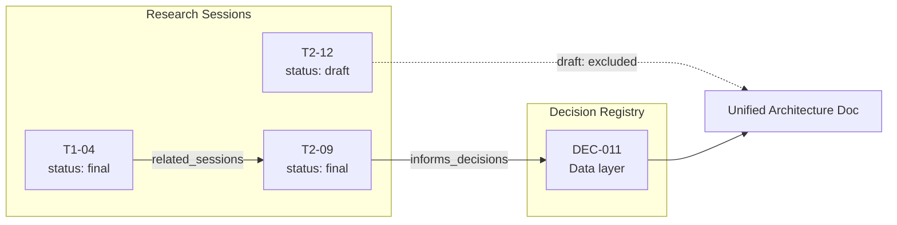

# T2-07 — Research Output Architecture: Format, Structure & Downstream Use

*This document's own header follows the frontmatter schema recommended in §5.2 — it is a working example, not just a proposal.*

## Table of Contents

1. [The Four Use Cases and the Weakest Link](#1-the-four-use-cases-and-the-weakest-link)
2. [Format Evaluation](#2-format-evaluation)
3. [What the Field Already Knows: Six Precedents](#3-what-the-field-already-knows-six-precedents)
4. [Resolving Standardized vs. Flexible](#4-resolving-standardized-vs-flexible)
5. [Recommended Architecture](#5-recommended-architecture)
6. [Synthesis Workflow: 10–25 Sessions → One Architecture Document](#6-synthesis-workflow-1025-sessions--one-architecture-document)
7. [Guidance for AI Code-Generation Consumers](#7-guidance-for-ai-code-generation-consumers)
8. [Migration Plan](#8-migration-plan)
9. [Anti-Patterns to Avoid](#9-anti-patterns-to-avoid)
10. [Summary Checklist](#10-summary-checklist)
11. [References](#references)

---

## Executive Summary

**Recommendation: keep Markdown as the body format, add a small YAML frontmatter block for metadata and relationships, and standardize a short set of required section headers while leaving the depth of "detailed findings" flexible.** Do not switch the body to JSON or YAML, and do not stand up a knowledge-graph database for 10–25 documents. This is additive to the current approach, not a replacement of it.

Quick answers to the five questions posed:

| Question | Short answer |
|---|---|
| How well does Markdown serve each use case? | Excellent for human reading and git diffs, good for AI consumption, **weak** for automated synthesis and cross-referencing — because those two depend on structure Markdown doesn't enforce. |
| Would structured data (JSON/YAML/frontmatter) help without hurting readability? | Yes, but only as a **metadata layer on top of** prose, not as a replacement **for** it. Frontmatter gets nearly all the benefit of full JSON/YAML with almost none of the readability or diff cost. |
| Standardized schema or flexible structure? | Both, at different layers: **standardize the metadata and a handful of required headings**; leave the internal structure of the findings themselves flexible. This is exactly how ADRs, RFCs, and Python PEPs already work. |
| How should outputs cross-reference each other and the decisions they inform? | Give every session and every decision a stable ID, hold typed relationships (`related_sessions`, `informs_decisions`, `supersedes`) in frontmatter, and derive a browsable index from those fields with a script — never hand-maintain the index. |
| What does the KM field say about organizing corpora for synthesis? | Consistently: atomic, self-contained units; explicit IDs and links; status/lifecycle gating of what's safe to synthesize; metadata separated from narrative. This shows up under different names in Zettelkasten, ADRs, PEPs, DITA, and in Anthropic's own multi-agent research system. |

The throughline of this report is **optimize for the weakest link, not the strongest one**. Markdown alone is already strong on the two dimensions the pipeline needs least fixing (human reading, git diffs) and weak on the two it needs most (automated synthesis, cross-referencing). The fix is the smallest addition that shores up the weak dimensions without touching the strong ones: a metadata layer, not a format change.

---

## 1. The Four Use Cases and the Weakest Link

The brief specifies four consumers of every research output. Each wants something different from the file:

| Use case | What "good" looks like |
|---|---|
| (a) Human reading | Scannable, narrative where needed, renders cleanly, low friction to skim or deep-read |
| (b) Automated synthesis across 10–25 sessions | A script or agent can reliably locate "the finding" and "the recommendation" in every file without guessing, and can filter to only the sessions that are ready to synthesize |
| (c) AI consumption for code generation | Unambiguous decisions, structured schemas/interfaces it can act on directly, no confusion between "options explored" and "what was chosen" |
| (d) Version control in git | Diffs isolate the actual change, merges rarely conflict, blame is meaningful at the line level |

Scoring the **current approach** (mandated Markdown, structured headers, tables, code blocks, no frontmatter or ID scheme) against these:

| Dimension | Current approach | Why |
|---|---|---|
| Human reading | **Strong** | This is Markdown's home turf — nothing to fix |
| Git diffs | **Strong** | Plain text, line-based, no serialization noise — nothing to fix |
| AI consumption | **Adequate** | LLMs read Markdown natively, but prose that mixes "options considered" with "the decision" is genuinely ambiguous to a downstream model |
| Automated synthesis | **Weak** | No document has a schema. A synthesizer has to guess where the recommendation lives, whether a file is finished, or whether two sessions contradict each other |
| Cross-referencing | **Weak** | Markdown links exist but carry no meaning — a link doesn't say whether it's "builds on," "contradicts," or "supersedes," and there's no registry of what informs what |

Two of five dimensions are weak, and they happen to be the two the brief cares most about: reliable synthesis into a unified document, and traceability from research to decision. The other three are already close to ideal. **This reframes the whole question.** It isn't "is Markdown good enough" — it's "what is the smallest change that fixes synthesis and cross-referencing without degrading readability or diffs." Section 5 answers that directly; Sections 2–4 build the case for why.

---

## 2. Format Evaluation

### 2.1 Comparison at a Glance

| Format | Human reading | Automated synthesis | Cross-referencing | Git diffs | AI code-gen consumption |
|---|---|---|---|---|---|
| Pure Markdown | Excellent | Weak | Weak | Excellent | Good |
| Pure JSON | Poor | Excellent | Good (with ID fields) | Weak | Good for schemas, poor for narrative |
| Pure YAML | Fair | Excellent | Good | Good | Good for fields, awkward for long-form reasoning |
| **Hybrid — Markdown + YAML frontmatter** | **Excellent** | **Strong** | **Strong** | **Excellent** | **Excellent** |
| Knowledge graph (graph DB / RDF) | Poor (not a document) | Excellent for relationships | Best-in-class | Poor | Good via query API, needs a serialization step |

### 2.2 Pure Markdown (the current mandate)

Markdown's strength is that it was designed for people, not machines: headers, tables, and code fences read naturally and render everywhere. Its weakness is the flip side of that same design choice — it has no schema, multiple incompatible dialects, and is, as one open-source maintainer put it while arguing to drop Markdown from a scientific data pipeline, not really meant for structured data since it's hard to parse back out reliably ([LivingNorwayR issue #23](https://github.com/LivingNorway/LivingNorwayR/issues/23)). A script or model can *read* a Markdown research file fine; it cannot *reliably locate a specific fact* in it without either brittle regex on heading text or a full LLM pass to re-extract what should have been explicit in the first place. That re-extraction cost is paid 10–25 times over the life of the pipeline, once per session, every time the unified document is regenerated.

### 2.3 Pure JSON

JSON gives synthesis exactly what Markdown lacks: a schema, deterministic parsing, and validation. It fails the other three use cases badly enough to disqualify it as a body format here. It is not designed for discursive writing — rationale, uncertainty, and trade-off discussion have to be forced into string fields or arrays of strings, which is worse to write and worse to read than prose. It is also a poor git citizen in practice: because JSON requires commas between array elements and forbids trailing commas, adding one item to a list means editing the *previous* line as well as adding a new one, so a diff shows two changed lines for what is conceptually one addition — a small but constant source of noise documented by developers who've lived with it for years ([Grumpy Gamer](https://www.grumpygamer.com/git_json_markdown/)). JSON does have better *tooling* for structural, whitespace-blind diffing (`jq`, `json-diff`) than YAML does — but that tooling has to be deliberately adopted; the diff a reviewer sees by default in a GitHub or GitLab pull request is still a flat text diff, with no structural awareness for either format ([JSON vs. YAML diffing](https://jsondiffs.com/blog/json-vs-yaml-which-format-is-easier-to-diff/)).

### 2.4 Pure YAML

YAML fixes some of JSON's git problems — no trailing-comma tax, and block-style lists mean adding an item is a pure line insertion rather than a two-line edit — but it inherits the same fundamental mismatch with narrative writing, and adds a new risk: YAML's significant whitespace makes it fragile as direct input to language models, whose tokenizers don't reliably preserve indentation, which can quietly re-cast values or break structure ([YAML vs Markdown vs JSON vs CSV](https://formatarc.com/en/blog/data-format-cheatsheet/)). Full-document YAML is a reasonable choice for a config file consumed by one program. It is a poor choice for a document meant to explain *why*, to a human, in the first person.

### 2.5 Hybrid — Markdown Body with YAML Frontmatter

This is the pattern used by essentially every static-site generator and note-taking tool built in the last fifteen years — Jekyll (which popularized it), Hugo, Astro, Docusaurus, Eleventy, and Obsidian all read a YAML block fenced by `---` at the top of an otherwise normal Markdown file ([Hugo docs](https://gohugo.io/content-management/front-matter/); [YAML frontmatter explained](https://blogizi.com/blog/yaml-frontmatter-explained)). The reason it has won by convention rather than by committee is that it cleanly separates two different jobs: the frontmatter is *read by machines* (routing, filtering, validation, indexing), and the body is *read by people* (and, downstream, by LLMs, which handle this exact pattern extremely well precisely because so much of their training data is written this way). One technical-writing blog summarized the resulting split plainly: Markdown for the parts a person needs to read, YAML for the parts a program needs to check, JSON reserved for machine-to-machine payloads — "the best format for both humans and AI is Markdown enhanced with YAML or JSON metadata" (<a href="https://blog.tech4teaching.net/markdown-json-yml-and-xml-what-is-the-best-content-format-for-both-human-and-ai/">tech4teaching</a>). Because the file is still, at its core, plain text with a small structured header, it keeps Markdown's git-diff and human-readability advantages almost entirely intact while giving automated synthesis a deterministic place to look. A developer building an AI-agent task-tracking format reached the same conclusion independently, converging on YAML frontmatter (id, status, assignment) plus a free-form Markdown body for exactly this reason — machine-parseable where it needs to be, human- and agent-readable everywhere else, git-diffable throughout ([The Case for Markdown as Your Agent's Task Format](https://dev.to/battyterm/the-case-for-markdown-as-your-agents-task-format-6mp)).

### 2.6 Knowledge Graph Structures

A real knowledge graph — a graph database or RDF triple store — is the only structure on this list built specifically for relationship-heavy queries: "which sessions inform decisions that were later superseded," multi-hop traversal, and so on. It is also the only one that fails version control almost completely. A graph database is not a text file git can diff; even text-serialized graph formats (Turtle, JSON-LD) tend to spread a single logical change across many disconnected lines, so meaningful diffs and clean merges are hard to get in practice. It is also not something a person reads directly — it's queried or visualized, which means introducing an entirely separate tool just to read a research finding. For 10–25 documents and probably a few dozen decisions, this is disproportionate infrastructure: the standard advice in adjacent fields that *do* use heavyweight structured-authoring systems (see DITA, §3.4) is to start with plain files and only adopt heavier tooling once reuse and scale actually justify the migration cost. The right move is not to reject graph *thinking* — typed relationships between sessions and decisions are genuinely valuable, per §1 — but to get that value from explicit fields in the hybrid format (§5.4) rather than from a graph database. If the corpus later grows by an order of magnitude, the frontmatter relation fields recommended in this report are exactly the raw material a graph would be *derived from* — see GraphRAG in §3.6, which builds its knowledge graph by extracting it from source documents with an LLM rather than requiring anyone to author in graph form directly.

---

## 3. What the Field Already Knows: Six Precedents

The underlying question — "how do you write documents that are read by people, machines, and later synthesized into something bigger, all while staying sane in version control" — is not new. Six existing bodies of practice converge on strikingly similar answers.

### 3.1 Architecture Decision Records (ADRs)

ADRs are the closest existing precedent to this exact problem: short, git-versioned Markdown documents, one per decision, that inform and get referenced by an evolving system architecture. Michael Nygard's original 2011 template — Title, Status, Context, Decision, Consequences — remains the base that most later formats extend ([Archyl](https://www.archyl.com/blog/architecture-decision-records-complete-guide)). Three conventions from ADR practice map directly onto this pipeline:

- **Explicit status lifecycle.** Proposed → Accepted → Deprecated → Superseded, so tooling and readers always know whether a record is live ([TechTarget](https://www.techtarget.com/searchapparchitecture/tip/4-best-practices-for-creating-architecture-decision-records)).
- **One decision per record, numbered sequentially, effectively immutable once accepted.** Later reconsideration produces a *new* record that points back, rather than an edited old one — this preserves the historical trail instead of erasing it ([joelparkerhenderson/architecture-decision-record](https://github.com/joelparkerhenderson/architecture-decision-record)).
- **A dedicated "Considered Options" section, separate from the decision itself.** The MADR (Markdown Any Decision Records) template made this explicit because the authors judged the rejected alternatives, with their pros and cons, as important to preserving the *reasoning* as the decision itself ([ADR Templates](https://adr.github.io/adr-templates/)). This is the single most important structural idea this report borrows (see §5.3 and §7): keeping "what we decided" separate from "what we considered and rejected" is what prevents a downstream reader — human or model — from mistaking a rejected option for the actual instruction.

### 3.2 RFC / PEP Culture

Python Enhancement Proposals follow the same shape at the level of an entire technical-decision process. Each PEP opens with an RFC-2822-style preamble — PEP number, title, author, status, type, created date — that is metadata, not prose, followed by a fixed sequence of required sections: Abstract, Motivation, Rationale, Specification, Backwards Compatibility, Reference Implementation, Rejected Ideas ([PEP 1](https://peps.python.org/pep-0001/); example header fields in [PEP 643](https://peps.python.org/pep-0643/)). This is structurally identical to what §5 recommends: a small structured header plus a fixed skeleton of required prose sections, with the *content* inside each section left entirely to the author. Notably, the Python packaging ecosystem has an active, ongoing debate about whether some of this metadata should move to JSON for tooling reasons ([PEP 819](https://peps.python.org/pep-0819/)) — but that debate is scoped to the machine-facing package metadata, never to the human-facing PEP body itself. The split holds even inside the community that argues most vigorously about format.

### 3.3 The Frontmatter Ecosystem

Section 2.5 covered the mechanics; what's worth adding here is how deep the convention runs. It isn't a niche trick — it's the default metadata mechanism across static site generators and personal knowledge tools, to the point that a page is described as belonging to the "flat-file" philosophy precisely *because* metadata lives in the same versionable file as the content: "a pull request changes text and metadata in one move, a review sees both side by side" ([le dot](https://www.le-dot.com/en/neuland/toolkit/standards/yaml-frontmatter)). That's a direct, independent restatement of why frontmatter suits a git-versioned research pipeline.

### 3.4 Diátaxis and DITA — Two Ends of the Standardization Spectrum

Diátaxis argues documentation should be split into four purpose-built modes — tutorial, how-to, reference, explanation — because mixing them produces confusing documents, and that "every document should serve exactly one user need" ([Diátaxis](https://diataxis.fr/); pattern-matching restated at [Smithery's Diátaxis skill](https://smithery.ai/skills/arisng/diataxis)). Research session outputs in this pipeline are functionally a blend of *reference* (facts a later reader looks up) and *explanation* (why they matter) — which is exactly the split this report's required-sections table (§5.3) enforces: Key Findings and Detailed Findings read as reference, Recommendation and Alternatives Considered read as explanation.

DITA sits at the opposite end: an XML standard for topic-based authoring (concept/task/reference topics) built for enterprises with massive, multi-product, multi-language documentation sets, where content reuse and compliance auditing justify heavy tooling (a full CCMS). One practitioner comparing the two frameworks noted that Diátaxis has no equivalent to DITA's specialization mechanism for defining new content types, because Diátaxis is a way of thinking, not a schema ([I'd Rather Be Writing](https://idratherbewriting.com/blog/what-is-diataxis-documentation-framework)). The practical guidance from teams who've made this call directly: start with Markdown and a static-site generator for speed, and only migrate to DITA once reuse, localization, or compliance scale genuinely demands it ([Scientyfic World](https://scientyficworld.org/topic-based-authoring/)). Applied here: 10–25 research sessions is nowhere near DITA's justification threshold, and the same logic is why §2.6 rejects a knowledge-graph database as premature infrastructure.

### 3.5 Zettelkasten and Atomic Notes

Niklas Luhmann's slip-box method is built on three rules that map almost one-to-one onto what a research-session output needs: every note gets a **stable unique identifier**, every note is **atomic and self-contained** — understandable without needing extra context pulled in — and notes are **explicitly, not implicitly, linked** to related notes ([Recall](https://www.recall.it/post/zettelkasten-method-how-to-take-smart-notes-in-2024); [Todoist](https://www.todoist.com/productivity-methods/zettelkasten-method)). The self-containment rule is precisely why this report requires a dedicated "Key Findings" section (§5.3) written so it can be lifted out of its source file and dropped into a synthesis pass without losing meaning. Modern implementations already fuse this method with the exact hybrid format recommended here: at least one open-source Zettelkasten tool stores atomic notes as Markdown files with YAML frontmatter carrying tags, typed bidirectional links, and status, and exposes the whole thing to AI assistants over MCP — a working, real-world instance of "Markdown + frontmatter + explicit IDs is how you make a corpus AI-navigable" ([joshylchen/zettelkasten](https://github.com/joshylchen/zettelkasten)).

### 3.6 Multi-Document AI Synthesis

Four specific techniques bear directly on how 10–25 files get synthesized into one document:

- **Header-based chunking.** RAG pipelines that ingest Markdown routinely split on heading boundaries and attach the heading path as metadata to each chunk, because well-formed headings are the most reliable structural signal a document offers ([Weaviate](https://weaviate.io/blog/chunking-strategies-for-rag)). This is a direct argument for the required-headings convention in §5.3: consistent H2s are not just for human navigation, they're the retrieval unit a synthesis pass will chunk on.
- **GraphRAG.** Microsoft Research's GraphRAG technique builds a knowledge graph from a document corpus by having an LLM extract entities and relationships, cluster them into communities, and pre-generate community summaries — specifically to answer broad, corpus-wide questions that plain retrieval handles poorly ([From Local to Global](https://www.microsoft.com/en-us/research/publication/from-local-to-global-a-graph-rag-approach-to-query-focused-summarization/)). The relevant detail for this report is *how* the graph comes to exist: it is derived from source text by automated extraction, not hand-authored, and a subsequent survey of RAG techniques notes plainly that this kind of graph indexing is operationally expensive ([arXiv survey](https://arxiv.org/pdf/2407.13193)). That is the strongest available argument for the position in §2.6: keep the source of truth as git-native Markdown+frontmatter, and treat a knowledge graph — if it's ever needed — as something generated from it, not authored directly in it.
- **Anthropic's own multi-agent research system.** This is the closest real-world analog to the pipeline described in this brief. Claude's Research feature uses a lead agent that decomposes a query and spawns parallel subagents, each working in an isolated context window; each subagent is required to **condense its findings** before returning them to the lead agent for synthesis, and a separate downstream pass handles citation/attribution ([ZenML write-up](https://www.zenml.io/llmops-database/building-production-multi-agent-research-systems-with-claude); [Anthropic — When to use multi-agent systems](https://claude.com/blog/building-multi-agent-systems-when-and-how-to-use-them)). Anthropic's own engineering findings are explicit that subagents need a clear objective, output format, and task boundaries — vague instructions caused early versions to duplicate work or leave gaps. That is an authoritative, first-party argument for exactly the standardized-output-format recommendation in §4 and §5: a fleet of research sessions synthesizes reliably only when each one returns findings in a predictable shape.
- **llms.txt and AI-facing indexes.** llms.txt — a curated Markdown index of links proposed in 2024 to help language models navigate a site — remains, as of mid-2026, unevenly adopted and contested as a *public SEO signal*; measured adoption is still a small minority of sites, and evidence that major AI search crawlers fetch it is thin ([State of llms.txt 2026](https://limy.ai/blog/llms.txt-in-2026-the-full-guide)). But the underlying *pattern* it encodes is validated in a narrower, more relevant context: coding agents (Claude Code, Cursor, Windsurf, GitHub Copilot, and others) do routinely fetch this kind of curated Markdown index when pointed at documentation, using it to find the specific page worth reading in full before generating code, according to the same source. That is precisely the role recommended for the generated index in §5.4 — not a public-facing standard, but the same lightweight-index-into-a-larger-corpus shape, purpose-built for the pipeline's own downstream code-generation consumer.

---

## 4. Resolving Standardized vs. Flexible

Every precedent in Section 3 answers this the same way, and it is not "pick one":

**Standardize the metadata and a minimal skeleton of required section headers. Leave the internal structure of the findings themselves flexible.**

Concretely:

- **Fixed, everywhere:** the frontmatter schema (§5.2) and the presence — not the content — of a small set of required H2 headings (§5.3). Every session states its recommendation in the same *place*, even if what's *in* that place varies enormously by topic.
- **Flexible, by design:** the internal shape of "Detailed Findings." A session evaluating hosting providers naturally wants a comparison table; a session evaluating an authentication approach might want a decision tree or a sequence of trade-off paragraphs; a session that surfaces mostly open questions might be almost all prose. Forcing identical subheadings onto all of these produces exactly the failure mode Diátaxis warns about — documents that look organized but say less than they should, because the author is filling in a template rather than answering the question.

This is not a compromise position invented for this report — it is what ADRs, PEPs, and structured academic abstracts already do, each in their own domain, and it's the reason none of them collapsed into either "no rules" or "rigid rows-and-columns."

---

## 5. Recommended Architecture

### 5.1 Directory Layout

```
research/
├── sessions/
│   ├── T1-01-hosting-provider-evaluation.md
│   ├── T1-02-auth-strategy-evaluation.md
│   ├── ...
│   ├── T2-07-research-output-architecture.md
│   └── T3-05-observability-stack.md
├── decisions/
│   ├── DEC-001-use-postgresql.md
│   ├── DEC-002-jwt-based-auth.md
│   └── ...
├── schema/
│   └── session.schema.json           # JSON Schema for frontmatter, see §5.2
├── _index.yaml                       # GENERATED — never hand-edited, see §5.4
└── architecture/
    └── unified-architecture.md       # the synthesis deliverable, also frontmatter-tagged
```

Adapt directory and prefix names to whatever convention the pipeline already uses (this report keeps the `T#-##` session-ID style already visible in the task name, `T2-07`, rather than inventing a competing scheme). What matters structurally is the three-way split: raw session outputs, a decision registry, and a generated index — kept separate so each can evolve and be regenerated independently.

### 5.2 Frontmatter Schema

Ten to twelve fields is enough. Every field beyond this should earn its place — unused fields rot, and rotten metadata is worse than none because it's actively misleading.

| Field | Type | Required | Purpose |
|---|---|---|---|
| `id` | string | Yes | Stable identifier matching the pipeline's existing session naming (e.g. `T2-07`). Never reused, never renumbered. |
| `title` | string | Yes | Human-readable title of the question this session investigated. |
| `session_date` | date | Yes | When the session ran. Drives ordering and staleness checks. |
| `status` | enum: `draft`, `in-review`, `final`, `superseded` | Yes | Lifecycle gate. Synthesis tooling defaults to reading only `status: final`. |
| `topic` | string | Yes | One primary domain tag for grouping (e.g. `authentication`, `data-layer`). |
| `tags` | array[string] | No | Additional free-text tags for cross-cutting search. |
| `related_sessions` | array[string] | No | IDs of sessions this one builds on, contradicts, or should be read alongside. |
| `supersedes` / `superseded_by` | string \| null | No | Forward/backward pointer when a later session revisits and replaces an earlier one. |
| `informs_decisions` | array[string] | No | IDs of decision-registry entries this session's findings feed into. |
| `confidence` | enum: `high`, `medium`, `low` | No | Self-rated evidence strength — lets synthesis and reviewers triage disagreements between sessions. |
| `open_questions` | integer | No | Count of unresolved questions, for at-a-glance triage; the full list stays in the body. |
| `schema_version` | string | Yes | Version of this frontmatter schema the file conforms to, so the schema can evolve without breaking old files. |

JSON Schema for the same fields, so it can be enforced in CI rather than trusted to author discipline:

```json
{
  "$schema": "http://json-schema.org/draft-07/schema#",
  "title": "Research Session Frontmatter",
  "type": "object",
  "required": ["id", "title", "session_date", "status", "topic", "schema_version"],
  "properties": {
    "id":            { "type": "string", "description": "e.g. T2-07" },
    "title":         { "type": "string" },
    "session_date":  { "type": "string", "format": "date" },
    "status":        { "enum": ["draft", "in-review", "final", "superseded"] },
    "topic":         { "type": "string" },
    "tags":          { "type": "array", "items": { "type": "string" } },
    "related_sessions":  { "type": "array", "items": { "type": "string" } },
    "supersedes":        { "type": ["string", "null"] },
    "superseded_by":     { "type": ["string", "null"] },
    "informs_decisions": { "type": "array", "items": { "type": "string" } },
    "confidence":    { "enum": ["high", "medium", "low"] },
    "open_questions":{ "type": "integer", "minimum": 0 },
    "schema_version":{ "type": "string" }
  },
  "additionalProperties": true
}
```

`remark-lint-frontmatter-schema` validates exactly this shape — Markdown frontmatter checked against a JSON Schema, runnable via `remark-cli` locally or wired into CI ([npm](https://www.npmjs.com/package/remark-lint-frontmatter-schema)) — so this is a same-day addition, not a tooling project.

### 5.3 Required Body Sections

| Section (H2) | Required? | Purpose | Internal structure |
|---|---|---|---|
| Research Question | Yes | One or two sentences: exactly what this session was asked to determine | Fixed length, free wording |
| Key Findings | Yes | 3–7 bullets, each self-contained enough to read in isolation (per the Zettelkasten self-containment principle, §3.5) — this is what a synthesis pass extracts first | Bullets only |
| Recommendation | Yes | One explicit, unambiguous statement of what should be done — or "no recommendation yet" if genuinely inconclusive | Kept separate from Alternatives, below — this is the ADR/MADR "Decision" section (§3.1) |
| Alternatives Considered | Yes if options were compared | What was evaluated and rejected, and why | Free — table, list, or prose |
| Detailed Findings | Yes | The substantive evidence: tables, code blocks, benchmarks, citations | **Fully flexible** — this is where the current approach's strengths (tables, fenced code, structured headers) are preserved wholesale |
| Open Questions & Risks | Yes | Explicit unresolved items — feeds the `open_questions` frontmatter count | Bullets |
| Sources | Yes | What was consulted — searches run, docs read, people interviewed | List of links/citations |

Seven headings, five of them one or two sentences to fill even in a thin session. This is deliberately close to the PEP/ADR precedent in §3.1–3.2: small, fixed skeleton; unrestricted content inside it.

### 5.4 Cross-Referencing and the Decision Registry

Every research session and every architectural decision gets a **stable ID** (`T#-##` for sessions, `DEC-###` for decisions — adjust prefixes to match existing convention). Relationships live in two places, matched to their audience:

- **In frontmatter**, for machines: `related_sessions`, `supersedes` / `superseded_by`, `informs_decisions`. These are what a script or synthesis agent reads to build a picture of the corpus without opening every file.
- **Inline in prose**, for humans: ordinary Markdown links that include the visible ID — `T2-09 (sessions/T2-09-data-layer-evaluation.md)` — so both a person clicking through in GitHub/Obsidian and a script grepping for `T\d-\d\d` can follow the same reference.

The **decision registry** (`decisions/`) holds one short file per architectural decision, in the ADR shape from §3.1 (Title, Status, Context, Decision, Consequences), plus one field this report adds: `informed_by_sessions`, the reverse pointer back to every research session that fed the decision. This closes the traceability loop the brief asks for directly — from any decision, you can see every session behind it; from any session, you can see every decision it shaped.

The **index** (`_index.yaml`) is a rollup of every session and decision's frontmatter, used for browsing and for feeding the synthesis step (§6). It must be **generated, never hand-edited** — a hand-maintained index is exactly the kind of shared file that produces merge conflicts when two sessions land in parallel, and it drifts out of sync with the files it's supposed to describe. Generating it is a small script:

```python
import frontmatter, glob, yaml

sessions = []
for path in sorted(glob.glob("research/sessions/*.md")):
    post = frontmatter.load(path)          # python-frontmatter: parses YAML header + body
    sessions.append({**post.metadata, "path": path})

decisions = []
for path in sorted(glob.glob("research/decisions/*.md")):
    post = frontmatter.load(path)
    decisions.append({**post.metadata, "path": path})

with open("research/_index.yaml", "w") as f:
    yaml.dump({"sessions": sessions, "decisions": decisions}, f, sort_keys=False)
```

Run this in CI on every push. The index is then a build artifact, not a source file — conflicts resolve themselves because nobody edits it directly.

### 5.5 Worked Example (illustrative — abbreviated)

```markdown
---
id: T2-09
title: "Data Layer: Managed Postgres vs. Self-Hosted"
session_date: 2026-08-11
status: final
topic: data-layer
tags: [database, postgres, infrastructure]
related_sessions: [T1-04]
supersedes: null
superseded_by: null
informs_decisions: [DEC-011]
confidence: high
open_questions: 1
schema_version: "1.0"
---

## Research Question
Should the data layer use a managed Postgres provider or a self-hosted instance?

## Key Findings
- Managed Postgres removes ~90% of operational burden at this team's current scale.
- Self-hosting saves cost only past roughly 500GB of storage, per current provider pricing.
- Both options support the read-replica pattern T1-04 recommended.

## Recommendation
Use a managed Postgres provider for the initial launch.

## Alternatives Considered
Self-hosted Postgres on a dedicated instance — rejected for now: lower cost at scale,
but the operational overhead isn't justified before the team has dedicated infra staff.

## Detailed Findings
[tables, benchmark numbers, pricing comparisons — free-form as needed]

## Open Questions & Risks
- Revisit at ~500GB storage or when infra headcount changes.

## Sources
- [Provider pricing page], [T1-04 findings]
```

Note how §5.3's separation pays off immediately: a synthesis script — or a code-generation model — can extract "Recommendation: use a managed Postgres provider" without ever risking a false read of the rejected self-hosted option as the actual instruction.

### 5.6 Relationship Diagram



Sessions still in `draft` are visible in the corpus but excluded from synthesis by default (§6) — the dotted line marks that gap intentionally, not as a bug.

### 5.7 Validation & Tooling

- **Frontmatter schema validation in CI**: `remark-lint-frontmatter-schema` (Node/`remark-cli`) or an equivalent Python `jsonschema`-against-YAML check ([background on the approach](https://ndumas.com/2023/06/validating-yaml-frontmatter-with-jsonschema/)). Fail the build on a missing required field or an invalid `status`/`confidence` enum value.
- **Index generation in CI**: the script in §5.4, run on every push to `research/**`, committed back or published as a build artifact.
- **ID uniqueness check**: a one-line script asserting no two files declare the same `id` — cheap insurance against a copy-paste error silently breaking every cross-reference.

### 5.8 Git Hygiene Rules

Four small conventions keep the hybrid format's diff advantage from eroding as the corpus grows:

1. **Use semantic line breaks in prose.** Break lines after sentences and independent clauses instead of hard-wrapping at a fixed column or writing one giant paragraph-line. This is a documented, named convention (Semantic Line Breaks / SemBr) adopted specifically because line-based diff tools then isolate a changed sentence instead of highlighting an entire reflowed paragraph ([sembr.org](https://sembr.org/); [rule set](https://github.com/sembr/specification)); it's seen real adoption in projects that maintain heavily-reviewed Markdown docs, including a GitLab documentation change made explicitly to get this benefit ([GitLab MR #37454](https://gitlab.com/gitlab-com/www-gitlab-com/-/merge_requests/37454)). No need to reformat existing files — apply it to new and edited text going forward.
2. **Use block-style YAML lists for fields expected to grow** (`related_sessions`, `tags`), not inline `[a, b, c]` — adding an item becomes a pure one-line insertion instead of rewriting the whole line.
3. **Don't hand-align Markdown table columns.** Pretty-printing pipes to line up visually means a single cell edit reflows every row's padding, and the diff drowns the real change in whitespace noise. Let a formatter do this on demand if wanted; don't maintain it inline.
4. **Never hand-edit `_index.yaml`.** Covered in §5.4 — worth repeating here because it's the rule most likely to be broken under deadline pressure.

---

## 6. Synthesis Workflow: 10–25 Sessions → One Architecture Document

1. **Filter** — read `_index.yaml`; include only `status: final` sessions by default (`in-review` can be included with a visible flag; `draft` is excluded).
2. **Group** — cluster the filtered sessions by `topic`/`tags`.
3. **Map** — within each topic group, extract just the **Key Findings** and **Recommendation** sections (per §5.3, these are written to be self-contained) and produce a per-topic synthesis. This is a small-scale version of the same map step used in classic map-reduce summarization, and it mirrors how Anthropic's own research subagents are required to condense findings before a lead agent ever sees them (§3.6) — filtering to the two sections built for exactly this purpose keeps each synthesis pass focused and keeps token/context cost down.
4. **Reduce** — merge the per-topic syntheses into the unified architecture document. Where two sessions' recommendations conflict, surface it explicitly rather than silently picking one — `confidence` and `session_date` are the fields to break the tie on, or to flag for human review.
5. **Trace** — the unified document itself carries frontmatter (or per-section annotations) listing which session and decision IDs fed each part of it, so any sentence in the final architecture doc can be walked back to its source. This is what makes the traceability requirement in the brief concrete rather than aspirational.
6. **Gate** — human review before any decision moves from `in-review` to `final` in the registry. The status lifecycle isn't only for sessions; it applies to decisions and to the synthesis document too.

---

## 7. Guidance for AI Code-Generation Consumers

Four points specific to (c) — a downstream model turning research into code:

- **Never let "recommended" and "considered" share a section.** This is the single highest-leverage rule in this whole report. A model given a paragraph that discusses three options and only implies which one won will sometimes implement the first-mentioned option, or blend elements of a rejected one. §5.3's mandatory split between Recommendation and Alternatives Considered exists specifically to remove that ambiguity.
- **Put anything implementable in a fenced code block with the right language tag.** Schemas, interfaces, config shapes, and API contracts should be treated as the ground truth a model should copy or implement directly — not prose describing them. This preserves exactly what the current approach already does well; nothing here asks for that to change.
- **Keep terminology consistent across sessions.** Twenty-five independently-run sessions will otherwise coin twenty-five slightly different names for the same concept, which fragments a code-gen model's understanding of the system it's building. A shared short glossary (even a single `glossary.md`) is cheap insurance.
- **Filter before feeding context, don't dump the whole corpus.** Use `status` and `topic`/`tags` to retrieve only the relevant, finalized subset for a given code-generation task, the same way a RAG pipeline retrieves relevant chunks rather than the entire indexed corpus (§3.6). This is a context-economy argument as much as an accuracy one — irrelevant sessions in context cost tokens and dilute attention without adding signal.

---

## 8. Migration Plan

This is additive, not a rewrite, which is the main reason to move on it immediately rather than treat it as a future project:

1. **New sessions, starting now**: use the full frontmatter schema (§5.2) and required headings (§5.3). Marginal cost per session is a few minutes of filling in a template.
2. **Existing sessions**: backfill frontmatter opportunistically — `id`, `title`, `session_date`, `status`, and `topic` can usually be inferred and added by script from filename and existing content in a single pass; `related_sessions` and `informs_decisions` are worth a human pass since they require judgment.
3. **Existing prose bodies**: leave as-is. The required-headings list (§5.3) maps closely enough to what "structured headers, tables, code blocks" already produces that most existing sessions will need heading renames, not rewrites, to comply.
4. **Stand up validation (§5.7) before backfilling**, not after — otherwise the backfill itself introduces the inconsistent, unvalidated metadata the schema exists to prevent.

Estimated effort: low. This is a template and a lint rule, not new infrastructure.

---

## 9. Anti-Patterns to Avoid

- **Standing up a graph database or a fully JSON/YAML-bodied system for 10–25 documents.** Per §2.6 and §3.4, this is infrastructure sized for a scale this pipeline isn't at; revisit only if the corpus grows an order of magnitude.
- **Making every frontmatter field mandatory, or forcing identical sub-structure onto every "Detailed Findings" section regardless of topic.** This produces the confused, template-filling documentation Diátaxis warns against (§3.4) and discourages researchers from writing what the topic actually needs.
- **Hand-maintaining `_index.yaml` or any cross-reference rollup.** Generate it (§5.4); a hand-edited shared index is a guaranteed source of merge conflicts and drift.
- **Manually aligning Markdown table columns or hard-wrapping long paragraphs at a fixed width.** Both create diff noise disproportionate to the actual edit (§5.8).
- **Leaving frontmatter unvalidated.** Unenforced schema fields rot within a few sessions; wire up CI validation (§5.7) from the start, not after the first cross-reference breaks.
- **Treating the frontmatter/body split as optional per-session.** The value is entirely in consistency — a metadata field that exists on 15 of 25 files is not queryable and provides none of the automated-synthesis benefit this whole architecture exists to deliver.

---

## 10. Summary Checklist

- [ ] Every research session file has frontmatter with at minimum `id`, `title`, `session_date`, `status`, `topic`, `schema_version`
- [ ] Every session has the seven required H2 headings from §5.3, with Recommendation and Alternatives Considered kept separate
- [ ] Sessions and decisions use stable, never-reused IDs (`T#-##`, `DEC-###`)
- [ ] Decision registry files exist under `decisions/`, ADR-shaped, with `informed_by_sessions` back-links
- [ ] `_index.yaml` is generated by script/CI, never hand-edited
- [ ] Frontmatter is schema-validated in CI (e.g. `remark-lint-frontmatter-schema`)
- [ ] Synthesis tooling filters to `status: final` by default and extracts Key Findings + Recommendation first
- [ ] New prose uses semantic line breaks; nobody hand-aligns table columns
- [ ] The unified architecture document traces each section back to the session/decision IDs behind it

---

## References

**Architecture Decision Records**
- [8 best practices for creating architecture decision records — TechTarget](https://www.techtarget.com/searchapparchitecture/tip/4-best-practices-for-creating-architecture-decision-records)
- [Architectural Decision Records / MADR templates — adr.github.io](https://adr.github.io/) · [ADR Templates](https://adr.github.io/adr-templates/)
- [Architecture Decision Records: The Complete Guide — Archyl](https://www.archyl.com/blog/architecture-decision-records-complete-guide)
- [architecture-decision-record — joelparkerhenderson (GitHub)](https://github.com/joelparkerhenderson/architecture-decision-record)

**Frontmatter & Flat-File Conventions**
- [YAML Frontmatter — le dot](https://www.le-dot.com/en/neuland/toolkit/standards/yaml-frontmatter)
- [Front matter — Hugo documentation](https://gohugo.io/content-management/front-matter/)
- [YAML Frontmatter Explained](https://blogizi.com/blog/yaml-frontmatter-explained)

**Documentation Frameworks**
- [Diátaxis](https://diataxis.fr/)
- [What is Diátaxis and should you be using it? — I'd Rather Be Writing](https://idratherbewriting.com/blog/what-is-diataxis-documentation-framework)
- [How Topic Based Authoring Enables Content Reuse — Scientyfic World](https://scientyficworld.org/topic-based-authoring/)
- [DITA overview — dita-lang.org](https://dita-lang.org/)

**Standardized-but-Flexible Technical Documents**
- [PEP 1 – PEP Purpose and Guidelines](https://peps.python.org/pep-0001/)
- [PEP 643 – Metadata for Package Source Distributions (example header)](https://peps.python.org/pep-0643/)
- [PEP 819 – JSON Package Metadata](https://peps.python.org/pep-0819/)

**Knowledge Graphs & RAG**
- [Project GraphRAG — Microsoft Research](https://www.microsoft.com/en-us/research/project/graphrag/)
- [From Local to Global: A Graph RAG Approach to Query-Focused Summarization](https://www.microsoft.com/en-us/research/publication/from-local-to-global-a-graph-rag-approach-to-query-focused-summarization/)
- [Retrieval-Augmented Generation for NLP: A Survey (arXiv)](https://arxiv.org/pdf/2407.13193)
- [Chunking Strategies to Improve LLM RAG Pipeline Performance — Weaviate](https://weaviate.io/blog/chunking-strategies-for-rag)

**Multi-Document AI Synthesis**
- [Building Production Multi-Agent Research Systems with Claude — ZenML LLMOps Database](https://www.zenml.io/llmops-database/building-production-multi-agent-research-systems-with-claude)
- [When to use multi-agent systems (and when not to) — Claude by Anthropic](https://claude.com/blog/building-multi-agent-systems-when-and-how-to-use-them)
- [State of llms.txt 2026 — Limy](https://limy.ai/blog/llms.txt-in-2026-the-full-guide)

**Zettelkasten / Atomic Notes**
- [Zettelkasten: How to Turn Notes into Knowledge That Compounds — Todoist](https://www.todoist.com/productivity-methods/zettelkasten-method)
- [Zettelkasten Method: How to Take Smart Notes — Recall](https://www.recall.it/post/zettelkasten-method-how-to-take-smart-notes-in-2024)
- [joshylchen/zettelkasten — AI-powered Zettelkasten with YAML frontmatter + MCP](https://github.com/joshylchen/zettelkasten)

**Git Diff Friendliness**
- [JSON vs. YAML: Which Format Is Easier to Diff?](https://jsondiffs.com/blog/json-vs-yaml-which-format-is-easier-to-diff/)
- [Git, JSON and Markdown walk into a bar — Grumpy Gamer](https://www.grumpygamer.com/git_json_markdown/)
- [The Case for Markdown as Your Agent's Task Format — DEV Community](https://dev.to/battyterm/the-case-for-markdown-as-your-agents-task-format-6mp)
- [Semantic Line Breaks — sembr.org](https://sembr.org/) · [Specification](https://github.com/sembr/specification)
- [markdown,.json,.yml, and .xml — what is the best content format for both human and AI?](https://blog.tech4teaching.net/markdown-json-yml-and-xml-what-is-the-best-content-format-for-both-human-and-ai/)

**Validation Tooling**
- [remark-lint-frontmatter-schema — npm](https://www.npmjs.com/package/remark-lint-frontmatter-schema)
- [Validating YAML frontmatter with JSONSchema — Form and Function](https://ndumas.com/2023/06/validating-yaml-frontmatter-with-jsonschema/)
