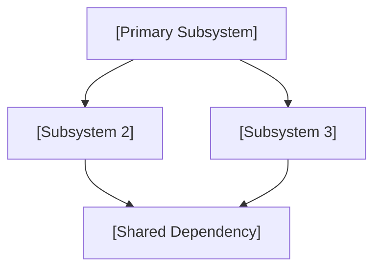

# Founding Architecture Document Template — Vivechak v1.0
### Map-Reduce Synthesis from Research Pipeline to Execution Blueprint

> **Usage:** This template structures the final synthesis document that bridges
> research findings into a concrete, buildable architecture specification.
>
> **How to compile this document:**
> 1. **Filter:** Gather all completed research sessions from `sessions/`
> 2. **Group:** Cluster sessions by topic (e.g., data, auth, infra, protocols, tooling)
> 3. **Map:** Extract the Key Findings and Recommendation from each session
> 4. **Reduce:** Merge each topic cluster into a unified subsystem chapter below
> 5. **Reconcile:** Resolve any cross-session contradictions (if Session A assumes REST but Session B assumes gRPC, pick one and document why)
> 6. **Trace:** Annotate every section with the session IDs and decision IDs that informed it
> 7. **Gate:** Run the Phase 0 Gate checklist before sealing

---

## Project: `[Project Name]`

```yaml
---
id: SYN-01
title: "[Project Name] — Founding Architecture Document"
synthesis_date: YYYY-MM-DD
status: draft                  # draft | sealed
research_sessions_ingested: N
decisions_locked: N
open_questions: N
schema_version: "1.0"
---
```

---

## 1. Executive Summary

`[2–5 paragraph summary of the overall architecture, key technical choices,
and strategic rationale. This section should be readable by a non-technical
stakeholder.]`

---

## 2. Locked Decision Registry

| D-ID | Decision | Chosen Option | Door Type | Confidence | Evidence |
|---|---|---|---|---|---|
| D-001 | `[Title]` | `[Option]` | `[1-way/2-way]` | `[H/M/L]` | `[E-NNN refs]` |
| D-002 | `[Title]` | `[Option]` | `[1-way/2-way]` | `[H/M/L]` | `[E-NNN refs]` |

---

## 3. Architecture & Primitives (Wardley Mapping)

### Composed (Commodity / Utility) — External Standards & Off-the-Shelf

| Component | Chosen Solution | Rationale | Decision Ref |
|---|---|---|---|
| `[Component]` | `[Solution]` | `[Why]` | D-NNN |
| `[Component]` | `[Solution]` | `[Why]` | D-NNN |
| `[Component]` | `[Solution]` | `[Why]` | D-NNN |

### Built (Proprietary / Genesis) — Custom Core IP

| Component | Description | Rationale | Decision Ref |
|---|---|---|---|
| `[Component]` | `[Description]` | `[Why custom]` | D-NNN |
| `[Component]` | `[Description]` | `[Why custom]` | D-NNN |

---

## 4. System Architecture Diagram

`[Insert a project-specific architecture diagram using Mermaid, ASCII, or
a referenced image. The diagram should reflect the actual system topology
discovered during research — do not force-fit a predefined pattern.]`



---

## 5. Cross-Cutting Concerns

### 5.1 Security & Compliance
`[Summary from security/compliance-related research sessions and ADRs.
Omit this section if not applicable to the project.]`

### 5.2 Performance & Scalability
`[Summary from performance-related research sessions and ADRs.
Omit this section if not applicable to the project.]`

### 5.3 Observability & Operations
`[Summary from operational research sessions.
Omit this section if not applicable to the project.]`

---

## 6. Risk Register & Reversal Triggers

| Risk | Source | Probability | Impact | Mitigation | Trigger for Re-evaluation |
|---|---|---|---|---|---|
| `[Risk 1]` | D-NNN | `[H/M/L]` | `[H/M/L]` | `[Action]` | `[Condition]` |
| `[Risk 2]` | D-NNN | `[H/M/L]` | `[H/M/L]` | `[Action]` | `[Condition]` |

---

## 7. Project Structure Specification

`[Specify the project's directory layout, module boundaries, and initial
dependencies. Adapt the structure to the project type — this may be a
repository tree, a package manifest, a hardware BOM, a specification
document outline, or any other structural blueprint appropriate to the domain.]`

```
project-root/
├── [module-1]/
├── [module-2]/
├── [shared/common]/
└── [docs/specs]/
```

---

## 8. Traceability Matrix

| FAD Section | Research Sessions | Decisions | Evidence |
|---|---|---|---|
| `[Subsystem 1]` | `[T#-##]` | `[D-NNN]` | `[E-NNN]` |
| `[Subsystem 2]` | `[T#-##]` | `[D-NNN]` | `[E-NNN]` |
| `[Subsystem 3]` | `[T#-##]` | `[D-NNN]` | `[E-NNN]` |

---

## 9. Phase 0 Gate Verification

- [ ] All One-Way Door ADRs locked with `status: accepted`
- [ ] All reversal triggers defined
- [ ] Gary Klein Premortem completed for all One-Way Door decisions
- [ ] Human Architect sign-off recorded
- [ ] This document sealed and committed

**Sealed By:** `[Name]`
**Seal Date:** `[YYYY-MM-DD]`
