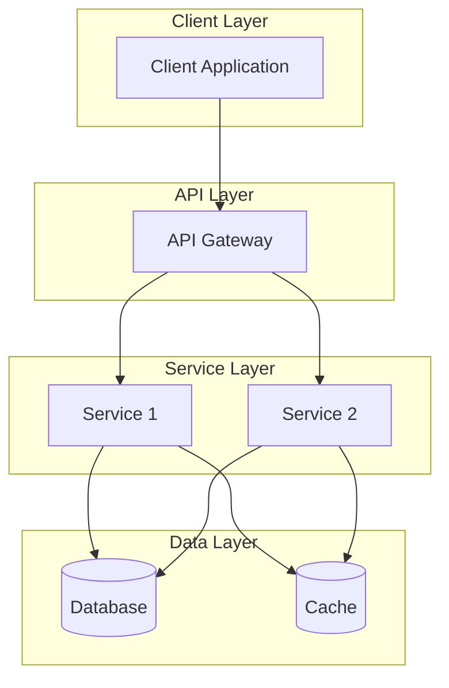

# Founding Architecture Document Template — Vivechak v3.0
### Map-Reduce Synthesis from Research Pipeline to Repository Scaffolding

> **Usage:** This template structures the final synthesis document that bridges
> research findings into a concrete, buildable architecture specification.
>
> **How to compile this document:**
> 1. **Filter:** Gather all completed research sessions from `sessions/`
> 2. **Group:** Cluster sessions by topic (data, auth, infra, etc.)
> 3. **Map:** Extract the Key Findings and Recommendation from each session
> 4. **Reduce:** Merge each topic cluster into a unified subsystem chapter below
> 5. **Reconcile:** Resolve any cross-session contradictions (if Session A assumes REST but Session B assumes gRPC, pick one and document why)
> 6. **Trace:** Annotate every section with the session IDs and decision IDs that informed it
> 7. **Gate:** Run the Phase 0 Gate checklist before sealing

---

## Project: `[Project Name]`

```yaml
---
id: SYN-01
title: "[Project Name] — Founding Architecture Document"
synthesis_date: YYYY-MM-DD
status: draft                  # draft | sealed
research_sessions_ingested: N
decisions_locked: N
open_questions: N
schema_version: "3.0"
---
```

---

## 1. Executive Architecture Summary

`[2–5 paragraph summary of the overall system architecture, key technology
choices, and strategic rationale. This section should be readable by a
non-technical stakeholder.]`

---

## 2. Locked Decision Registry

| D-ID | Decision | Chosen Option | Door Type | Confidence | Evidence |
|---|---|---|---|---|---|
| D-001 | `[Title]` | `[Option]` | `[1-way/2-way]` | `[H/M/L]` | `[E-NNN refs]` |
| D-002 | `[Title]` | `[Option]` | `[1-way/2-way]` | `[H/M/L]` | `[E-NNN refs]` |

---

## 3. Technology Stack

### Composed (Commodity) — Wardley Utility/Product

| Component | Chosen Solution | Rationale | Decision Ref |
|---|---|---|---|
| Authentication | `[e.g., Clerk]` | `[Why]` | D-NNN |
| Database | `[e.g., PostgreSQL 16]` | `[Why]` | D-NNN |
| Storage | `[e.g., Cloudflare R2]` | `[Why]` | D-NNN |
| Hosting | `[e.g., Vercel + Fly.io]` | `[Why]` | D-NNN |

### Built (Proprietary) — Wardley Genesis/Custom

| Component | Description | Rationale | Decision Ref |
|---|---|---|---|
| `[Core Engine]` | `[Description]` | `[Why custom]` | D-NNN |
| `[State Machine]` | `[Description]` | `[Why custom]` | D-NNN |

---

## 4. System Architecture Diagram



`[Replace with project-specific architecture diagram]`

---

## 5. Cross-Cutting Concerns

### 5.1 Security & Compliance
`[Summary from security-related research sessions and ADRs]`

### 5.2 Performance & Scalability
`[Summary from performance-related research sessions and ADRs]`

### 5.3 Observability & Monitoring
`[Summary from infrastructure-related research sessions]`

---

## 6. Risk Register & Reversal Triggers

| Risk | Source | Probability | Impact | Mitigation | Trigger for Re-evaluation |
|---|---|---|---|---|---|
| `[Risk 1]` | D-NNN | `[H/M/L]` | `[H/M/L]` | `[Action]` | `[Condition]` |
| `[Risk 2]` | D-NNN | `[H/M/L]` | `[H/M/L]` | `[Action]` | `[Condition]` |

---

## 7. Repository Scaffolding Specification

### Directory Structure
```
project-root/
├── src/
│   ├── [module-1]/
│   ├── [module-2]/
│   └── [shared]/
├── docs/
│   ├── decisions/           ← ADRs from this pipeline
│   └── evidence/            ← E-NNN records
├── tests/
└── infrastructure/
```

### Initial Dependency Manifest
```json
{
  "dependencies": {},
  "devDependencies": {}
}
```
`[Replace with project-specific dependency manifest]`

---

## 8. Traceability Matrix

| FAD Section | Research Sessions | Decisions | Evidence |
|---|---|---|---|
| Auth Architecture | T2-04 | D-003, D-007 | E-012, E-019 |
| Data Layer | T2-03, T2-05 | D-001, D-004 | E-047, E-015 |
| `[Section]` | `[T#-##]` | `[D-NNN]` | `[E-NNN]` |

---

## 9. Phase 0 Gate Verification

- [ ] All One-Way Door ADRs locked with `status: accepted`
- [ ] All reversal triggers defined
- [ ] Gary Klein Premortem completed for all Type 1 decisions
- [ ] Human Architect sign-off recorded
- [ ] This document committed to repository root

**Sealed By:** `[Name]`
**Seal Date:** `[YYYY-MM-DD]`
